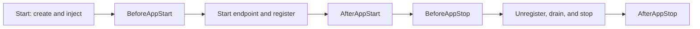

# Components & Modules

Components and modules split an application into functional units that can be
initialized, injected, and stopped independently. `app.New` creates the App
shell, constructs and validates its specification, and captures runtime inputs;
it does not yet construct declared components or modules. `Start` constructs
and injects them and runs their startup hooks. Graceful shutdown runs their
stop hooks in reverse order.

## Capability overview

Application-side capabilities are declared by the App and enabled as needed:

| Capability | What it provides | Entry point |
| --- | --- | --- |
| Module | Organizes domain services, background work, and lifecycle resources | `InitModules`, `app.BaseModule` |
| Config | Obtains `eternal` or `instant` configuration | [Application Configuration](./configuration.md) |
| Rpc | Provides and calls type-safe services | [Using Rpc](./rpc-guide.md) |
| Web | Registers HTTP routes, static assets, and reverse proxies | [Web](./web.md) |
| Event | Publishes facts and notifies multiple consumers asynchronously | [Events and Tasks](./event-task.md) |
| Task | Triggers specific work or schedules it with Cron | [Events and Tasks](./event-task.md) |
| RDB | Connects to PostgreSQL or SQLite and injects DAOs | [Relational Database](./rdb-guide.md) |
| Redis | Injects Redis, caches, and distributed lockers | [Redis](./redis-guide.md) |
| Logger / testkit | Provides structured logging and standalone integration testing | [Logging and Testing](./logging-testing.md) |

Three components collaborate in a multi-process runtime:

| Component | Responsibility | Documentation |
| --- | --- | --- |
| Hub | Distributes configuration, registrations, and runtime state | [Hub](../runtime/hub.md) |
| Link | Connects applications, discovers and forwards services, and dispatches messages | [Link](../runtime/link.md) |
| Portal | Provides the external HTTP, HTTPS, Rpc, and Web gateway | [Portal](../runtime/portal.md) |

See [Component Runtime Mechanisms](../runtime/mechanisms.md) and [Deployment Topologies](../getting-started/deployment-modes.md) for how these pieces form standalone, linked, and fully separated deployments.

## When to use a module

Business capabilities are typically implemented as modules. Modules are suitable for domain services, background work, and resources that should start and stop with the application:

```go title="module.go"
type UserModule struct {
    app.BaseModule
}

func (m *UserModule) BeforeAppStart() error {
    // Initialize business resources
    return nil
}

func (m *UserModule) BeforeAppStop() {
    // Stop accepting new work
}
```

Declare the module in the application:

```go title="app.go"
func (*DemoApp) InitModules(add app.TypeAdder) {
    add(app.T[*UserModule]())
}
```

## When to use an infrastructure component

Infrastructure such as databases and Redis is integrated through components. A business application declares concrete component types and uses them to provide connection settings, DAOs, lockers, or caches:

```go title="app.go"
func (*DemoApp) InitComponents(add app.TypeAdder) {
    add(app.T[*MainDatabase]())
    add(app.T[*MainRedis]())
}
```

Objects exposed by components enter the dependency injection container. Modules, Rpc handlers, Web handlers, Event listeners, and Task runners can inject and use them directly.

## Lifecycle order



- `BeforeAppStart`: establish connections, warm data, or verify dependencies
  before registration. An error aborts startup and is surfaced as a panic; Vine
  does not automatically roll back hooks that already ran.
- `AfterAppStart`: runs after the endpoint has started and registration has
  begun. Requests may already arrive, so do not put readiness work here.
- `BeforeAppStop`: stop producers and prepare for the unregister-and-drain
  phase.
- `AfterAppStop`: releases connections and other resources.

At startup, Vine runs infrastructure components in declaration order, followed by modules. During shutdown, it stops modules in reverse order before stopping components. This lets business modules use database and Redis resources that are already ready during startup, and gives them a chance to clean up before those connections are released.

Do not declare the same module or component type more than once. To share dependencies, bind them in the application's `BindCommon` method or in the object's own `Bind` method. Leave per-request context dependencies to the execution scope.

See [Dependency Injection](./di.md) for binding options and
[Application Lifecycle](../runtime/application-lifecycle.md) for the complete startup
and shutdown sequence.
