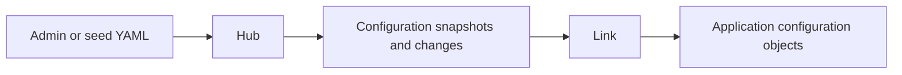

# Application Configuration

Vine configuration is declared in `.skel`, stored by Hub, distributed by Link, and provided to the application through dependency injection. Applications do not need to poll the configuration center themselves.

## Declare configuration

```skel title="config.skel"
config CheckoutConfig eternal {
    timeoutMs: int
    currency: string
}

config FeatureFlagsConfig instant {
    newCheckout: bool
}
```

- `eternal`: read when the application starts; suitable for connection settings and behavior determined at startup.
- `instant`: can be updated while the application is running; suitable for feature flags and dynamically adjustable business settings. Objects created for new executions read the updated value, while configuration already injected into existing objects does not change in place.

After you run `skelc gen go`, the generated configuration types are registered with Vine. Business objects can inject configuration just like any other dependency:

```go title="service.go"
type CheckoutService struct {
    Config *skeled.CheckoutConfig `inject:""`
}
```

## Provide initial values

Hub seed files use each configuration's fully qualified Skel name and encode its value as a JSON string:

```yaml title="seed.yaml"
appConfigs:
  - name: demo.checkout.CheckoutConfig
    value: '{"timeoutMs":3000,"currency":"CNY"}'
  - name: demo.checkout.FeatureFlagsConfig
    value: '{"newCheckout":true}'
```

A standalone application can import the file at startup:

```go title="main.go"
standalone.NewWithOption[*CheckoutApp](standalone.Option{
    SQLiteFile:   "./vine.sqlite",
    SeedYAMLFile: "./seed.yaml",
}).StartAndWait()
```

Field names and types must match the generated configuration schema. Linked and fully separated deployments use the same seed format; import the file with `vine hub serve --seed-yaml-file ./seed.yaml`.

## How configuration reaches an application



Standalone mode uses Hub and Link in the same process, but the configuration access model remains unchanged. In linked or fully separated deployments, Link connects to a remote Hub. If a configuration update fails, first verify the data in Hub, the connection between Link and Hub, and whether the configuration schema matches the generated code.

See [Skel Syntax](https://skel.yorun.ai/docs/syntax) for configuration syntax and [Hub](/docs/hub) for Hub startup and seed files.
