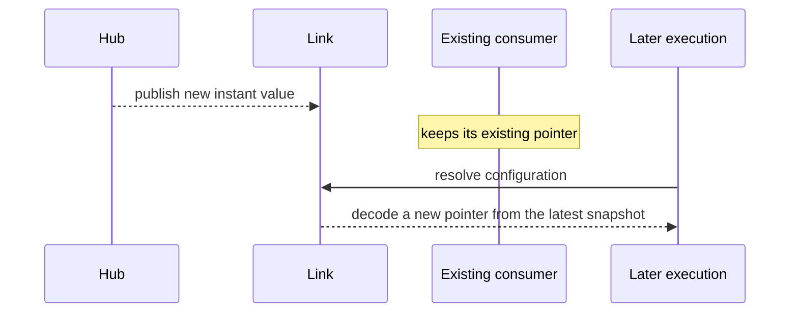
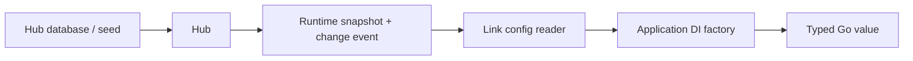

# Configuration

Vine configuration is declared in Skel, stored by Hub, distributed through
Link, and resolved as a typed Go dependency. Application code doesn't poll Hub
or decode configuration JSON itself.

The important design choice is not only the fields in a configuration. It is
also **when an application instance is allowed to observe a new value**.

## Declare typed configuration

```skel title="skel/domain.skel"
@desc("Checkout application")
domain demo.checkout
```

```skel title="skel/config.skel"
domain demo.checkout

config CheckoutConfig eternal {
    timeoutMs: int
    currency: string
}

config FeatureFlagsConfig instant {
    newCheckout: bool
}
```

Run the normal Skel check and generation workflow:

```bash
skelc check --skel-in ./skel
skelc gen go --skel-in ./skel --go-out ./skeled
```

The generated types register their Skel name, Go type, and lifecycle with Vine.
Inject them like any other dependency:

```go title="checkout_service.go"
type CheckoutService struct {
    Config *skeled.CheckoutConfig `inject:""`
}
```

Do not register generated configuration types by hand.

## String whitespace

Vine removes leading and trailing Unicode whitespace from configuration string
fields, including nullable strings, list elements, and string values in maps.
For example, `"  hello  world\n"` becomes `"hello  world"`; whitespace inside the
string is preserved. Null values, map keys, enums, and `json` content are unchanged.

This applies to both `eternal` and `instant` configuration. It affects the value
received by your application, not the value saved in Hub or shown in the Dashboard.
Marking a field `@sensitive` controls log redaction; it does not disable trimming.

## Choose the lifecycle

| Lifecycle | What Link retains | What application code observes | Good fit |
| --- | --- | --- | --- |
| `eternal` | The value captured when this application instance first reads the config | The same snapshot for the rest of that application instance | Connection settings, schema choices, startup policy |
| `instant` | A watched snapshot that changes when Hub publishes an update | A newly decoded value on a later DI resolution | Feature flags, limits, and behavior that may change at runtime |

Both lifecycles are lazy: the first read happens when DI first needs the
generated type. A module or component that injects the configuration is usually
constructed during application startup. A configuration used only by a request
handler may not be read until the first matching execution.

### Instant does not mutate an existing object

An instant update changes Link's snapshot. It doesn't modify a Go pointer that
was already injected:



This has a direct DI consequence:

- A normal Rpc, Web, Event, or Task handler is created for an execution. A
  configuration it injects is resolved for that execution and can observe the
  latest instant snapshot.
- A module and an application component are application-lifetime singletons.
  If one stores an instant configuration in a field, that pointer remains the
  value from construction time.
- Any explicitly singleton dependency that captures an instant configuration
  has the same behavior.

If a long-lived object must react to updates, keep the update-sensitive logic
in a newly created execution dependency or design an explicit refresh boundary.
Do not assume field injection is a live reference.

## Provide values

Hub seed files identify a configuration by its fully qualified Skel name. The
`value` field accepts a YAML mapping, which Hub converts to JSON; JSON encoded
as a YAML string remains supported:

```yaml title="seed.yaml"
appConfigs:
  - name: demo.checkout.CheckoutConfig
    value:
      timeoutMs: 3000
      currency: CNY
  - name: demo.checkout.FeatureFlagsConfig
    value:
      newCheckout: true
```

For standalone mode:

```go title="main.go"
standalone.NewWithOption[*CheckoutApp](standalone.Option{
    SQLiteFile:      "./hub.sqlite",
    SeedHubDataFile: "./seed.yaml",
}).StartAndWait()
```

`SQLiteFile` here is **Hub's database**. It doesn't configure a business
`infra/rdb` component. If the application also owns a relational database,
declare that database separately.

For an independently running Hub:

```bash
vine hub serve \
  --db-sqlite-file ./hub.sqlite \
  --seed-hub-data-file ./seed.yaml
```

The seed is imported into Hub's database, which remains the source of truth
after import. Without a database, Hub keeps the seed in memory and serves it
read-only.

## Deployment variables {#deployment-variables}

Seed variables let an application expose a small deployment configuration without
requiring operators to understand its internal domain configurations. The developer
decides which seed fields reference variables and leaves the rest fixed; one
variable can supply several configuration fields.

Deployment variables are available in Vine v0.17.0.

### Expose selected settings

For the checkout configuration above, expose the timeout and keep the currency
fixed in the application seed:

```yaml title="app/seed/hub.yaml"
appConfigs:
  - name: demo.checkout.CheckoutConfig
    value:
      timeoutMs: "${checkout.timeoutMs:3000}"
      currency: CNY
```

The deployment file only needs the exposed settings:

```yaml title="vars.yaml"
checkout:
  timeoutMs: 5000
```

The filename is your choice. Supply it with `--seed-hub-vars-file ./vars.yaml`,
`VINE_SEED_HUB_VARS_FILE`, or `standalone.Option.SeedHubVarsFile`.
Application code still receives `CheckoutConfig` with the resolved values; it
does not need to read this file or interpret placeholders.

### Declare the variable schema

An application can declare the deployment dictionary as the Skel data type
`app.Vars`, with nested data types:

```skel title="app/skel/vars.skel"
domain app

data Vars {
    checkout: CheckoutVars
}

data CheckoutVars {
    timeoutMs: int
}
```

Generate and import its Go package with the normal Skel workflow. Importing the
generated package registers the schema, so standalone Hub can validate referenced
variables. An independently running Hub only uses schemas registered in its own
process. Without a registered `app.Vars`, placeholder lookup still works, but
referenced values are not type-checked.

### Substitution rules

- Paths use camelCase segments separated by dots: `${database.host}` reads
  `database.host` from the YAML dictionary.
- `${database.port:5432}` uses the default only when the key is missing.
  An explicit `null`, empty string, `0`, or `false` is passed to validation at
  its use site; it does not select the default.
- A whole-field reference can supply a scalar, object, or list. A reference
  inside text, such as `"https://${host}/api"`, performs string interpolation.
- Registered variable schemas check referenced values. Registered configuration
  schemas also validate whole-object substitutions: required keys must be present,
  and extra object keys are ignored. Unused dictionary values are not required.
- Inserted values are not parsed again for placeholders.
- A missing variable without a default fails seed initialization with an error
  such as `variable "database.host" is missing and has no default`.

No variables means no vars file is needed. The file can also be omitted when all
referenced variables have defaults.

### Initialization and later changes

Hub resolves the seed before storing the final configuration. This is an
initialization step, not a live binding to the variable file.

| Hub storage | When variables take effect | How to change deployed values |
| --- | --- | --- |
| Default no-db mode | Every start, into a fresh in-memory store | Edit `vars.yaml` and restart; Dashboard configuration is read-only |
| SQLite or PostgreSQL | The first seed initialization, recorded in database metadata | Update configuration through Hub; later starts skip seed, source, and vars files entirely |

Field source records retain `source`, `define`, and `override`, together with the
original template, the variable values used, and whether defaults were selected.
Dashboard shows these in configuration comments or field information tooltips.
The optional seed source map adds origin information; it does not supply variable
values. See [standalone packaging](../getting-started/deployment-modes.md#deployment-configuration)
for distributing a binary with a deployment configuration file.

## How a value reaches an execution



1. Hub stores the configured JSON and publishes the runtime representation.
2. Link loads the value. For instant configuration, it also subscribes when the
   value is first referenced.
3. Vine's DI binding asks Link for the snapshot and decodes it into a new
   generated Go value.
4. The consumer receives that value through field or factory injection.

Standalone follows the same steps through in-process connections.

## Failure behavior

Resolving a configuration is a strict operation:

- The generated configuration must be registered in the process.
- Hub and Link must have a non-empty value for its fully qualified Skel name.
- The JSON must decode into the generated Go type.

If any of these conditions is not met, resolution fails rather than silently
returning a zero-value configuration. Where the failure appears depends on the
first consumer: a module can fail application startup, while a handler-only
configuration can first fail during a request.

When diagnosing a missing value:

1. Confirm the generated package is imported by the application.
2. Confirm the fully qualified name and JSON field names in Hub.
3. Confirm the application's Link can reach Hub's API and Redis distribution
   endpoint.
4. Confirm the deployed generated schema and configuration value were released
   together.
5. For instant configuration, create a new execution before concluding that an
   already injected singleton should have changed.

## Design guidance

- Use `eternal` when changing the value without recreating the application
  would leave resources or invariants inconsistent.
- Use `instant` only when each new execution can safely choose behavior from a
  newer snapshot.
- Keep configuration values declarative. Do not use a value update as an
  imperative job trigger; use a Task for that.
- Make related fields backward-compatible during a rolling deployment, because
  different application versions can temporarily read the same Hub value.
- Keep credentials and private keys inside the current trusted-runtime network
  boundary. Review the [production readiness checklist](../operations/production-readiness.md)
  before distributing sensitive values.

See the [Skel configuration syntax](https://skel.yorun.ai/docs/syntax) for
language rules and [Dependency injection](./di.md) for binding and scope
details.
