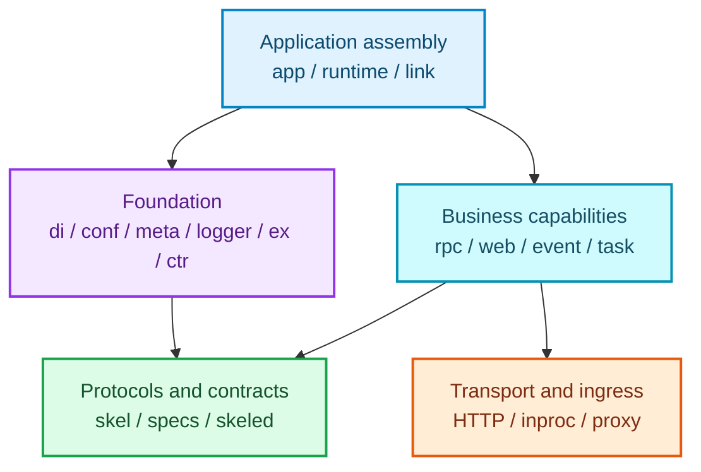

# Framework Architecture Reference

This page explains how Vine's application assembly, dependency injection, configuration, context, request execution, and message delivery capabilities work together. Package paths help locate each capability; everyday business development does not need to depend on these internal packages directly.

> Business code should prefer public packages such as `app`, `core/rpc`, `core/web`, `core/event`, `core/task`, and `core/skel`. Consult this internal capability map only when you need to understand advanced behavior or troubleshoot a problem.

## Application and runtime

| Package | Responsibility | Main collaborators |
| --- | --- | --- |
| `internal/core/app` | Defines the endpoints, muted implementations, and application-side Skel contracts required by the application runtime; lifecycle assembly lives in `internal/app`. | `runtime`, `link`, `app/skeled` |
| `internal/core/app/skeled` | Skel-generated internal application data models, schemas, and service definitions. | `app`, `skel`, Rpc |
| `internal/core/runtime` | Represents the identity, build information, Go runtime environment, and diagnostic data of a running application. | `app`, `meta`, `logger` |
| `internal/core/link` | Defines the `Linker` abstraction required when an application connects to Link, exposing Rpc proxy, Event, Task, and other endpoints to the application runtime. | `app`, Link daemon, Rpc/Event/Task |
| `internal/core/link/ingressinproc` | Registers and resolves in-process Link ingress handlers, allowing standalone and linked modes to bypass network transport. | `link`, Portal, Web/Rpc forwarding |
| `internal/core/link/skeled` | Generated data, schemas, and service definitions for Link's internal protocol, including application registration and capability declarations. | Link daemon, `link`, `skel` |

## Application foundation

| Package | Responsibility | Main collaborators |
| --- | --- | --- |
| `internal/core/di` | Dependency injection container supporting bindings, scopes, field injection, method invocation, execution child injectors, and seeds. | `app`, `ctr`, all capabilities |
| `internal/core/ctr` | Method execution container with a filter chain; organizes arguments, DI, and results within one execution. | `di`, Rpc/Web/Event/Task executors |
| `internal/core/conf` | Registers configuration types, reads configuration, and obtains typed configuration snapshots. | `app`, Link configuration subscriptions |
| `internal/core/meta` | Application identity, trace, initiator, actor, and contexts carrying this metadata. | Rpc/Web/Event/Task, `runtime` |
| `internal/core/logger` | Framework logger based on `slog`, including global options, standard-library log bridging, and call-site handling. | All runtime packages |
| `internal/core/redact` | Architecture-independent sensitive-field masking, bounded JSON-safe projection, and binary summaries. Its public entry point is `core/redact`. | Rpc/Event/Task logs, application diagnostics |
| `internal/core/ex` | Unified error codes, error objects, and recognizable exception semantics. | Boundaries, Rpc/Web/Event/Task |

## Rpc

| Package | Responsibility | Main collaborators |
| --- | --- | --- |
| `internal/core/rpc/spec` | Core Rpc contracts: service and method registration, requests and responses, handlers, contexts, argument validation, and in-process endpoint definitions. | Rpc client/server, generated code |
| `internal/core/rpc/client` | Creates clients, organizes call arguments, selects an invoker, and initiates Rpc requests. | `rpc/spec`, Link Rpc proxy |
| `internal/core/rpc/server` | Maps Rpc handlers to HTTP handlers and provides direct or `ctr`-container-based executors. | `rpc/spec`, `ctr`, `di` |
| `internal/core/rpc/transport/http` | Rpc HTTP encoding, decoding, and round-trip implementation. | `rpc/client`, `rpc/server` |
| `internal/core/rpc/transport/inproc` | In-process Rpc endpoint registry and round-trip implementation. | standalone/linked runtime, `rpc/spec` |
| `internal/core/rpc/log` | Configuration, recording, and muted implementations for Rpc call logs. | `rpc/client`, `rpc/server`, `logger` |

## Web

| Package | Responsibility | Main collaborators |
| --- | --- | --- |
| `internal/core/web/spec` | Contracts for Web handlers, routes, request contexts, request models, and registries. | Web server, application Webber |
| `internal/core/web/server` | Executes routes and handlers based on `web/spec`, mapping requests into execution contexts. | `ctr`, `di`, `web/spec` |
| `internal/core/web/inproc` | Registers and accesses in-process Web endpoints. | standalone/linked runtime, Portal forwarding |
| `internal/core/web/proxy` | Reverse-proxy utilities that forward Web requests to target endpoints. | Link, Portal, Web gateway |
| `internal/core/web/assets` | Embedded asset archives, static asset serving, and archive access. | Hub Dashboard, Web server |

## Event

| Package | Responsibility | Main collaborators |
| --- | --- | --- |
| `internal/core/event/spec` | Event messages, listener declarations, contexts, implementation types, and registries. | Event emitter/server, generated code |
| `internal/core/event` | Creates emitters, receives messages, and invokes local listeners through an executor. | `event/spec`, `ctr`, Link/NATS |
| `internal/core/event/log` | Logs Event delivery and processing. | `event`, `logger` |

## Task

| Package | Responsibility | Main collaborators |
| --- | --- | --- |
| `internal/core/task/spec` | Task messages, runner declarations, trigger information, contexts, implementation types, and registries. | Task launcher/server, generated code |
| `internal/core/task` | Creates launchers, receives Tasks, and runs local Task runners through an executor. | `task/spec`, `ctr`, Link/NATS |
| `internal/core/task/log` | Logs Task delivery, execution, and failures. | `task`, `logger` |

## Contracts and code generation

| Package | Responsibility | Main collaborators |
| --- | --- | --- |
| `internal/core/skel` | Skel runtime scalar types, schema registration, actor/auth helpers, generated-code identifiers, and minimum compiler version constraints. | All `skeled` packages, Rpc/Web/Event/Task |

## Suggested reading path

1. Start with [App](/docs/app), [Dependency Injection](/docs/di), [Execution Container](/docs/ctr), and [Context Metadata](/docs/meta) to understand how an application processes one request.
2. Continue with the Rpc, Web, Event, or Task capability guide as needed.
3. Read [Link](/docs/link), [Hub](/docs/hub), and [Portal](/docs/portal) to understand how services collaborate in a multi-process deployment.
