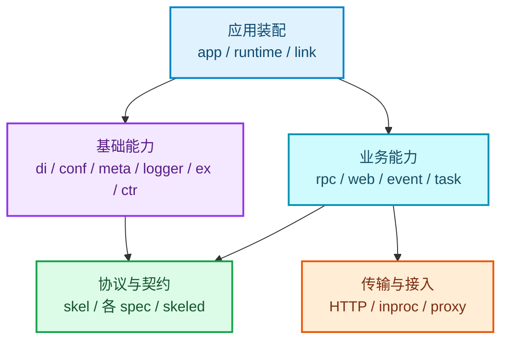

# 框架架构参考

本页帮助你理解 Vine 的应用装配、依赖注入、配置、上下文、请求执行和消息投递如何协作。包路径用于定位对应能力；日常业务开发不需要直接依赖这些内部包。

> 业务代码应优先使用顶层 `app`、`core/rpc`、`core/web`、`core/event`、`core/task`、`core/skel` 等公开包。只有在需要理解高级行为或排查问题时，再参考本页的内部能力映射。

## 应用与运行

| 包 | 职责 | 主要协作对象 |
| --- | --- | --- |
| `internal/core/app` | 定义应用运行时需要的 endpoint、静默实现和应用侧 skel 契约；具体的生命周期装配在 `internal/app`。 | `runtime`、`link`、`app/skeled` |
| `internal/core/app/skeled` | 由 skel 生成的应用内部数据模型、schema 与服务定义。 | `app`、`skel`、Rpc |
| `internal/core/runtime` | 表示运行中的应用身份、构建信息、Go 运行环境与诊断信息。 | `app`、`meta`、`logger` |
| `internal/core/link` | 定义应用连接 Link 时需要的 `Linker` 抽象，向应用运行时提供 Rpc proxy、Event、Task 等 endpoint。 | `app`、Link daemon、Rpc/Event/Task |
| `internal/core/link/ingressinproc` | 注册和查找进程内 Link ingress handler，使 standalone / linked 模式可绕过网络连接。 | `link`、Portal、Web/Rpc 转发 |
| `internal/core/link/skeled` | Link 内部协议的生成数据、schema 与服务定义，例如应用注册和能力声明。 | Link daemon、`link`、`skel` |

## 应用基础能力

| 包 | 职责 | 主要协作对象 |
| --- | --- | --- |
| `internal/core/di` | 依赖注入容器：绑定、scope、字段注入、方法调用、execution 子 injector 与 seed。 | `app`、`ctr`、所有 capability |
| `internal/core/ctr` | 带 filter 链的方法执行容器；在一次 execution 中组织参数、DI 和执行结果。 | `di`、Rpc/Web/Event/Task executor |
| `internal/core/conf` | 配置类型注册、配置读取和按类型获取配置快照。 | `app`、Link 配置订阅 |
| `internal/core/meta` | 应用身份、trace、initiator、actor 与带元信息的 context。 | Rpc/Web/Event/Task、`runtime` |
| `internal/core/logger` | 基于 `slog` 的框架日志器、全局选项、标准库日志桥接和调用位置。 | 所有 runtime 包 |
| `internal/core/redact` | 与框架架构无关的敏感字段遮蔽、有界 JSON 安全投影和二进制摘要。公开入口为 `core/redact`。 | Rpc/Event/Task 日志、业务诊断代码 |
| `internal/core/ex` | 统一错误码、错误对象和可识别的异常语义。 | 边界层、Rpc/Web/Event/Task |

## Rpc

| 包 | 职责 | 主要协作对象 |
| --- | --- | --- |
| `internal/core/rpc/spec` | Rpc 的核心契约：服务/方法注册、请求响应、handler、上下文、参数校验及 inproc endpoint 定义。 | Rpc client/server、生成代码 |
| `internal/core/rpc/client` | 创建 client、组织调用参数、选择 invoker 并发起 Rpc 请求。 | `rpc/spec`、Link Rpc proxy |
| `internal/core/rpc/server` | 将 Rpc handler 映射为 HTTP handler；提供直接执行或经 `ctr` 容器执行的 executor。 | `rpc/spec`、`ctr`、`di` |
| `internal/core/rpc/transport/http` | Rpc 的 HTTP 编解码与 round-trip 实现。 | `rpc/client`、`rpc/server` |
| `internal/core/rpc/transport/inproc` | 进程内 Rpc endpoint 注册表和 round-trip 实现。 | standalone / linked runtime、`rpc/spec` |
| `internal/core/rpc/log` | Rpc 调用日志的设置、记录和静默实现。 | `rpc/client`、`rpc/server`、`logger` |

## Web

| 包 | 职责 | 主要协作对象 |
| --- | --- | --- |
| `internal/core/web/spec` | Web handler、路由、请求上下文、请求模型和注册表契约。 | Web server、应用 Webber |
| `internal/core/web/server` | 基于 `web/spec` 执行路由和 handler，并将请求映射到执行上下文。 | `ctr`、`di`、`web/spec` |
| `internal/core/web/inproc` | 进程内 Web endpoint 的注册与访问。 | standalone / linked runtime、Portal 转发 |
| `internal/core/web/proxy` | 反向代理工具，用于将 Web 请求转发到目标 endpoint。 | Link、Portal、Web gateway |
| `internal/core/web/assets` | 嵌入资源归档、静态资源服务与 archive 读取。 | Hub Dashboard、Web server |

## Event

| 包 | 职责 | 主要协作对象 |
| --- | --- | --- |
| `internal/core/event/spec` | 事件消息、监听声明、上下文、实现类型与注册表。 | Event emitter/server、生成代码 |
| `internal/core/event` | 创建 emitter、接收消息并通过 executor 调用本地监听器。 | `event/spec`、`ctr`、Link/NATS |
| `internal/core/event/log` | 事件投递与处理过程的日志记录和静默实现。 | `event`、`logger` |

## Task

| 包 | 职责 | 主要协作对象 |
| --- | --- | --- |
| `internal/core/task/spec` | 任务消息、runner 声明、触发信息、上下文、实现类型和注册表。 | Task launcher/server、生成代码 |
| `internal/core/task` | 创建 launcher、接收任务并通过 executor 运行本地 task runner。 | `task/spec`、`ctr`、Link/NATS |
| `internal/core/task/log` | 任务投递、运行和失败处理的日志记录与静默实现。 | `task`、`logger` |

## 契约与代码生成

| 包 | 职责 | 主要协作对象 |
| --- | --- | --- |
| `internal/core/skel` | skel 运行时的标量类型、schema 注册、actor/auth 辅助、生成代码标识与最低编译器版本约束。 | 所有 `skeled`、Rpc/Web/Event/Task |

## 阅读路径

1. 从 [App](/docs/app)、[依赖注入](/docs/di)、[执行容器](/docs/ctr) 和 [上下文元信息](/docs/meta) 开始，了解应用如何处理一次请求。
2. 按需要继续阅读 [Rpc](/docs/rpc)、Web、Event 或 Task 的能力说明。
3. 阅读 [Link](/docs/link)、[Hub](/docs/hub) 和 [Portal](/docs/portal)，了解多进程部署时各服务如何协作。
