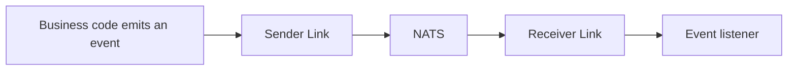
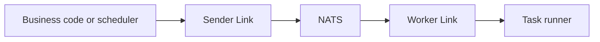

# Events and Tasks

Use an Event to publish a fact that has already happened. Use a Task to ask an application to perform work. Both use type-safe contracts defined in `.skel`, and Link delivers them through the messaging system.

An application that consumes Events or runs Tasks first enables the corresponding capabilities:

```go title="app.go"
type DemoApp struct {
    app.Application
    app.EventerEnabled
    app.TaskerEnabled
}
```

## Event

```skel title="event.skel"
pub event UserCreatedEvent {
    payload {
        userId: uuid
    }
}
```

Generated code provides emitter and listener interfaces. An application registers listeners through `EventerInitListeners` and can configure timeout, concurrency, and failure retry policies.

```go title="event.go"
type UserCreatedListener struct {
    skeled.DefaultUserCreatedEventListener
}

func (*UserCreatedListener) OnUserCreated(event *skeled.UserCreatedEvent) {
    // Update a read model or send a notification
}

func (*DemoApp) EventerInitListeners(add app.ListenerTypeAdder) {
    add(
        app.T[*UserCreatedListener](),
        app.WithListenerConcurrency(4),
    )
}
```

The sender can inject the generated emitter and call its type-safe method:

```go title="service.go"
type UserService struct {
    Events skeled.UserCreatedEventEmitter `inject:""`
}

func (s *UserService) Publish(userId skel.UUID) {
    s.Events.EmitUserCreated(&skeled.UserCreatedEvent{UserId: userId})
}
```



## Task

```skel title="task.skel"
task RebuildIndexTask {
    trigger manually {}
    trigger nightly {}
}
```

Generated code provides launcher and runner interfaces. An application registers runners through `TaskerInitRunners`; use `WithRunnerCronScheduler` to add a Cron schedule for a trigger.

```go title="task.go"
type RebuildIndexRunner struct {
    skeled.DefaultRebuildIndexTaskRunner
}

func (*RebuildIndexRunner) RunManually() {
    // Rebuild the index
}

func (*RebuildIndexRunner) RunNightly() {
    // Rebuild the index
}

func (*DemoApp) TaskerInitRunners(add app.RunnerTypeAdder) {
    add(
        app.T[*RebuildIndexRunner](),
        app.WithRunnerCronScheduler("nightly", "0 2 * * *"),
    )
}
```

Inject the generated launcher when a Task must be triggered immediately:

```go title="service.go"
type MaintenanceService struct {
    Tasks skeled.RebuildIndexTaskLauncher `inject:""`
}

func (s *MaintenanceService) RebuildNow() {
    s.Tasks.LaunchManually()
}
```



Events and Tasks both carry trace, initiating application, and Actor context. Whether an error thrown by a listener or runner is retried depends on its registration options. Enable retries cautiously for non-idempotent operations.

See [Skel Syntax](https://skel.yorun.ai/docs/syntax) for the complete syntax and [Link](/docs/link) for Link's delivery responsibilities.
