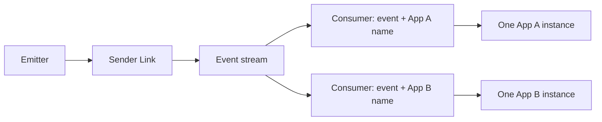
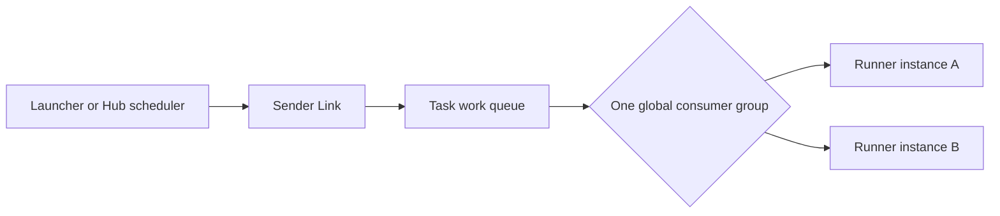

# Events & Tasks

Use an Event to publish a fact that has already happened. Use a Task to request
work that one runner should perform. Both are type-safe `.skel` contracts, but
their recipient selection is intentionally different.

## Event or Task?

| Question | Event | Task |
| --- | --- | --- |
| What does it mean? | “User 42 was created.” | “Rebuild index 42.” |
| How many logical recipients? | One delivery for every distinct listening App name | One delivery to one runner globally |
| How do multiple instances behave? | Instances with the same App name compete for that App's copy | All registered instances compete for the one task |
| Does the sender wait for business work? | No; it waits for the message to be accepted | No; it waits for the message to be accepted |
| Typical design | Notifications, projections, integration facts | Background work, scheduled maintenance, jobs |

An Event is not a broadcast to every process. A Task is not addressed to the
App that launched it. Choose based on these delivery groups, not only on the
method name.

## Enable the Capabilities

An App that listens for Events or runs Tasks embeds the corresponding enabled
types:

```go title="app.go"
type DemoApp struct {
    app.Application
    app.EventerEnabled
    app.TaskerEnabled
}

func (*DemoApp) Name() string {
    return "demo.async"
}
```

The embedded types provide no-op defaults. Override only the registration and
binding methods that the App needs.

## Define and Generate the Contracts

This contract includes business identifiers that consumers can use for
idempotency:

```skel title="skel/async.skel"
domain demo.async

pub event UserCreatedEvent {
    payload {
        eventId: uuid
        userId: uuid
    }
}

task RebuildIndexTask {
    trigger manually {
        input {
            jobId: uuid
        }
    }

    trigger nightly {}
}
```

```bash
skelc check --skel-in ./skel
skelc gen go --skel-in ./skel --go-out ./skeled
```

Generated code provides an emitter/listener pair for the Event and a
launcher/runner pair for the Task. Do not edit generated files.

## Publish an Event

### Register a Listener

Embed the generated default listener and implement its method:

```go title="event.go"
type UserCreatedListener struct {
    skeled.DefaultUserCreatedEventListener
}

func (*UserCreatedListener) OnUserCreated(event *skeled.UserCreatedEvent) {
    // Use event.EventId as the idempotency key before applying side effects.
    // Update a read model or send a notification.
}

func (*DemoApp) EventerInitListeners(add app.ListenerTypeAdder) {
    add(
        app.T[*UserCreatedListener](),
        app.WithListenerTimeout(20*time.Second),
        app.WithListenerConcurrency(4),
    )
}
```

Without options, one registered listener uses a 30-second attempt timeout,
allows 10 concurrent executions, and retries failures.

### Emit From Business Code

Inject the generated emitter. The method returns after Link has accepted and
published the message, not after listeners finish:

```go title="service.go"
type UserService struct {
    Events skeled.UserCreatedEventEmitter `inject:""`
}

func (s *UserService) Publish(eventId skel.UUID, userId skel.UUID) {
    s.Events.EmitUserCreated(&skeled.UserCreatedEvent{
        EventId: eventId,
        UserId:  userId,
    })
}
```



### How Event Recipients Are Selected

Vine forms an Event consumer identity from the Event's Skel name and the
listener App name:

- Two different App names each receive their own copy.
- Two instances with the same App name compete for that App's copy.
- A retry may run on a different instance with the same App name.
- Concurrency and retries mean handlers must not depend on global ordering.
- Events are not a replayable audit log. Do not assume a listener that appears
  later receives facts published before matching consumer interest existed.

Use distinct App names when two logical consumers must each observe the Event.
Use the same App name for horizontally scaled instances of one logical
consumer.

## Launch a Task

### Register a Runner

Embed the generated default runner. A Cron schedule may only target a no-input
trigger, so `nightly` is schedulable while `manually` is not:

```go title="task.go"
type RebuildIndexRunner struct {
    skeled.DefaultRebuildIndexTaskRunner
}

func (*RebuildIndexRunner) RunManually(jobId skel.UUID) {
    // Use jobId as the idempotency key before rebuilding.
}

func (*RebuildIndexRunner) RunNightly() {
    // Use a stable business key for this scheduled occurrence.
}

func (*DemoApp) TaskerInitRunners(add app.RunnerTypeAdder) {
    add(
        app.T[*RebuildIndexRunner](),
        app.WithRunnerTimeout(10*time.Minute),
        app.WithRunnerConcurrency(2),
        app.WithRunnerCronScheduler("nightly", "0 2 * * *"),
    )
}
```

Without options, one registered runner uses a 30-second attempt timeout,
allows 10 concurrent executions, and retries failures.

### Launch From Business Code

Inject the generated launcher for an immediate Task:

```go title="service.go"
type MaintenanceService struct {
    Tasks skeled.RebuildIndexTaskLauncher `inject:""`
}

func (s *MaintenanceService) RebuildNow(jobId skel.UUID) {
    s.Tasks.LaunchManually(jobId)
}
```



### How Task Runners Are Selected

Vine forms one consumer identity from the Task's Skel name. All Links and all
App instances registered for that Task compete in the same logical work queue:

- One message is dispatched to one selected runner.
- The launching App does not choose a target App or instance.
- Within one Link, available local instances are used round-robin.
- A retry can run on another App, Link, or instance.
- Task execution has no synchronous result channel back to the launcher.

If two teams need independent work for the same business occurrence, define
two Tasks or launch two explicit jobs. Registering two App names for one Task
does not create two copies.

## Delivery Defaults and Boundaries

| Behavior | Event listener | Task runner |
| --- | --- | --- |
| Attempt timeout | 30 seconds | 30 seconds |
| Concurrency | 10 per registered instance | 10 per registered instance |
| Success | Ack after the handler returns successfully | Ack after the runner returns successfully |
| Failure by default | Negative acknowledgment and retry | Negative acknowledgment and retry |
| Retry limit | No Vine delivery-count limit while the stream exists | No Vine delivery-count limit while the stream exists |
| `NoRetry` | Terminal acknowledgment; no retry | Terminal acknowledgment; no retry |
| Dead-letter queue | None | None |
| Message storage | In-memory stream | In-memory stream |

Configure these values at registration:

```go
app.WithListenerTimeout(20*time.Second)
app.WithListenerConcurrency(4)
app.WithListenerNoRetry()

app.WithRunnerTimeout(10*time.Minute)
app.WithRunnerConcurrency(2)
app.WithRunnerNoRetry()
```

`NoRetry` means “finish this message after the first failed attempt.” It does
not move the message to a dead-letter queue and does not create a failure
record that the sender can query.

The streams currently use memory storage. Successful publication protects
against an individual handler failure, but it is not a disk-durability
guarantee across messaging-runtime restarts. Use a database-backed outbox,
durable external workflow system, or another persisted record when loss across
runtime restart is unacceptable.

## At-Least-Once Requires Idempotency

Default Event and Task processing is at-least-once. The same business message
can execute more than once after:

- a listener or runner error;
- an attempt timeout;
- loss of an acknowledgment;
- reconnect or consumer reassignment.

Vine does not add a public delivery ID to the generated payload. Put a stable
business ID such as `eventId` or `jobId` in the contract, then make the side
effect idempotent. Common approaches are:

- a database unique constraint on the business ID;
- an atomic “record processed + apply state transition” transaction;
- idempotent upserts;
- calling an external API with its idempotency-key feature.

Do not mark a non-idempotent operation `NoRetry` merely to avoid duplicates:
that trades duplicate risk for silent loss after the first failure. Decide
which outcome the business can reconcile, and keep an auditable business
record when necessary.

## Timeout Does Not Mean Execution Stopped

The registration timeout bounds how long Link waits for one attempt. The
listener or runner receives a context with that deadline and should stop work
when it is canceled.

If business code ignores cancellation, Link can time out, mark the attempt as
failed, and redeliver while the original handler is still running. This is true
in network deployments and intentionally remains caller-visible in standalone
in-process transport. Two attempts can therefore overlap.

Consequences:

- Check the injected context during long loops and before irreversible work.
- Make every retried side effect idempotent.
- Set timeout longer than normal execution latency, but keep it bounded.
- Treat concurrency as the number of attempts, not necessarily the number of
  distinct business messages.

## Metadata and Context Propagation

Event and Task messages do not carry the full synchronous request context:

| Metadata | Event | Task |
| --- | --- | --- |
| Trace id/span | Propagated | Propagated |
| Sending App identity | Available as `Emitter()` | Available as `Launcher()` |
| Publish time | Available as `EmittedAt()` | Available as `LaunchedAt()` |
| Actor | Not propagated; listener/runner sees an absent Actor | Not propagated; listener/runner sees an absent Actor |
| Initiator | Not propagated | Not propagated |
| Sender deadline/cancellation | Not propagated | Not propagated |

Each delivery gets a fresh deadline from its listener or runner registration.
If authorization or tenant identity is required for asynchronous work, put the
minimum immutable identity data needed by the consumer in the contract,
validate it again, and avoid copying credentials or secrets into the payload.

## Cron Scheduling

`WithRunnerCronScheduler` uses a standard five-field Cron expression:

```text
minute hour day-of-month month day-of-week
0      2    *            *     *
```

Important boundaries:

- The trigger must have no input arguments.
- The string passed to the option is the trigger's Skel name, such as
  `"nightly"`, not its generated Go method name.
- Equivalent declarations from replicas with the same App name are
  deduplicated by Hub. Different App names create distinct schedules, even if
  their Cron expressions match; both publications enter the same global Task
  queue.
- A scheduled publication only proceeds while a matching runner is active.
- The scheduler uses the Hub process's clock and default local timezone.
- Vine does not promise catch-up or backfill for schedules missed while Hub,
  its scheduler, or the messaging runtime was unavailable.
- The resulting message enters the same global Task work queue and has the same
  retry/idempotency requirements as a manually launched Task.

For business schedules that require calendars, explicit timezone governance,
misfire policies, history, or operator-controlled replay, use a dedicated
scheduler/workflow system and launch a Vine Task from it.

## Production Checklist

Before relying on an Event or Task:

- Include a stable business identifier in the contract.
- Confirm whether recipients should be per App name or globally competing.
- Choose timeout and concurrency from measured workload behavior.
- Verify handlers observe context cancellation.
- Decide how duplicates and first-attempt terminal failures are reconciled.
- Do not assume a DLQ, result query, ordering, replay history, or disk
  persistence.
- Test a forced failure, timeout, duplicate delivery, and graceful shutdown.

See [Request Routing & Readiness](../runtime/request-routing.md) for registration and
drain behavior, [Trace & Timeout](./trace-timeout.md) for synchronous context
rules, and [Skel Syntax](https://skel.yorun.ai/docs/syntax) for the contract
language.
