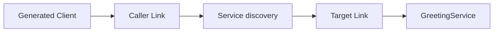

# Rpc Services

The usual Vine Rpc workflow is to declare a service in Skel, generate its interfaces with skelc, implement the server, and register the handler in an App. Business code normally doesn't need to construct a low-level `ServiceSpec` manually.

This guide continues the flat workspace used by the first-application and
first-contract tutorials. In the [standard project
structure](../getting-started/filetree.md), run Skel commands from the project
root and Go commands from `src/server/`.

## Define and generate

```skel title="greeting.skel"
pub service GreetingService {
    noauth
    method hello {
        input { name: string }
        output Greeting
    }
}
```

```bash
skelc check --skel-in ./skel
skelc gen go --skel-in ./skel --go-out ./skeled
```

## Implement the service

Generated code provides a Server interface and default implementation. Embed the default implementation and implement the methods you need:

```go title="service.go"
type GreetingService struct {
    skeled.DefaultGreetingServiceServer
}

func (*GreetingService) Hello(name string) skeled.Greeting {
    return skeled.Greeting{Message: "Hello, " + name}
}
```

## Register it with the application

```go title="app.go"
type GreetingApp struct {
    app.Application
    app.ServicerEnabled
}

func (*GreetingApp) Name() string {
    return "demo.greeting"
}

func (*GreetingApp) ServicerInitHandlers(add app.TypeAdder) {
    add(app.T[*GreetingService]())
}
```

## Make the first call

Generated clients can be injected directly into a handler or module. The module below calls the service you just registered after the application has finished starting:

```go title="main.go"
type GreetingProbe struct {
    app.BaseModule
    Client skeled.GreetingServiceClient `inject:""`
}

func (m *GreetingProbe) AfterAppStart() {
    greeting := m.Client.Hello("Vine")
    logger.Info("greeting received", "message", greeting.Message)
}

func (*GreetingApp) InitModules(add app.TypeAdder) {
    add(app.T[*GreetingProbe]())
}

func main() {
    standalone.NewWithOption[*GreetingApp](standalone.Option{
        SQLiteFile: "./vine.sqlite",
    }).StartAndWait()
}
```

After running `go run .`, the logs contain `message="Hello, Vine"`. Because
this call starts in a module rather than an incoming request, Vine creates a new
trace, identifies `GreetingApp` as the client application, and sends an absent
Actor. A client injected into an Rpc, Web, Event, or Task execution instead
inherits that execution's trace, initiator, and Actor. Link handles discovery
and forwarding in both cases; standalone selects an in-process endpoint.



See the [Rpc Reference](../infrastructure/rpc.md) for timeout, error-return, and low-level client/server options.
