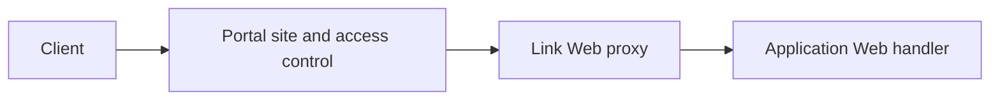

# Web Apps

The Web capability registers HTTP routes, static assets, or a development-server proxy for an application. `.skel` declares the Web name and Actors allowed to access it, while Go handlers define the actual routes.

## Declare an entry point

```skel title="web.skel"
web UserPortalWeb {
    for ClientActor via client
}
```

Add `mount /path` when the frontend needs a fixed public prefix. Portal then matches
and forwards that prefix instead of the prefixes configured on the site's rules, and
the handler's routes stay relative to it, so `router.GET("/health", ...)` answers
`/console/health` when the Web declares `mount /console`. See
[Portal](../runtime/portal.md#entry-path-mapping) for the routing behavior and the
[Skel syntax reference](https://skel.yorun.ai/docs/actors-and-access) for the
declaration.

After generating code, implement the corresponding Web server and register routes in `Routes`:

```go title="web.go"
type UserPortal struct {
    skeled.DefaultUserPortalWebServer
    Context *gin.Context `inject:""`
}

func (h *UserPortal) Routes(router *web.Router) {
    router.GET("/health", h.Health)
}

func (h *UserPortal) Health() {
    h.Context.JSON(200, map[string]string{"status": "ok"})
}
```

Group related routes with `router.SubRouter("/orders")`. `BasePath()` returns the
accumulated path within the Web: the root router returns the Web's mount path, or
`"/"` when the Web declares none, then the orders router returns `"/orders"` and
its `SubRouter("/:id")` returns `"/orders/:id"`. Entry prefixes stripped before
forwarding are not included, so this value alone does not reconstruct an external
URL.

Enable the Web capability and register the handler in the application:

```go title="app.go"
type DemoApp struct {
    app.Application
    app.WebberEnabled
}

func (*DemoApp) WebberInitHandlers(add app.TypeAdder) {
    add(app.T[*UserPortal]())
}
```

Vine registers the Web capability with Link, and Portal discovers the endpoint from its site rules and forwards external requests.

## Request path



A handler reads the path from its own mount onward, so a request for
`/console/orders` reaches a Web that declares `mount /console` as
`/console/orders`, and the routes you register resolve against that same path.

Standalone mode uses the same matching and forwarding behavior, but its endpoint is an in-process connection.

### Static assets

Embed `web.AssetsServer` by value in the Web handler, set its accessor in
`DIInit`, and delegate `Routes` to `AssetsServer.Routes`:

```go title="assets.go"
//go:embed dist
var assetsFS embed.FS

type UserPortal struct {
    skeled.DefaultUserPortalWebServer
    web.AssetsServer
}

func (h *UserPortal) DIInit() {
    h.AssetsServer.SetAccessor(web.NewEmbedAssetsAccessor(assetsFS, "dist"))
}

func (h *UserPortal) Routes(router *web.Router) {
    h.AssetsServer.Routes(router)
}
```

Embed the server anonymously and by value: `Serve` must belong to the registered
handler type, and a named field or a pointer embedding panics when the handler is
registered. The accessor arrives through `DIInit`.

`AssetsServer.Routes` answers the mount root as well as every path below it, so a
request for the mount itself serves the index rather than redirecting to the path
the application keeps inside. The `*path` parameter holds the part below the mount,
and a Web without a mount path serves from the root.

### Development server

A development build can serve the Web from the frontend's own development server
instead of embedded assets. Embed `web.DevProxyServer` by value in the handler,
point it at the state file the development server writes, and delegate `Routes`:

```go title="dev.go"
type UserPortal struct {
    skeled.DefaultUserPortalWebServer
    web.DevProxyServer
}

func (h *UserPortal) DIInit() {
    h.DevProxyServer.SetStateFile("./dev-server.json")
}

func (h *UserPortal) Routes(router *web.Router) {
    h.DevProxyServer.Routes(router)
}
```

The state file carries the `host` and `port` the development server listens on,
as JSON; an empty host means the machine the application runs on. The path is your
choice, and the process that starts the frontend must write the same file. The
file is re-read at most once a second, so a frontend that restarts on another port
is followed without restarting the application. A state file that cannot be read
keeps the development server already followed, and a request the development
server does not answer is reported as `502`, because the Web has no content of its
own to serve. The path the Web received reaches the development server with the
escaping the client sent.

For a backend that is not a development server, register a route that forwards the
request itself.

See [Portal](../runtime/portal.md) for Portal configuration and [Skel Syntax](https://skel.yorun.ai/docs/syntax) for Actor and Web syntax.
