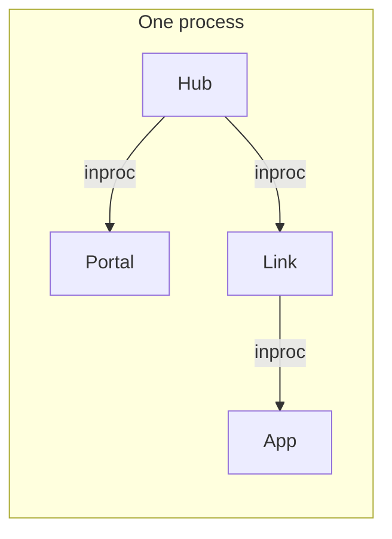
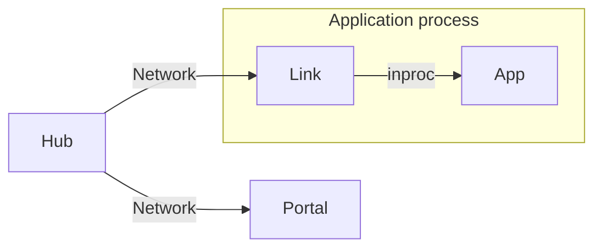
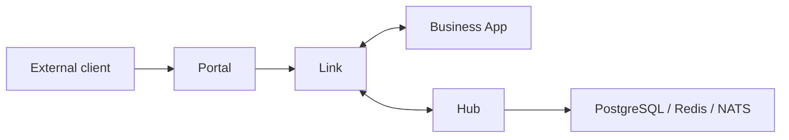

# Runtime & Deployment

Vine supports different runtime topologies for development and production. The business application code remains the same; the difference is whether Hub, Portal, Link, and the business application run in the same process, and whether components communicate through inproc or network connections.

## Mode Comparison

| Mode | Hub / Portal / Link | Business application | Recommended for |
| --- | --- | --- | --- |
| standalone | Same process | Same process | Quick starts, tests, and local monolith development |
| linked | Hub and Portal are separate; Link runs with the application | Same process as Link | Local development, a small number of services, and simpler application deployment |
| Separated deployment | Hub, Portal, and Link all run separately | Independent process | Production, independent scaling, and failure testing |

Regardless of the selected mode, the business application keeps the same `ApplicationSpec`, Rpc, Web, Event, and Task definitions. Only the startup entry point and endpoint configuration change.

## Standalone

Standalone assembles Hub, Portal, Link, and one business application in the same process:



```go title="main.go"
standalone.NewWithOption[*HelloApp](standalone.Option{
	SQLiteFile: "./vine.sqlite",
}).StartAndWait()
```

The startup order is Hub → Portal → Link → business application. Shutdown runs in the reverse order. Hub uses in-process Redis, while Link and Portal use inproc endpoints, so no runtime service needs to be started in advance.

### Characteristics and Limitations

- You only need to start one business binary, which makes this the best mode for the [first application tutorial](/docs/tutorial-first-app).
- Use `standalone.Option` to configure SQLite/PostgreSQL, a seed YAML file, and the Dashboard URL.
- Hub and Link do not start heartbeat, TTL lease renewal, or the registry sweeper. Registrations are removed explicitly when the application stops.
- Hub and Link do not expose separate management ports. Portal can still listen on business HTTP/HTTPS ports according to its entry rules.
- This mode does not cover cross-process networking or independent service restarts.

## Linked: Separate Hub and Application

Linked mode runs Hub and Portal as independent runtime services, while each business application carries an inproc Link in its own process:



Start Hub first, then start Portal when you need an external entry point:

```bash
vine hub serve \
  --mq-embedded-nats \
  --db-sqlite-file ./hub.sqlite

vine portal serve \
  --hub-endpoint http://127.0.0.1:7071
```

The business application imports `go.yorun.ai/vine/app/linked` and uses:

```go title="main.go"
linked.NewWithOption[*HelloApp](linked.Option{
	HubEndpoint:   "http://127.0.0.1:7071",
	IngressListen: "127.0.0.1:7082",
}).StartAndWait()
```

`HubEndpoint` and `IngressListen` can also be supplied through `VINE_HUB_ENDPOINT` and `VINE_INGRESS_LISTEN`.

This mode preserves the configuration, registration, and lease semantics of an independent Hub, but Link and the business application are still released and stopped together. It is suitable for development and deployment environments where maintaining a separate Link sidecar is undesirable.

## Separated Deployment: Independent Runtime and Application

In production, you can separate the control plane, external entry point, application-side connectivity layer, and business application into independent processes:



A minimal local process startup sequence is:

```bash
# 1. Control plane
vine hub serve \
  --mq-embedded-nats \
  --db-sqlite-file ./hub.sqlite

# 2. External gateway (when an external HTTP/HTTPS entry point is required)
vine portal serve \
  --hub-endpoint http://127.0.0.1:7071

# 3. Application-side Link
vine link serve \
  --api-listen 127.0.0.1:7079 \
  --ingress-listen 127.0.0.1:7082 \
  --hub-endpoint http://127.0.0.1:7071
```

The business application no longer uses `standalone.New` or `linked.New`. Create it directly instead:

```go title="main.go"
app.NewWithOption[*HelloApp](app.Option{
	LinkEndpoint: "http://127.0.0.1:7079",
}).StartAndWait()
```

You can omit the endpoint from the code and set an environment variable instead:

```bash
VINE_LINK_ENDPOINT=http://127.0.0.1:7079 ./hello-app
```

In this mode, Link registers applications with Hub and maintains heartbeats. The application, Link, Portal, and Hub can be released, restarted, and scaled independently. External Portal listeners, site rules, and TLS certificates are managed through Hub configuration.

## How to Choose

Start with standalone. Move to linked when you need shared configuration, discovery between multiple applications, or an external entry point. Use fully separated deployment when you need independent scaling, failure isolation, or complete distributed-system semantics.

| Requirement | Recommended mode |
| --- | --- |
| Learn the framework or test a single application | standalone |
| Debug multiple applications locally without maintaining a separate Link | linked |
| Containerized deployment, multiple instances, independent releases, and realistic failure exercises | Separated deployment |

## Related Documentation

- [Hub](/docs/hub): Configuration, registration, and lease management.
- [Link](/docs/link): Application registration, discovery, and request forwarding.
- [Portal](/docs/portal): External entry points and gateway rules.
- [Application model](/docs/application-model): Application construction and lifecycle.
