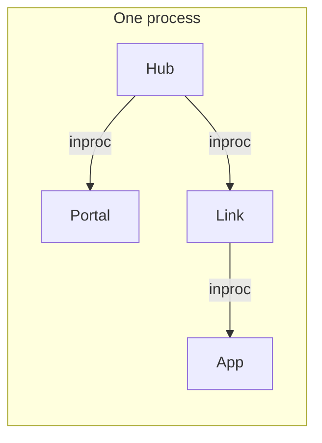
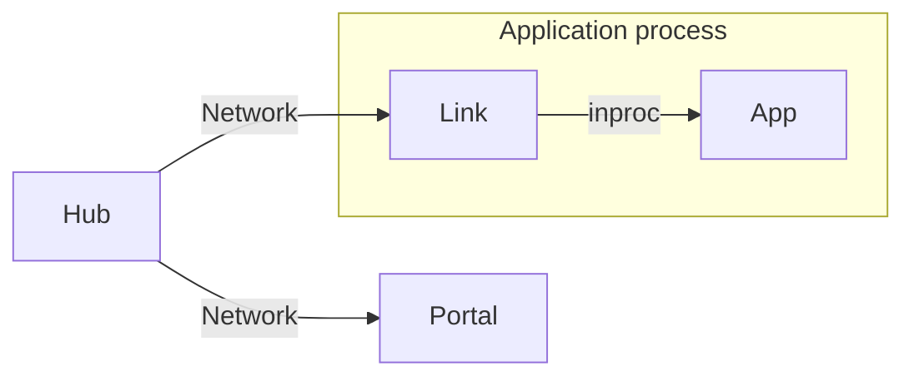
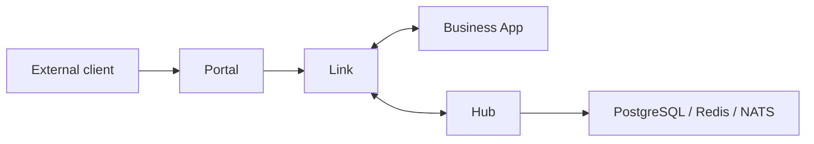

# Deployment

Vine supports different runtime topologies without a second application
implementation for production. The same `ApplicationSpec`, components, modules,
and Rpc/Web/Event/Task code can run in a local monolith or behind independently
deployed runtime services in Kubernetes. Only the thin startup entry point,
process boundary, and endpoint configuration change.

Business code declares capabilities rather than service locations, so it stays
the same. Link owns registration, discovery, and forwarding, while Hub and Portal
sit outside the application. Read [Architecture](../runtime/mechanisms.md) for how
this boundary works.

## Mode comparison

| Mode | Hub / Portal / Link | Business application | Recommended for |
| --- | --- | --- | --- |
| standalone | Same process | Same process | Quick starts, tests, and local monolith development |
| linked | Hub and Portal are separate; Link runs with the application | Same process as Link | Local development, a small number of services, and simpler application deployment |
| Separated deployment | Hub, Portal, and Link all run separately | Independent process | Production, independent scaling, and failure testing |

Regardless of mode, the business application keeps the same `ApplicationSpec`,
Rpc, Web, Event, and Task definitions. Only deployment assembly and endpoint
configuration change.

## Standalone

Standalone assembles Hub, Portal, Link, and one business application in the same process:



```go title="main.go"
standalone.NewWithOption[*HelloApp](standalone.Option{
	SQLiteFile: "./vine.sqlite",
}).StartAndWait()
```

The startup order is Hub, then Portal, then Link, then the business application.
Shutdown reverses that order. Hub uses in-process Redis, while Link and Portal
use inproc endpoints, so no runtime service needs to be started ahead of time.

### Characteristics and limitations

- You only need one business binary, which makes this the best mode for the
  [first application tutorial](./tutorial-first-app.md).
- `standalone.Option` lets you configure SQLite/PostgreSQL, a seed YAML file, and
  the Dashboard URL.
- Hub and Link skip heartbeat, TTL lease renewal, and the registry sweeper.
  Registrations are removed explicitly when the application stops.
- Hub and Link do not expose separate management ports. Portal can still listen
  on business HTTP/HTTPS ports according to its entry rules.
- This mode doesn't cover cross-process networking or independent service
  restarts.

## Linked: separate Hub and application

Linked mode runs Hub and Portal as independent runtime services, while each
business application carries an inproc Link in its own process:



Start Hub first, then start Portal when you need an external entry point:

```bash
vine hub serve \
  --mq-embedded-nats \
  --db-sqlite-file ./hub.sqlite

vine portal serve \
  --hub-endpoint http://127.0.0.1:7071
```

The business application imports `go.yorun.ai/vine/app/linked` and uses:

```go title="main.go"
linked.NewWithOption[*HelloApp](linked.Option{
	HubEndpoint:   "http://127.0.0.1:7071",
	IngressListen: "127.0.0.1:7082",
}).StartAndWait()
```

`HubEndpoint` and `IngressListen` can also come from `VINE_HUB_ENDPOINT` and
`VINE_INGRESS_LISTEN`.

This mode keeps the configuration, registration, and lease semantics of an
independent Hub, but Link and the business application are still released and
stopped together. It fits development and deployment environments where running a
separate Link sidecar adds more complexity than it solves.

## Separated deployment: independent runtime and application

In production, you can split the control plane, external entry point,
application-side connectivity layer, and business application into independent
processes:



A minimal local process startup sequence:

```bash
# 1. Control plane
vine hub serve \
  --mq-embedded-nats \
  --db-sqlite-file ./hub.sqlite

# 2. External gateway (when an external HTTP/HTTPS entry point is required)
vine portal serve \
  --hub-endpoint http://127.0.0.1:7071

# 3. Application-side Link
vine link serve \
  --api-listen 127.0.0.1:7079 \
  --ingress-listen 127.0.0.1:7082 \
  --hub-endpoint http://127.0.0.1:7071
```

The business application no longer uses `standalone.New` or `linked.New`. Create
it directly instead:

```go title="main.go"
app.NewWithOption[*HelloApp](app.Option{
	LinkEndpoint: "http://127.0.0.1:7079",
}).StartAndWait()
```

You can omit the endpoint from the code and set an environment variable instead:

```bash
VINE_LINK_ENDPOINT=http://127.0.0.1:7079 ./hello-app
```

In this mode, Link registers applications with Hub and maintains heartbeats. The
application, Link, Portal, and Hub each have independent process lifecycles,
though their scaling and availability boundaries differ. External Portal
listeners, site rules, and TLS certificates are managed through Hub
configuration. Review the
[Production Readiness Checklist](../operations/production-readiness.md) before
treating process separation as high availability.

## Pick a topology

Start with standalone. Move to linked when you need shared configuration,
discovery between multiple applications, or an external entry point. Use fully
separated deployment when you need independent scaling, failure isolation, or
complete distributed-system semantics.

| Requirement | Recommended mode |
| --- | --- |
| Learn the framework or test a single application | standalone |
| Debug multiple applications locally without maintaining a separate Link | linked |
| Containerized deployment, multiple instances, independent releases, and realistic failure exercises | Separated deployment |

## Related documentation

- [Hub](../runtime/hub.md): Configuration, registration, and lease management.
- [Link](../runtime/link.md): Application registration, discovery, and request forwarding.
- [Portal](../runtime/portal.md): External entry points and gateway rules.
- [Application model](../framework/application-model.md): Application construction and lifecycle.
- [Production readiness](../operations/production-readiness.md): Security, persistence,
  shutdown, failure, and scaling boundaries.
