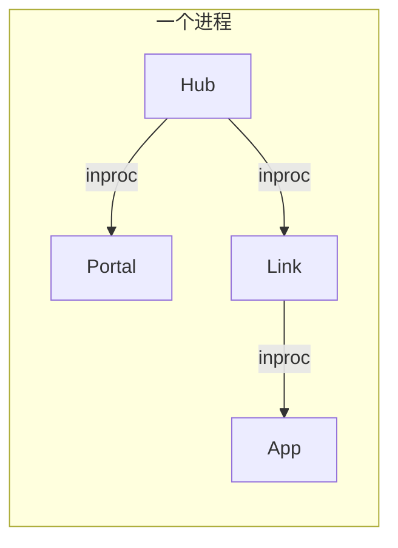
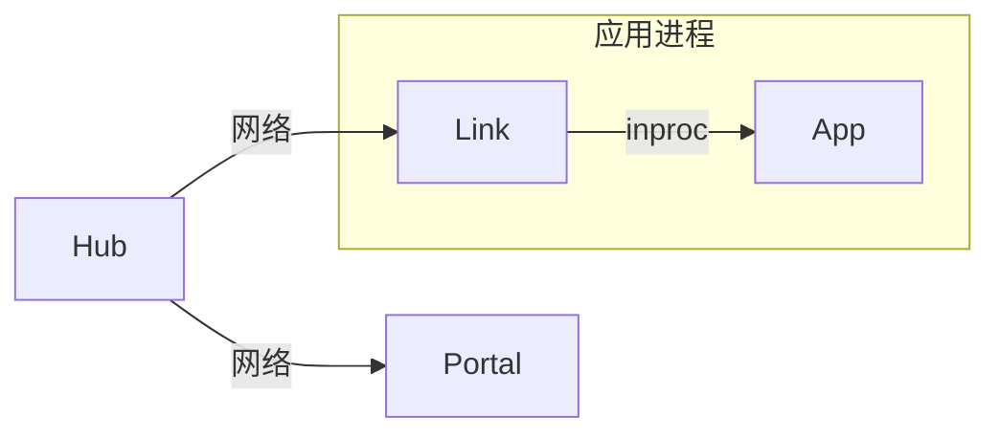
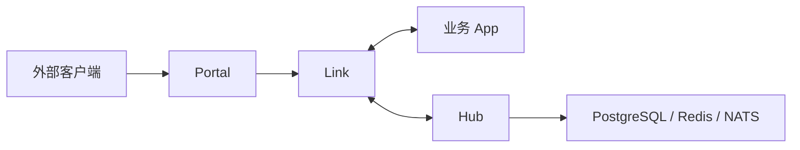

# 运行模式与部署拓扑

Vine 可按开发和生产需求选择不同的运行拓扑。区别不在业务应用的写法，而在 Hub、Portal、Link 和业务应用是否位于同一进程，以及组件之间使用 inproc 还是网络连接。

## 模式对比

| 模式 | Hub / Portal / Link | 业务应用 | 适用场景 |
| --- | --- | --- | --- |
| standalone | 同一进程 | 同一进程 | 快速开始、测试、本地单体开发 |
| linked | Hub、Portal 独立；Link 与应用同进程 | 与 Link 同进程 | 本地开发、少量服务、简化应用部署 |
| 分开部署 | Hub、Portal、Link 均独立 | 独立进程 | 生产环境、独立扩缩容、故障验证 |

无论选择哪种模式，业务应用的 `ApplicationSpec`、Rpc、Web、Event 和 Task 定义保持不变；改变的是启动入口和 endpoint 配置。

## 1. Standalone

standalone 将 Hub、Portal、Link 和一个业务应用装配到同一进程：



```go title="main.go"
standalone.NewWithOption[*HelloApp](standalone.Option{
	SQLiteFile: "./vine.sqlite",
}).StartAndWait()
```

启动顺序为 Hub → Portal → Link → 业务应用；停止时按相反顺序执行。Hub 使用进程内 Redis，Link 与 Portal 使用 inproc endpoint，因此不需要提前启动任何 runtime 服务。

### 特点与限制

- 只需启动一个业务 binary，最适合 [第一个应用教程](/docs/tutorial-first-app)。
- 使用 `standalone.Option` 配置 SQLite / PostgreSQL、seed YAML 和 Dashboard URL。
- Hub 与 Link 不启动 heartbeat、TTL 续租和 registry sweeper；应用停止时靠显式注销清理注册。
- Hub 和 Link 不开放独立管理端口；Portal 仍可按入口规则监听业务 HTTP/HTTPS 端口。
- 不覆盖跨进程网络、服务单独重启等场景。

## 2. Linked：Hub 与应用分开

linked 模式将 Hub 与 Portal 作为独立 runtime 服务运行，而每个业务应用在自己的进程中携带一个 inproc Link：



先启动 Hub；Portal 需要外部入口时再启动：

```bash
vine hub serve \
  --mq-embedded-nats \
  --db-sqlite-file ./hub.sqlite

vine portal serve \
  --hub-endpoint http://127.0.0.1:7071
```

业务应用导入 `go.yorun.ai/vine/app/linked` 并使用：

```go title="main.go"
linked.NewWithOption[*HelloApp](linked.Option{
	HubEndpoint:   "http://127.0.0.1:7071",
	IngressListen: "127.0.0.1:7082",
}).StartAndWait()
```

`HubEndpoint` 和 `IngressListen` 也可由 `VINE_HUB_ENDPOINT`、`VINE_INGRESS_LISTEN` 提供。

这种模式保留了独立 Hub 的配置、注册和租约语义，但 Link 与业务应用仍同时发布、同时停止。它适合不想额外维护 Link sidecar 的开发和部署环境。

## 3. 分开部署：独立 runtime 与应用

在生产环境中，可将控制面、外部入口、应用侧接入层和业务应用完全拆开：



一个最小的本地进程启动顺序如下：

```bash
# 1. 控制面
vine hub serve \
  --mq-embedded-nats \
  --db-sqlite-file ./hub.sqlite

# 2. 对外网关（需要外部 HTTP / HTTPS 入口时）
vine portal serve \
  --hub-endpoint http://127.0.0.1:7071

# 3. 应用侧 Link
vine link serve \
  --api-listen 127.0.0.1:7079 \
  --ingress-listen 127.0.0.1:7082 \
  --hub-endpoint http://127.0.0.1:7071
```

业务应用不再用 `standalone.New` 或 `linked.New`，而是直接创建：

```go title="main.go"
app.NewWithOption[*HelloApp](app.Option{
	LinkEndpoint: "http://127.0.0.1:7079",
}).StartAndWait()
```

也可不在代码中指定 endpoint，转而设置环境变量：

```bash
VINE_LINK_ENDPOINT=http://127.0.0.1:7079 ./hello-app
```

此模式下，Link 负责向 Hub 注册应用并维持 heartbeat；应用、Link、Portal 与 Hub 可以独立发布、重启和扩缩容。Portal 的外部监听、站点规则和 TLS 证书均由 Hub 配置管理。

## 如何选择

从 standalone 开始；当需要共享配置、多个应用相互发现或对外暴露入口时，迁移到 linked；当需要独立伸缩、故障隔离或验证完整分布式语义时，使用完全分开部署。

| 需求 | 推荐模式 |
| --- | --- |
| 学习框架或编写单应用测试 | standalone |
| 本地调试多个应用、但不想单独维护 Link | linked |
| 容器化部署、多实例、独立发布与真实故障演练 | 分开部署 |

## 相关文档

- [Hub](/docs/hub)：配置、注册与租约管理。
- [Link](/docs/link)：应用注册、发现和请求转发。
- [Portal](/docs/portal)：外部访问入口与网关规则。
- [应用模型](/docs/application-model)：应用构造入口与生命周期。
