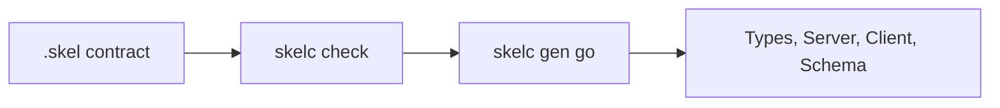

# First Skel Contract

In this tutorial, you will define a Greeting service and use `skelc` to validate it and generate Go code. When you finish, you will have a type-safe server interface and client.

## Install skelc

```bash
go install go.yorun.ai/skelc/cmd/skelc@v0.10.0
skelc version
```

This tutorial pins the generator so that its output is reproducible. Check
[Version Compatibility](./compatibility.md) before changing Vine, Go, or
`skelc`.

## Create the Contract Directory

From the parent directory where you want the example:

```bash
mkdir -p greeting/skel
cd greeting
```

```text
greeting/
├── skel/
│   ├── domain.skel
│   └── greeting.skel
└── skeled/
```

```skel title="skel/domain.skel"
@desc("Greeting example")
domain demo.greeting
```

```skel title="skel/greeting.skel"
domain demo.greeting

pub data Greeting {
    message: string
}

pub service GreetingService {
    noauth

    method hello {
        input {
            name: string
        }
        output Greeting
    }
}
```

## Validate the Contract

```bash
skelc check --skel-in ./skel
```

If the command exits without an error, the domain, type references, names, and public contract rules are valid. Inspect the symbols recognized by the generator:

```bash
skelc symbol list --skel-in ./skel
```

The output should include:

```text
pub  data     demo.greeting.Greeting
pub  service  demo.greeting.GreetingService
```

## Generate Go Code

```bash
skelc gen go \
  --skel-in ./skel \
  --go-out ./skeled
```

The output directory contains data models, schemas, and service code. Implement
the server with the generated `GreetingServiceServer` interface, and make calls
with the generated client. When the implementation is outside the generated
package, embed `DefaultGreetingServiceServer`; the interface includes a
package-private seal method and cannot be implemented directly from another
package. Generated files are updated the next time the command runs, so do not
edit them manually.



## Next Steps

- Read [Using Rpc](../framework/rpc-guide.md) to register the generated service implementation with a Vine App.
- Read [Skel syntax](https://skel.yorun.ai/docs/syntax) to continue defining actors, permissions, events, Web endpoints, and tasks.
- When you need separate regular/pub modules, see the [skelc guide](https://skel.yorun.ai/docs/getting-started).
