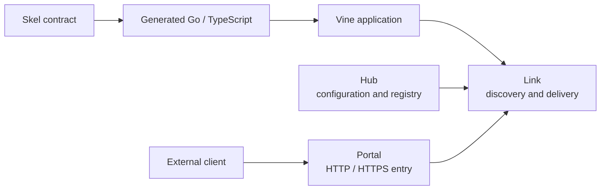

# Getting Started

Vine is a runtime framework for Go applications. It gives business code one
application model for lifecycle, dependency injection, configuration, Rpc, Web,
events, tasks, Redis, and relational databases. The same application can run
with an embedded development runtime or connect to independently deployed
runtime services.

This section helps you choose the shortest useful path through the
documentation. You do not need to learn Hub, Link, and Portal internals before
writing your first handler.

:::info Version first

Check the version selector before copying an example. **Vine next** follows the
current source, while release labels are immutable documentation snapshots.
For production, select a release and pin compatible Vine and `skelc` versions
instead of copying `@latest` into a reproducible build. See
[Versions and compatibility](./compatibility.md).

:::

## The mental model

- **Your application** owns business code and declares only the capabilities it
  needs.
- **Skel and skelc** define and generate type-safe contracts. Their language
  reference lives on the [Skel site](https://skel.yorun.ai/docs/).
- **Link** is the application-side runtime access layer. It handles
  registration, discovery, forwarding, configuration reads, and asynchronous
  delivery.
- **Hub** is the control plane for configuration and runtime registration
  state.
- **Portal** is the optional external HTTP/HTTPS gateway. Internal application
  calls do not need to pass through Portal.

In standalone mode, Vine starts Hub, Link, Portal, and your application in one
process. The responsibility boundaries stay the same even though network hops
become in-process calls.

## Choose a capability

| You need to… | Start with | Key behavior |
| --- | --- | --- |
| Call another application and receive a result | [Rpc](../framework/rpc-guide.md) | Synchronous, typed request/response |
| Expose application-owned HTTP routes | [Web](../framework/web.md) | HTTP handling through a generated Web boundary |
| Announce a fact to interested applications | [Events](../framework/event-task.md) | Asynchronous fan-out by consuming application |
| Ask one available worker to perform work | [Tasks](../framework/event-task.md) | Asynchronous competing-consumer delivery |
| Read managed settings | [Configuration](../framework/configuration.md) | Eternal snapshots or instant updates |
| Store shared cache state or coordinate a lock | [Redis](../framework/redis-guide.md) | Managed client, typed cache, and locker |
| Persist relational models | [RDB](../framework/rdb-guide.md) | Managed GORM connection and typed DAO |

If two components are part of the same application and do not need a network
contract, inject a Go dependency instead of creating an Rpc service.

## Recommended learning paths

### Evaluate Vine

1. Check the [prerequisites and compatibility matrix](./compatibility.md).
2. Run the [first Vine application](./tutorial-first-app.md).
3. Define the [first Skel contract](./first-contract.md).
4. Implement and call the generated service in the [Rpc guide](../framework/rpc-guide.md).

This path starts in standalone mode, so no runtime process needs to be installed
or started separately.

### Build an application

1. Learn the [application model](../framework/application-model.md) and how to compose
   [components and modules](../framework/components.md).
2. Add configuration and the Rpc, Web, Event, or Task capabilities you need.
3. Add Redis or RDB only when the application owns that infrastructure
   dependency.
4. Use [logging and testkit](../framework/logging-testing.md) to verify observable
   behavior.

### Understand what happens at runtime

Read these after the first working application, or earlier when you need to
make a lifecycle or concurrency decision:

1. [Runtime architecture](../runtime/mechanisms.md)
2. [Application lifecycle](../runtime/application-lifecycle.md)
3. [Dependency and execution model](../runtime/execution-model.md)
4. [Registration, discovery, and request routing](../runtime/request-routing.md)
5. [Trace and timeout propagation](../framework/trace-timeout.md)

### Prepare for deployment

1. Choose a [deployment topology](./deployment-modes.md).
2. Work through the [production readiness checklist](../operations/production-readiness.md).
3. Read the operating guides for [Hub](../runtime/hub.md), [Link](../runtime/link.md), and
   [Portal](../runtime/portal.md).
4. Keep all internal runtime endpoints on loopback or a trusted private network;
   the current [security boundary](../operations/production-readiness.md#secure-the-runtime-network)
   does not support exposing them to an untrusted network.

## What to keep in application code

- Put business behavior in modules and capability handlers, not in `main`.
- Treat generated code as build output; change the `.skel` source and regenerate.
- Use `BeforeAppStart` for work that must finish before the application becomes
  discoverable. `AfterAppStart` runs after serving and registration begin.
- Keep request-scoped dependencies inside the execution that created them.
- Design Event listeners and Task runners to be idempotent because failed
  deliveries can be retried.
- Preserve the injected context when calling downstream services.

For a package-oriented lookup, use the [public package map](../framework/core-packages.md)
or the [Go API reference](https://pkg.go.dev/go.yorun.ai/vine).
