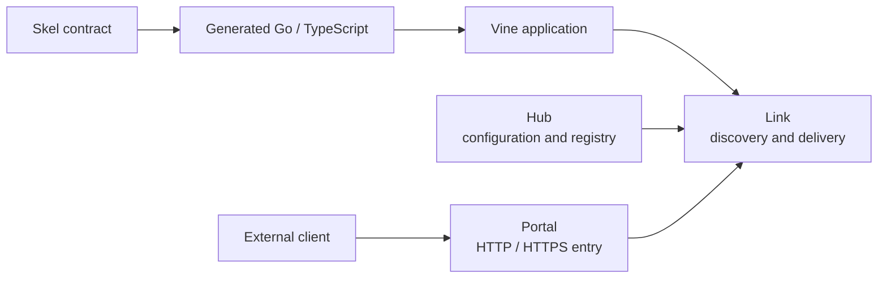

# Getting Started

Vine brings lifecycle, dependency injection, configuration, Rpc, Web, Event,
Task, Redis, and relational databases under one Go application model. Start
with a standalone process; split Hub, Link, Portal, and the business
application only when you need the network and operational boundaries.

If you are trying Vine for the first time:

1. Check the [supported Go, Vine, and skelc versions](./compatibility.md).
2. Run the [first application](./tutorial-first-app.md).
3. Generate a service from the [first Skel contract](./first-contract.md).
4. Implement and call it with the [Rpc guide](../framework/rpc-guide.md).

You can finish all four steps without starting a separate runtime service.

:::info Before copying a command

Before 1.0, this site maintains only **Vine next**. It follows current source
and may be ahead of the latest release. Pin released application builds to
exact Vine and skelc revisions, and check the
[compatibility page](./compatibility.md) when an example differs from the
revision you use.

:::

## What runs where

- **Your application** owns business code and declares only the capabilities it
  needs.
- **Skel and skelc** define and generate type-safe contracts. Their language
  reference lives on the [Skel site](https://skel.yorun.ai/docs/).
- **Link** is the application-side runtime access layer. It handles
  registration, discovery, forwarding, configuration reads, and asynchronous
  delivery.
- **Hub** is the control plane for configuration and runtime registration
  state.
- **Portal** is the optional external HTTP/HTTPS gateway. Internal application
  calls do not need to pass through Portal.

Standalone starts all four roles in one process. Their responsibilities do not
change; only the transport becomes in-process.

## Pick the capability you need

| You need to… | Start with | Key behavior |
| --- | --- | --- |
| Call another application and receive a result | [Rpc](../framework/rpc-guide.md) | Synchronous, typed request/response |
| Expose application-owned HTTP routes | [Web](../framework/web.md) | HTTP handling through a generated Web boundary |
| Announce a fact to interested applications | [Events](../framework/event-task.md) | Asynchronous fan-out by consuming application |
| Ask one available worker to perform work | [Tasks](../framework/event-task.md) | Asynchronous competing-consumer delivery |
| Read managed settings | [Configuration](../framework/configuration.md) | Eternal snapshots or instant updates |
| Store shared cache state or coordinate a lock | [Redis](../framework/redis-guide.md) | Managed client, typed cache, and locker |
| Persist relational models | [RDB](../framework/rdb-guide.md) | Managed GORM connection and typed DAO |

If two components are part of the same application and do not need a network
contract, inject a Go dependency instead of creating an Rpc service.

## Read further when the problem appears

### As the application grows

1. Learn the [application model](../framework/application-model.md) and how to compose
   [components and modules](../framework/components.md).
2. Add configuration and the Rpc, Web, Event, or Task capabilities you need.
3. Add Redis or RDB only when the application owns that infrastructure
   dependency.
4. Use [logging and testkit](../framework/logging-testing.md) to verify observable
   behavior.

### When lifecycle or concurrency matters

Start with [runtime architecture](../runtime/mechanisms.md), then go to the
specific boundary you are debugging:

- [Application lifecycle](../runtime/application-lifecycle.md) for hook order,
  readiness, shutdown, and resource ownership.
- [Dependency and execution model](../runtime/execution-model.md) for scopes,
  request-local objects, filters, and disposal.
- [Request routing](../runtime/request-routing.md) for registration,
  discovery, instance selection, and drain.
- [Trace and timeout](../framework/trace-timeout.md) for downstream deadlines
  and call metadata.

### Before deployment

1. Choose a [deployment topology](./deployment-modes.md).
2. Work through the [production readiness checklist](../operations/production-readiness.md).
3. Read the operating guides for [Hub](../runtime/hub.md), [Link](../runtime/link.md), and
   [Portal](../runtime/portal.md).
4. Keep all internal runtime endpoints on loopback or a trusted private network;
   the current [security boundary](../operations/production-readiness.md#secure-the-runtime-network)
   does not support exposing them to an untrusted network.

## Boundaries worth keeping

- Put business behavior in modules and capability handlers, not in `main`.
- Treat generated code as build output; change the `.skel` source and regenerate.
- Use `BeforeAppStart` for work that must finish before the application becomes
  discoverable. `AfterAppStart` runs after serving and registration begin.
- Keep request-scoped dependencies inside the execution that created them.
- Design Event listeners and Task runners to be idempotent because failed
  deliveries can be retried.
- Preserve the injected context when calling downstream services.

For a package-oriented lookup, use the [public package map](../framework/core-packages.md)
or the [Go API reference](https://pkg.go.dev/go.yorun.ai/vine).
