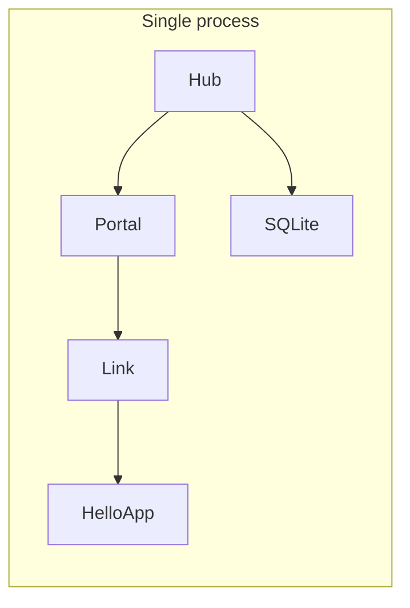

# First Application

The fastest way to see Vine run is standalone mode: Hub, Portal, Link, and the
business application start together in one process. The small application below
has no business endpoint yet -- it's just enough to exercise application
assembly, module lifecycle, persistent Hub state, and graceful shutdown.

## Prerequisites

- Go 1.26.5 or later.
- Network access to download the `go.yorun.ai/vine` module, or an existing module
  cache.

Create an empty directory and initialize a Go module:

```bash
mkdir vine-hello
cd vine-hello
go mod init example.com/vine-hello
go get go.yorun.ai/vine@main
```

`@main` matches the `next` documentation you are reading. For a released
application, replace it with a reviewed commit or tag and keep that revision in
`go.mod`.

## Define the Application

Create `main.go`:

```go title="main.go"
package main

import (
	"go.yorun.ai/vine/app"
	"go.yorun.ai/vine/app/standalone"
	"go.yorun.ai/vine/core/logger"
)

type HelloModule struct {
	app.BaseModule
}

func (*HelloModule) AfterAppStart() {
	logger.Info("hello from Vine")
}

type HelloApp struct {
	app.Application
}

func (*HelloApp) Name() string {
	return "demo.hello"
}

func (*HelloApp) InitModules(add app.TypeAdder) {
	add(app.T[*HelloModule]())
}

func main() {
	standalone.NewWithOption[*HelloApp](standalone.Option{
		SQLiteFile: "./vine.sqlite",
	}).StartAndWait()
}
```

Three pieces matter here:

1. Embed `app.Application` to get the default implementation of the application
   specification.
2. `Name()` returns the logical application name. It must use one or more
   lowercase-letter segments separated by dots, like `demo.hello`. Replicas of
   the same application share this name but have different instance IDs; two
   different applications in one process cannot use the same name.
3. `HelloModule` follows the application lifecycle and logs from
   `AfterAppStart()`.

`StartAndWait()` starts the runtime and waits for `SIGINT` or `SIGTERM`. After
you press `Ctrl+C`, the application shuts down gracefully in reverse startup
order.

## Run the Application

```bash
go run .
```

On the first run, Vine creates `vine.sqlite` in the current directory. The
terminal logs show the standalone Hub, Portal, Link, and `demo.hello` starting in
order, including:

```text
hello from Vine
```

That line proves the module reached `AfterAppStart()`. The application hasn't
declared Rpc, Web, Event, or Task yet, so it doesn't advertise any business
capability through Link.

Press `Ctrl+C` to stop it. Running the same command again reuses the Hub data
stored in `vine.sqlite`.

## What standalone started



- **Hub** stores configuration and registration information and provides
  in-process Redis.
- **Portal** subscribes to entry, site, and endpoint configuration.
- **Link** owns the connection to `HelloApp` and provides configuration,
  discovery, and forwarding. This minimal App declares no public capability, so it
  has nothing to advertise yet.
- **HelloApp** is the business application. Components, modules, and Rpc, Web,
  Event, or Task capabilities get added here as the application grows.

In standalone mode, the management connections between Hub and Link use the
inproc transport and don't open additional management ports. Portal can still
listen on business HTTP/HTTPS ports according to its entry rules. This mode does
not simulate heartbeat, TTL expiration, or network disconnection. Switch to
linked mode when you need to validate these behaviors.

## Connect to an Existing Hub

Install the matching Vine CLI, then start Hub separately:

```bash
go install go.yorun.ai/vine/cmd/vine@main

vine hub serve \
  --mq-embedded-nats \
  --db-sqlite-file ./hub.sqlite
```

Then import `go.yorun.ai/vine/app/linked` and replace `main` with:

```go title="main.go"
func main() {
	linked.NewWithOption[*HelloApp](linked.Option{
		HubEndpoint:   "http://127.0.0.1:7071",
		IngressListen: "127.0.0.1:7082",
	}).StartAndWait()
}
```

The business application and a Link now run in the same process. Link connects to
the independent Hub and registers any application capabilities you declare.
`HubEndpoint` and `IngressListen` can also come from `VINE_HUB_ENDPOINT` and
`VINE_INGRESS_LISTEN`, respectively.

To run Link and the business application in separate processes, start the
business application with `app.New` and use `--link-endpoint` or
`VINE_LINK_ENDPOINT` to point to the API endpoint of an existing Link.

## Next Steps

- Complete [your first Skel contract](./first-contract.md) to generate type-safe
  business code.
- Read [App](../framework/app.md) to learn the complete lifecycle of
  applications, components, and modules.
- Read [Hub](../runtime/hub.md), [Link](../runtime/link.md), and
  [Portal](../runtime/portal.md) to understand responsibility boundaries in
  multi-process deployments.
- Read [Using Rpc](../framework/rpc-guide.md) to start declaring and calling
  services.
