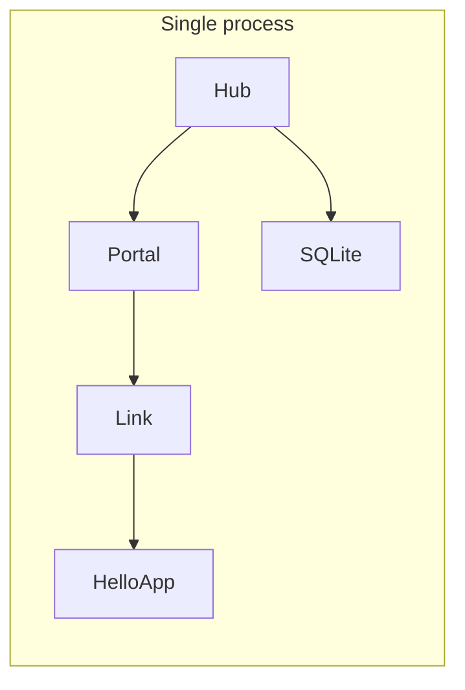

# Tutorial: Start Your First Vine Application

In this tutorial, you will create a minimal Vine application and run it in standalone mode. Standalone starts Hub, Portal, Link, and the business application in the same process, making it suitable for first-time evaluation, local development, and integration testing.

When you finish, you will have a Vine application that starts, shuts down gracefully, and stores its data in a local SQLite database file.

## Prerequisites

- Go 1.26 or later.
- Vine is installed, or the project can access the `go.yorun.ai/vine` module.

Create an empty directory and initialize a Go module:

```bash
mkdir vine-hello
cd vine-hello
go mod init example.com/vine-hello
go get go.yorun.ai/vine@latest
```

## 1. Define the Application

Create `main.go`:

```go title="main.go"
package main

import (
    "go.yorun.ai/vine/app"
	"go.yorun.ai/vine/app/standalone"
    "go.yorun.ai/vine/core/logger"
)

type HelloModule struct {
    app.BaseModule
}

func (*HelloModule) AfterAppStart() {
    logger.Info("hello from Vine")
}

type HelloApp struct {
	app.Application
}

func (*HelloApp) Name() string {
	return "demo.hello"
}

func (*HelloApp) InitModules(add app.TypeAdder) {
    add(app.T[*HelloModule]())
}

func main() {
	standalone.NewWithOption[*HelloApp](standalone.Option{
		SQLiteFile: "./vine.sqlite",
	}).StartAndWait()
}
```

This code introduces three concepts you need to understand:

1. Embed `app.Application` to get the default implementation of the application specification.
2. `Name()` returns a globally unique application name. The name cannot be empty or contain `@`.
3. `HelloModule` starts with the application and writes a verifiable log message after startup completes.

`StartAndWait()` starts the runtime and waits for `SIGINT` or `SIGTERM`. After you press `Ctrl+C`, the application shuts down gracefully in reverse startup order.

## 2. Run the Application

```bash
go run .
```

On the first run, Vine creates `vine.sqlite` in the current directory. The terminal logs show the standalone Hub, Portal, Link, and `demo.hello` starting in order, including:

```text
hello from Vine
```

This message confirms that the application, dependency injection, and module lifecycle are all working. The application does not yet declare Rpc, Web, Event, or Task capabilities, but the complete runtime is assembled and running.

Press `Ctrl+C` to stop it. Running the same command again reuses the Hub data stored in `vine.sqlite`.

## 3. Understand the Standalone Runtime



- **Hub** stores configuration and registration information and provides in-process Redis.
- **Portal** subscribes to entry, site, and endpoint configuration.
- **Link** registers `HelloApp` and provides configuration, service discovery, and request forwarding.
- **HelloApp** is your business application. You can later add components, modules, and Rpc, Web, Event, or Task capabilities to it.

In standalone, the management connections between Hub and Link use the inproc transport and do not open additional management ports. Portal can still listen on business HTTP/HTTPS ports according to its entry rules. This mode does not simulate heartbeat, TTL expiration, or network disconnection. Use linked mode when you need to validate these behaviors.

## 4. Connect to an Existing Hub

First, start Hub separately:

```bash
vine hub serve \
  --mq-embedded-nats \
  --db-sqlite-file ./hub.sqlite
```

Then import `go.yorun.ai/vine/app/linked` and replace `main` with:

```go title="main.go"
func main() {
	linked.NewWithOption[*HelloApp](linked.Option{
		HubEndpoint:   "http://127.0.0.1:7071",
		IngressListen: "127.0.0.1:7082",
	}).StartAndWait()
}
```

The business application and a Link now run in the same process. Link connects to the independent Hub and registers the application capabilities with it. `HubEndpoint` and `IngressListen` can also be supplied through `VINE_HUB_ENDPOINT` and `VINE_INGRESS_LISTEN`, respectively.

To run Link and the business application in separate processes, start the business application with `app.New` and use `--link-endpoint` or `VINE_LINK_ENDPOINT` to specify the API endpoint of an existing Link.

## Next Steps

- Complete [your first Skel contract](/docs/first-skel-contract) to generate type-safe business code.
- Read [App](/docs/app) to learn the complete lifecycle of applications, components, and modules.
- Read [Hub](/docs/hub), [Link](/docs/link), and [Portal](/docs/portal) to understand responsibility boundaries in multi-process deployments.
- Read [Using Rpc](/docs/guide/rpc) to start declaring and calling services.
