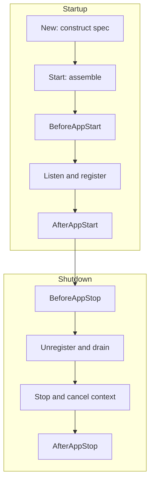
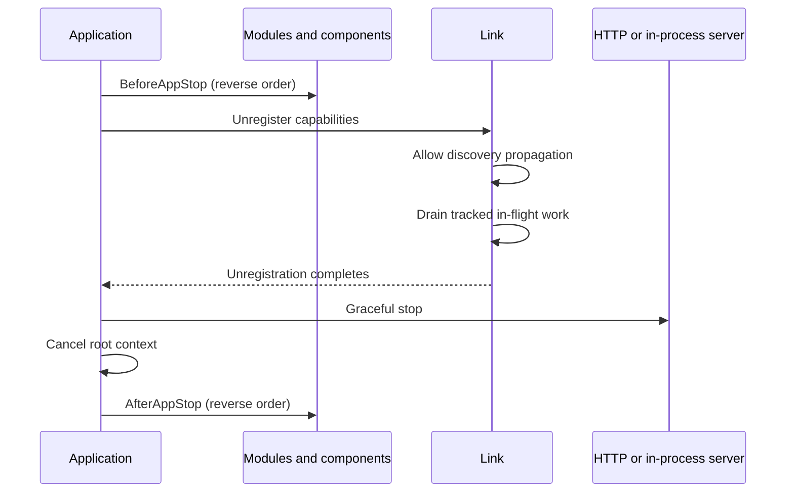

# Application Lifecycle

Vine applications have two distinct setup moments: construction with `New(...)`, and activation with `Start()`. This distinction matters because construction is not lazy, while most of the application dependency graph is assembled only during `Start()`.

The practical lifecycle is:



## Construction is not lazy

Calling an application constructor immediately:

1. Applies the supplied flags and creates a default `RunFlag` when necessary.
2. Constructs the application specification and performs its field injection.
3. Calls `DIInit()` on the specification when it implements the DI initialization convention.
4. Validates the application name and assigns the application identity.
5. Derives the root context from `RunFlag.Context`, or from `context.Background()` when it is `nil`.
6. Captures the listen address that the eventual server will use.

This has two important consequences.

First, constructor validation and specification initialization can panic before `Start()` is called. Treat construction as real initialization, not as the creation of an inert descriptor.

Second, runtime inputs that are captured during construction must be supplied before or during specification initialization. In particular, `BindCommon(...)` runs later while Vine is assembling dependency containers. Changing `AppFlag.ListenAddr` there is too late to change the address already captured by the application.

Prefer supplying runtime values at the constructor boundary:

```go
application := app.New[*DemoApp](
    app.With(&app.RunFlag{
        ListenAddr: "127.0.0.1:18080",
        Context:    rootCtx,
    }),
)
```

Custom flags follow the same rule: validate or normalize constructor inputs in the application specification's `DIInit()` when later initialization depends on them. Treat flags as immutable input after construction. Objects in later dependency containers receive copies; mutating one injected flag is not a process-wide configuration mechanism.

An application type and an application name can each be constructed only once in a process, even after the application has stopped. Applications are also single-use: they cannot be started twice or restarted after shutdown.

## What `Start()` does

`Start()` is synchronous. It returns only after the application has assembled its dependencies, started its endpoints and capabilities, registered with Link when registration is needed, and completed all `AfterAppStart()` hooks.

It has four useful conceptual phases.

### 1. Connect and assemble

Vine first connects to Link and obtains the runtime information needed by the application. It then creates:

- The application dependency graph.
- Declared components.
- Declared modules.
- Rpc, Web, Event, and Task servers and their execution containers.

Declared component and module instances are application-lifetime singletons. Their injected fields and `DIInit()` methods run while the graph is being constructed. Framework component minders also initialize their components at this point. For example, an RDB component can open its database before lifecycle hooks begin.

`BindCommon(...)`, component `Bind(...)`, and module `Bind(...)` are dependency declarations, not lifecycle callbacks. Vine may apply them to more than one container. They should be deterministic and free of operational side effects.

### 2. Run pre-start hooks

Vine calls `BeforeAppStart()` in this order:

1. Components in declaration order.
2. Modules in declaration order.

No application endpoint has been published by Vine yet. Use this phase for bounded readiness checks, warm-up that must finish before serving, and validation that requires the assembled dependency graph.

`BeforeAppStart()` returns an error, but `Start()` does not return that error to its caller. Vine converts it into a panic. Startup is not transactional: already-created resources are not rolled back automatically, and completed hooks do not receive compensating callbacks. A caller that recovers a startup panic is responsible for deciding whether cleanup is safe.

### 3. Start endpoints and publish capabilities

After all pre-start hooks succeed, Vine:

1. Starts the HTTP or in-process endpoint.
2. Starts the enabled Rpc, Event, and Task capability machinery.
3. Registers the application's Rpc, Web, Event, Task, and schema metadata with Link.

The listener therefore exists before registration begins. Registration makes the application discoverable through Link; remote Link and Portal views can still require a short propagation interval.

Applications without a public capability do not publish an application registration, although their local lifecycle still runs.

### 4. Run post-start hooks

Finally, Vine calls `AfterAppStart()`:

1. Components in declaration order.
2. Modules in declaration order.

At this point the endpoint has started and registration with the local Link has completed. `AfterAppStart()` is the appropriate place to launch background loops that should run only while the application is available. Keep an explicit cancellation and join mechanism for every loop so it can be stopped during `BeforeAppStop()`.

## Hook order and responsibilities

| Hook | Order | Runtime state | Good responsibilities | Avoid |
| --- | --- | --- | --- | --- |
| `BeforeAppStart()` | Components, then modules; declaration order | Graph assembled, endpoint not published | Validate dependencies, bounded warm-up, readiness checks | Irreversible work that assumes automatic rollback |
| `AfterAppStart()` | Components, then modules; declaration order | Endpoint started and local registration complete | Start background loops, announce local readiness | Blocking forever inside the hook |
| `BeforeAppStop()` | Modules, then components; reverse declaration order | Still registered, server and root context still active | Stop producers, cancel and join workers, flush bounded work | Waiting without a deadline |
| `AfterAppStop()` | Modules, then components; reverse declaration order | Unregistered, server stopped, root context cancelled | Release application-owned resources, final local cleanup | New Rpc, Event, Task, or context-dependent work |

Components start before modules so business modules can rely on initialized infrastructure. Shutdown reverses that relationship so modules can finish while component resources are still present.

Hook order is based on declaration order, not necessarily object construction order. Dependency resolution may construct an injected object earlier. Do not use declaration order as a substitute for declaring real dependencies.

## Graceful shutdown

`StopGracefully()` blocks the caller until shutdown completes. Its observable sequence is:



The details are intentional:

- `BeforeAppStop()` runs while the root context and server are still active. Stop background producers and join their goroutines here.
- Link removes the instance from discovery, allows that change to propagate, and waits for tracked in-flight work up to its drain bound while the application endpoint remains available.
- The application then gracefully stops its own server.
- Only after the server stops does Vine cancel the application root context.
- `AfterAppStop()` runs with the root context already cancelled. It is for local release, not remote work.

Lifecycle hooks do not receive an automatic timeout. Each hook must bound its own network calls and goroutine joins. A panic in a shutdown hook is also not converted into a recoverable lifecycle error.

`RunFlag.Context` is the parent of the injected application context, but cancelling it does not itself call `StopGracefully()`. `StartAndWait()` waits for `SIGINT` or `SIGTERM`, then performs graceful shutdown. Code that owns an application directly must still arrange to call `StopGracefully()`.

## Runtime wrappers and bundles

The business application's internal lifecycle stays the same in every deployment mode. The wrapper controls the surrounding runtime order.

| Mode | Startup order | Shutdown order |
| --- | --- | --- |
| Direct `app.New(...)` | Business application | Business application |
| `linked.New(...)` | In-process Link, then business application | Business application, then Link |
| `linked.NewBundled(...)` | Link, then business applications in declaration order | Business applications in reverse order, then Link |
| `standalone.New(...)` | Hub, Portal, Link, then business application | Business application, Link, Portal, then Hub |
| `standalone.NewBundled(...)` | Hub, Portal, Link, then business applications in declaration order | Business applications in reverse order, then Link, Portal, Hub |

Stopping business applications before their in-process Link is essential: the unregister and drain path must remain available until each business application has completed its shutdown.

## A robust module pattern

The following shape makes ownership explicit:

```go
type WorkerModule struct {
    app.BaseModule

    Context context.Context `inject:""`

    cancel context.CancelFunc
    done   chan struct{}
}

func (m *WorkerModule) AfterAppStart() {
    workerCtx, cancel := context.WithCancel(m.Context)
    m.cancel = cancel
    m.done = make(chan struct{})

    go func() {
        defer close(m.done)
        runWorker(workerCtx)
    }()
}

func (m *WorkerModule) BeforeAppStop() {
    if m.cancel == nil {
        return
    }
    m.cancel()

    select {
    case <-m.done:
    case <-time.After(5 * time.Second):
        // Record the timeout and continue shutdown.
    }
}
```

The module starts work only after publication, stops it while dependencies are still usable, and never relies on `AfterAppStop()` to observe cancellation in time.

## Related documentation

- [Application Model](../framework/application-model.md) introduces application specifications and capabilities.
- [Components and Modules](../framework/components.md) explains how to divide application responsibilities.
- [Execution Model](./execution-model.md) describes per-request injection and disposal.
- [Runtime and Deployment](../getting-started/deployment-modes.md) compares standalone, linked, and separated topologies.
- [Runtime Mechanisms](./mechanisms.md) connects lifecycle behavior to Hub, Link, and Portal.
