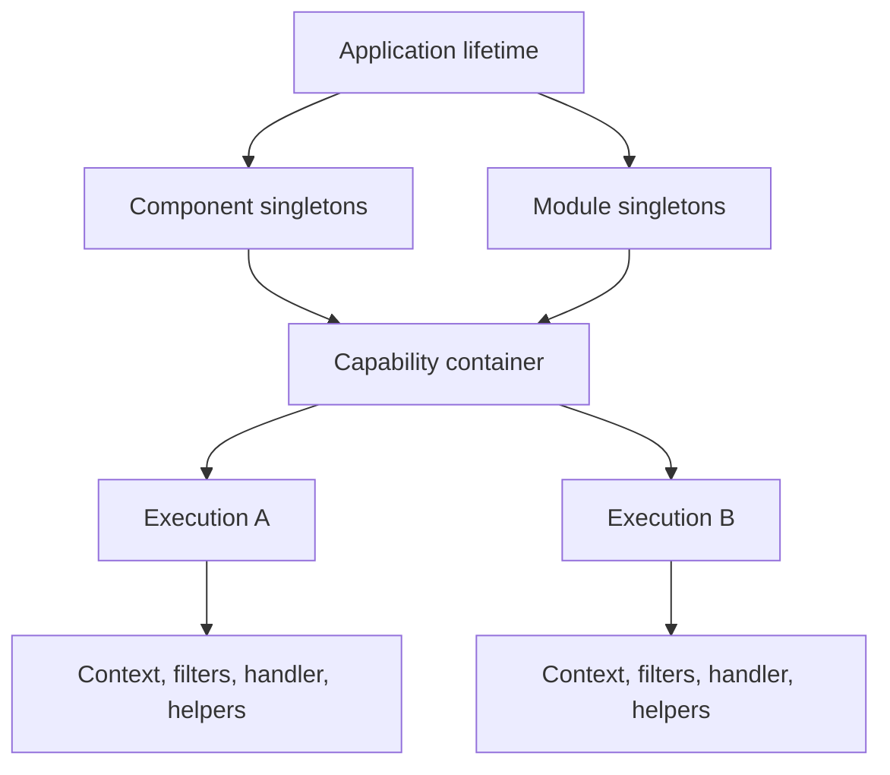
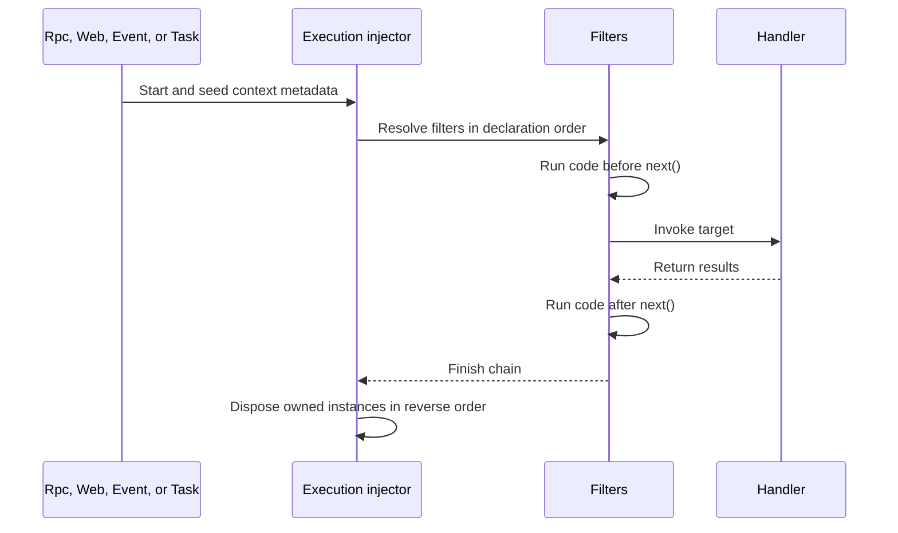

# Execution Model

Vine uses dependency injection at two different lifetimes:

- The **application lifetime** owns components, modules, and other long-lived
  objects.
- An **execution lifetime** is created for every Rpc call, Web request, Event
  delivery, and Task run.

The execution boundary is what lets a generated client, configuration value, DAO,
cache, or locker automatically follow the current request context without turning
every dependency into a global singleton.



## Application-lifetime objects

Every component and module declared by an application is constructed once during
`Start()` and retained until that application stops. These objects are explicit
singletons in the application graph.

They work well for:

- Infrastructure connection owners.
- Process-local registries and managers.
- Background workers with explicit lifecycle hooks.
- Immutable services that do not capture request state.

They receive the application root `context.Context` and root `meta.Context`, not
a future request context. A generated Rpc client injected into a module therefore
represents application-originated background work. It doesn't become
request-aware later.

Long-lived objects must not retain an execution-scoped object obtained from a
handler, filter, or other request path. Apart from holding a cancelled context,
doing so also extends the apparent lifetime of resources that Vine has already
disposed.

## One injector per execution

Each capability keeps a plain container describing its bindings. When work
arrives, the container creates a new execution injector:

| Capability | Execution boundary | Seeded request state |
| --- | --- | --- |
| Rpc | One method invocation | Rpc context and method information |
| Web | One routed HTTP request | Web context |
| Event | One listener delivery | Event context and event information |
| Task | One trigger run | Task context and trigger information |

Handler, listener, runner, and filter instances are created within that
execution. Different executions never share execution-scoped instances.

An execution should be treated as single-use. Once its filter chain returns, Vine
completes it and rejects later resolution from the completed injector.

## The important unscoped rule

An unscoped binding doesn't have one fixed lifetime. Its effective fallback
depends on which injector resolves it:

- In a plain injector, unscoped means **transient**.
- In an execution injector, unscoped means **execution-scoped**.

This is deliberate. A binding such as:

```go
b.BindFactory(func(ctx context.Context) *Repository {
    return NewRepository(ctx)
})
```

creates a new value on each plain resolution, but within one request it is
created at most once and reused by every consumer. The next request receives a
different value with its own context.

### Scope reference

| Declaration | Plain injector | Execution injector | Typical use |
| --- | --- | --- | --- |
| No explicit scope | New value per resolution | One value per execution | Context-aware clients, configs, DAOs, caches, lockers |
| `SingletonScope` | One value in the binding owner's container | Redirects to that same singleton | Application-owned managers and immutable shared services |
| `ExecutionScope` | Cannot be resolved outside an execution | One value per execution | Request context, protocol metadata, handlers |
| `TransientScope` | New value per resolution | New value per resolution | Small stateless helpers that must never be cached |

Scope belongs to the requested binding target. Binding an interface as a
singleton does not automatically make a separately bound concrete type the same
singleton.

Child containers inherit parent bindings and can add new target types, but they
cannot shadow a type already bound by a parent.

## Execution pipeline

For every unit of work, Vine runs the same core pipeline:



Filters form an onion:

```go
func (f *TimingFilter) Filter(next ctr.FilterNext) {
    started := time.Now()
    next()
    f.Logger.Info("execution completed", "elapsed", time.Since(started))
}
```

Vine appends target invocation as the final filter. A filter can inspect or
rewrite arguments before `next()`, and it can inspect or rewrite results after
`next()` returns.

Short-circuiting is a protocol decision, not merely omitting `next()`. Rpc,
Event, and Task executors expect a valid result shape. A filter that terminates
those chains must set results compatible with the target contract; otherwise
execution fails because no result was produced.

## Initialization and disposal

For Vine-constructed struct pointers:

1. The object is allocated.
2. Fields tagged with `inject:""` are resolved and assigned.
3. `DIInit()` runs when the object implements the initialization convention.

Execution completion waits for active resolutions, then disposes
execution-owned instances in reverse creation order. Disposal uses either:

- `DIDispose()` on an object that implements the disposal convention.
- A disposer supplied by the binding.

Seeded request objects are supplied by the protocol and are not owned or disposed
by DI.

Plain injectors do **not** automatically dispose their singleton instances. A
component or module that owns a database, Redis client, file, queue connection,
or goroutine must release it explicitly in application lifecycle hooks. See
[Application Lifecycle](./application-lifecycle.md) for the correct shutdown
phase.

## Dependency safety rules

Vine validates the dependency graph before serving:

- Dependency cycles are rejected.
- A declared singleton cannot depend on a declared execution-scoped type.
- An execution-scoped type cannot be resolved from a plain injector.
- Implicit construction only supports pointers to structs.
- Injected fields must be exported.

These checks prevent a request object from being silently captured in a
long-lived singleton. They don't replace lifecycle design: an unscoped
context-aware factory can still produce a value for a long-lived component from
the application root context. Decide intentionally whether the consumer belongs to
the application or to an execution.

## How common generated dependencies get context

Vine publishes many generated or infrastructure helpers as unscoped factories.
Their effective lifetime follows the injector rule above.

| Dependency | Context captured when it is created | Consequence inside a handler |
| --- | --- | --- |
| Generated Rpc client | Current `meta.Context` | Outgoing calls inherit the current trace, actor, initiator, and request lifecycle |
| Generated Event emitter | Current `meta.Context` | Emission is associated with the current trace and application |
| Generated Task launcher | Current `meta.Context` | Launch is associated with the current trace and application |
| Generated configuration | Current Link snapshot at resolution | One decoded pointer per execution; an existing pointer does not mutate |
| RDB DAO | Current `context.Context` and request logger | GORM operations use the execution cancellation and correlated logger |
| Redis cache | Current `context.Context` | Cache operations stop when the execution context ends |
| Redis locker | Current `context.Context` | Lock acquisition and refresh are tied to that context |

Within one execution, repeated injection of the same target returns the same
effective execution-scoped value. Across executions, the factory runs again and
observes the new context or configuration snapshot.

The Redis component itself is an application singleton and exposes commands that
accept an explicit context. Its injected cache and locker helpers are different:
they capture the context used to create them.

## Do not move dependencies across executions

This is unsafe:

```go
var cachedDAO *OrderDAO

func (h *OrderHandler) Handle() {
    cachedDAO = h.OrderDAO
}
```

After the request finishes, `cachedDAO` contains a DAO whose context has ended.
The same applies to generated clients, request loggers, configuration pointers
whose freshness matters, caches, lockers, handlers, and filters.

Use one of these designs instead:

- Keep the dependency on the handler and use it only during that call.
- Pass plain data to a background queue rather than passing the dependency.
- Let a lifecycle-managed module own a separate application-context client.
- Bind a true application singleton only when it is context-free and has explicit
  shutdown ownership.

## Choosing a scope

| Question | Prefer |
| --- | --- |
| Must every consumer in one request share the same object? | Unscoped or `ExecutionScope` |
| Must every resolution create a fresh stateless object? | `TransientScope` |
| Is the object immutable or explicitly lifecycle-managed for the whole application? | `SingletonScope` |
| Does the object capture request context, identity, logger, transaction, or mutable config? | Execution lifetime |
| Does it open a resource that must be closed? | Give it an explicit owner and lifecycle hook; scope alone is insufficient |

Do not make configuration, clients, or caches singleton merely because they are
used often. A singleton freezes the object and any context or snapshot it
captured. Choose a lifetime from ownership and freshness requirements, not from
construction cost alone.

## Related documentation

- [Dependency Injection](../framework/di.md) is the API reference for bindings,
  factories, scopes, and seeding.
- [Execution Container](../framework/ctr.md) explains filters, arguments, and
  result rewriting.
- [Application Lifecycle](./application-lifecycle.md) covers startup, shutdown,
  and singleton resource ownership.
- [Configuration](../framework/configuration.md) explains eternal and instant
  snapshots.
- [Context and Identity](../framework/meta.md) explains trace, initiator, and
  actor propagation.
