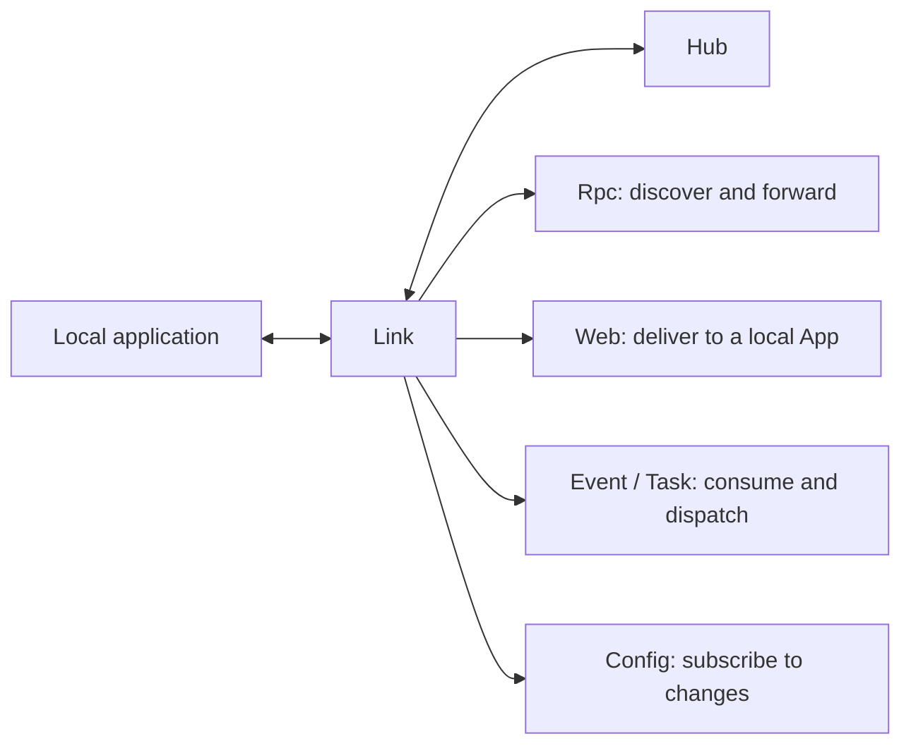

# Link Runtime

Link is the runtime access layer deployed alongside applications. It registers
local applications with Hub, maintains configuration and service-discovery
state, and provides unified runtime capabilities for Rpc, Web, events, and tasks.



## Responsibilities

- **Application registration**: stores the facts for local application instances,
  registers their capabilities with Hub, and unregisters them on exit.
- **Health and leases**: performs instance health checks and sends heartbeats to
  Hub in normal mode.
- **Configuration reads**: provides configuration snapshots and watches Hub Redis
  for change events.
- **Rpc discovery and forwarding**: selects a registered local or remote Rpc
  instance and forwards the call.
- **Web delivery**: accepts a Portal-selected Web request and forwards it to the
  locally owned application instance named by that request.
- **Asynchronous message dispatch**: consumes NATS messages and delivers them to
  locally declared event listeners and task runners.

Link is the sole owner of local application capability state. The Rpc, Web,
event, task, and configuration modules derive their runtime indexes from Link
rather than maintaining separate copies of application instance state.

## Starting Link

After Hub is running, start Link with the Hub API endpoint:

```bash
vine link serve \
  --hub-endpoint http://127.0.0.1:7071
```

The API listens on `127.0.0.1:7079` by default. Ingress defaults to `0.0.0.0:0`;
the operating system assigns a port, and Link registers the resulting endpoint
with Hub. Set fixed addresses explicitly when needed:

```bash
vine link serve \
  --api-listen 127.0.0.1:7081 \
  --ingress-listen 127.0.0.1:7082 \
  --hub-endpoint http://127.0.0.1:7071
```

The corresponding environment variables are `VINE_API_LISTEN`,
`VINE_INGRESS_LISTEN`, and `VINE_HUB_ENDPOINT`.

For a network deployment, configure Link's `vine.link` backend identity and use
the Hub HTTPS endpoint:

```bash
vine link serve \
  --hub-endpoint https://hub.internal:7071 \
  --ingress-listen 10.0.2.10:7082 \
  --mtls-ca-file /run/vine/ca.pem \
  --mtls-cert-file /run/vine/link.pem \
  --mtls-key-file /run/vine/link-key.pem
```

Link then uses this certificate for Hub Rpc, Redis, and embedded NATS clients,
and as the server identity on Link ingress. Its exact X.509-SVID is
`spiffe://<trust-domain>/vine/daemon/vine.link`, using the same trust domain as Hub and
Portal. Remote Link and Portal proxy traffic must use HTTPS and authenticate
that SPIFFE ID. The Link API remains h2c because Link is the application's
sidecar. The application and Link must run on the same host and within the same
deployment trust boundary; placing them on different hosts is unsupported.

## Request Paths

### Rpc

When an application makes an Rpc call, the request first enters Link's
`rpcproxy`. The proxy selects the next current service registration using
round-robin. If that registration belongs to a local application, Link invokes
its application endpoint directly; otherwise it forwards through the target Link.
Locality changes the forwarding path, not selection priority. A failure after
selection doesn't make that invocation automatically try another registration.

### Web

`webproxy` indexes Web handlers only for applications owned by this Link. Portal
owns the distributed Web endpoint snapshot and round-robin selection; it sends
the request to the Link that owns the selected instance. That target Link
verifies the local instance and handler, then invokes the application endpoint.
Link doesn't select a remote Web target from its own discovery index. See
[Request routing](./request-routing.md) for Portal selection, discovery
freshness, and failure boundaries.

### Event and Task

The `event` and `task` modules create NATS consumers from the declarations of
local instances. Link automatically updates the corresponding consumers and
dispatch state when application capabilities change.

## Inproc Mode

`linked.New(...)` runs Link and the business application in the same process,
while Hub remains an external service. Link still opens ingress, registers with
Hub, and continues Hub heartbeats. The in-process App is coupled to the Link
lifecycle, so its separate application health check is disabled.

Only standalone mode runs Hub, Portal, Link, and the application in a single
process and uses in-process Redis and endpoints. Standalone mode doesn't send
heartbeats. Use linked mode or a fully separated deployment to test leases and
network failures.

## Related Documentation

- [Hub](./hub.md): the source of configuration and registration data.
- [Portal](./portal.md): the gateway through which external requests enter
  applications.
- [App](../framework/app.md): assembles applications in linked or standalone
  mode.
