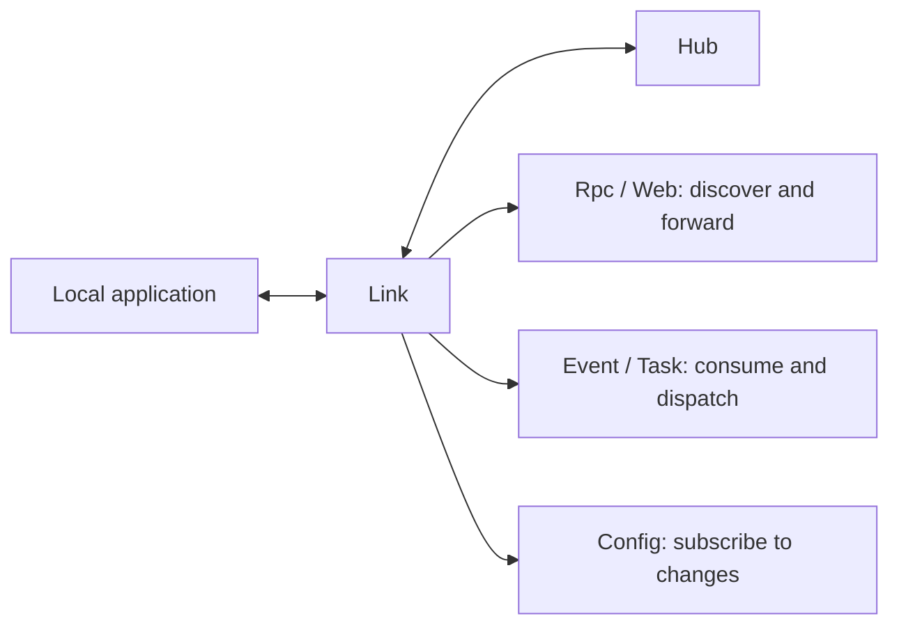

# Link

Link is the runtime access layer deployed alongside applications. It registers local applications with Hub, maintains configuration and service-discovery state, and provides unified runtime capabilities for Rpc, Web, events, and tasks.



## Responsibilities

- **Application registration**: stores the facts for local application instances, registers their capabilities with Hub, and unregisters them on exit.
- **Health and leases**: performs instance health checks and sends heartbeats to Hub in normal mode.
- **Configuration reads**: provides configuration snapshots and watches Hub Redis for change events.
- **Service discovery and forwarding**: routes Rpc and Web requests to local or remote instances based on registration data.
- **Asynchronous message dispatch**: consumes NATS messages and delivers them to locally declared event listeners and task runners.

Link is the sole owner of local application capability state. The Rpc, Web, event, task, and configuration modules derive their runtime indexes from Link rather than maintaining separate copies of application instance state.

## Starting Link

After Hub is running, start Link with the Hub API endpoint:

```bash
vine link serve \
  --hub-endpoint http://127.0.0.1:7071
```

The API listens on `127.0.0.1:7079` by default. Ingress defaults to `0.0.0.0:0`; the operating system assigns a port, and Link registers the resulting endpoint with Hub. Set fixed addresses explicitly when needed:

```bash
vine link serve \
  --api-listen 127.0.0.1:7081 \
  --ingress-listen 127.0.0.1:7082 \
  --hub-endpoint http://127.0.0.1:7071
```

The corresponding environment variables are `VINE_API_LISTEN`, `VINE_INGRESS_LISTEN`, and `VINE_HUB_ENDPOINT`.

## Request Paths

### Rpc

When an application makes an Rpc call, the request first enters Link's `rpcproxy`. The proxy uses service discovery to determine whether the target is local or remote, then invokes it locally or forwards the request through the remote Link. Rpc requests entering through external Link ingress follow the same proxy path before reaching the local application.

### Web

`webproxy` maintains indexes for local Web handlers and remote discovery results. It uses the same model as Rpc: prefer an available local target and reach remote targets through their Link.

### Event and Task

The `event` and `task` modules create NATS consumers from the declarations of local instances. Link automatically updates the corresponding consumers and dispatch state when application capabilities change.

## Inproc Mode

`linked.New(...)` runs Link and the business application in the same process, while Hub remains an external service. Link still opens ingress, registers with Hub, and continues heartbeats and application health checks.

Only standalone mode runs Hub, Portal, Link, and the application in a single process and uses in-process Redis and endpoints. Standalone mode does not send heartbeats. Use linked mode or a fully separated deployment to test leases and network failures.

## Related Documentation

- [Hub](/docs/hub): the source of configuration and registration data.
- [Portal](/docs/portal): the gateway through which external requests enter applications.
- [App](/docs/app): assembles applications in linked or standalone mode.
