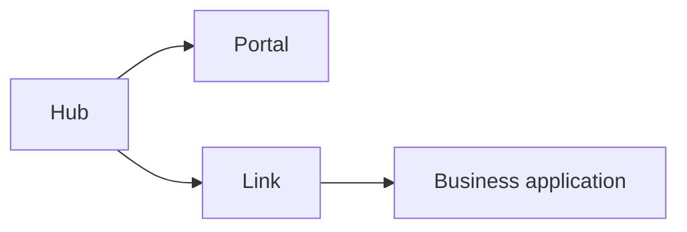
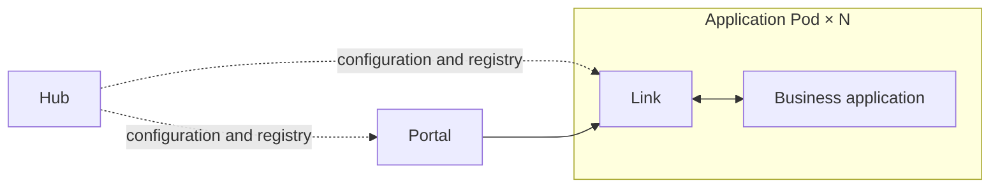
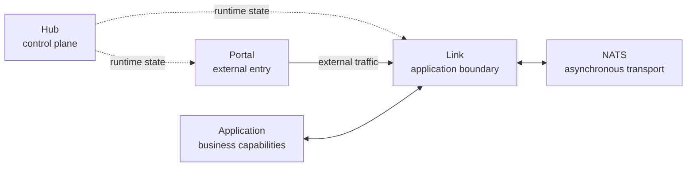
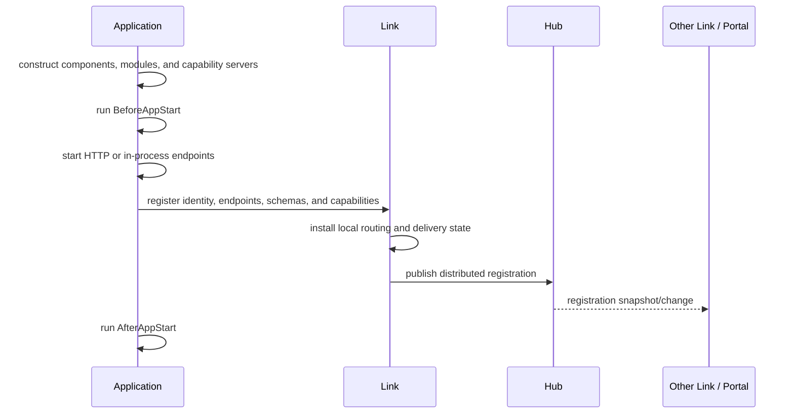
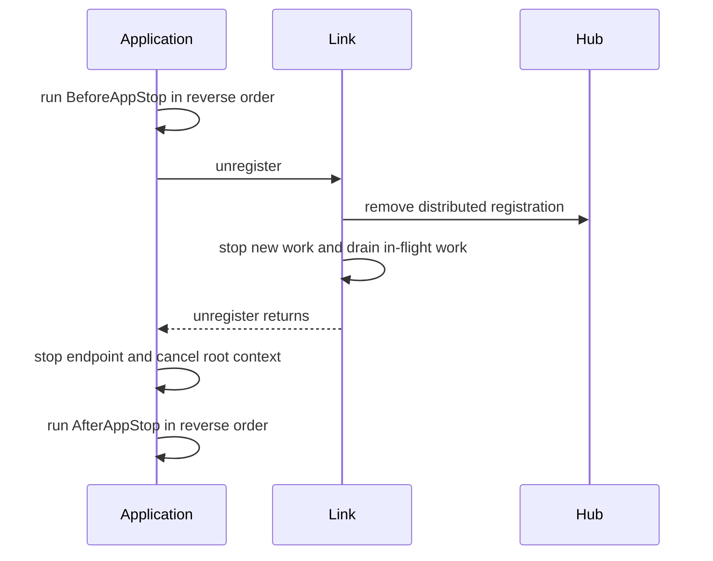

# Architecture

Vine draws a firm line between business capabilities and deployment topology. An
application declares components, modules, Rpc services, Web handlers, Event
listeners, and Task runners without owning service addresses, discovery, or
gateway wiring. The runtime decides how those capabilities are reached.

That separation lets the same application implementation run as a local
single-process system or as part of a Kubernetes deployment. Business packages
stay unchanged; only the thin process entry point and runtime configuration
choose how Hub, Link, Portal, and the application are assembled.

The four roles can be reduced to one sentence:

> **Hub knows what exists, Link connects applications to it, Portal admits
> external traffic, and the application executes business code.**

## One application model, different deployment shapes

The quickest Vine setup is a complete runtime in one process. A production
cluster can split the same roles across workloads. One practical Kubernetes
layout places Link beside each application instance, while Hub and Portal run as
independent workloads:

**Standalone: one process**



**Kubernetes: separated runtime**



The Kubernetes diagram shows one layout, not a required sidecar model. Link and
the application may also be separate workloads as long as their API and
application endpoints are mutually reachable.

### What remains unchanged

- The `ApplicationSpec` and the component/module graph.
- Rpc, Web, Event, and Task implementations and generated contracts.
- Dependency injection, execution context, filters, lifecycle hooks, and
  application configuration reads.
- Calls made through generated clients, emitters, and launchers.

### What moves to the deployment edge

| Concern | Standalone | Kubernetes / separated deployment |
| --- | --- | --- |
| Process assembly | `standalone.New` starts Hub, Portal, Link, and the app | The `vine` CLI and the app binary start separate roles |
| App-to-Link transport | In-process endpoint | `VINE_LINK_ENDPOINT` points to a reachable Link API |
| Registration and discovery | In-process endpoints and snapshots | Link registers with Hub and consumes distributed snapshots |
| External traffic | Embedded Portal may open configured listeners | Independently deployed Portal forwards to registered Links |
| Scaling and failure | One process boundary | Application, Link, Portal, and infrastructure can be operated independently |

In practice, keep the entry point small. Keep the application specification in a
reusable package:

```go title="cmd/checkout-standalone/main.go"
func main() {
	standalone.New[*checkout.App]().StartAndWait()
}
```

```go title="cmd/checkout/main.go"
func main() {
	app.New[*checkout.App]().StartAndWait()
}
```

The cluster entry point gets its Link address from deployment configuration:

```bash
VINE_LINK_ENDPOINT=http://127.0.0.1:7079 ./checkout
```

Changing these few lines is deployment assembly, not a rewrite of business code.
Vine does not generate Kubernetes resources; it keeps topology-specific concerns
out of the application implementation so the same capability model survives the
move.

### Why the boundary holds

Three mechanisms make the topology switch possible:

1. **Capability registration is transport-neutral.** The application reports the
   same identity, schemas, and Rpc/Web/Event/Task capabilities whether its
   endpoint is in-process or networked.
2. **Link owns location and delivery.** Business handlers don't resolve pod
   addresses or select service instances. Link maintains local and distributed
   views and performs the final forwarding or message delivery.
3. **In-process transport uses the runtime contracts.** Standalone replaces
   network hops with registered in-process endpoints; it doesn't introduce a
   second business programming model.

## The four runtime roles



| Participant | Owns | On a synchronous business request path? |
| --- | --- | --- |
| Application | Components, modules, handlers, listeners, runners, and business state | Yes, as caller or target |
| Link | Local application state, configuration reads, discovery snapshots, forwarding, Event/Task consumers, health and drain | Yes |
| Hub | Configuration, registry state, Portal configuration, schemas, and runtime distribution | No; Link and Portal use synchronized state |
| Portal | External listeners, sites, TLS, admission policy, and endpoint selection | Only for external traffic |
| NATS | Event and Task messages | Only for asynchronous delivery |

This separation matters during an outage: a component can be essential to
control-plane convergence without sitting on every request. It also determines
which process must remain alive during startup and graceful shutdown.

## Control, entry, and execution

### Control plane: Hub

Hub uses its database as the source of truth for managed configuration such as
application config, Portal sites, rules, and certificates. It exposes runtime
snapshots and change notifications through its Redis distribution layer.

Link publishes application registration and lease state to Hub. Link and Portal
then read or subscribe to the parts they need. Hub is a control-plane dependency,
not an extra proxy hop in an ordinary Rpc or Web invocation.

### Application access layer: Link

Each application connects to a Link. Link has two kinds of knowledge:

- **Local source state** reported directly by applications connected to that
  Link.
- **Distributed snapshots** loaded from Hub for configuration and remote
  discovery.

Link uses these views to forward Rpc and Web requests, deliver configuration,
create Event and Task consumers, maintain registration leases, and drain an
application during shutdown.

### External entry: Portal

Portal is northbound infrastructure. It watches Hub for entry rules, sites,
certificates, schemas, and available endpoints, then accepts external HTTP or
HTTPS traffic. Portal can authenticate and authorize a request according to the
generated schemas and site policy before forwarding it to a target Link.

Application-to-application calls do not go through Portal. Portal is also not a
replacement for Link: its selected destination is a Link ingress endpoint, not an
application handler discovered independently of Link.

### Execution: the application

The application creates its components, modules, and capability servers. Each
Rpc, Web, Event, or Task delivery enters an execution container that supplies the
correct context and dependencies before calling business code.

Read [Dependency and execution model](./execution-model.md) for the scope and
filter rules inside that boundary.

## From declaration to discoverable capability



A registration describes only declared runtime facts: the application identity
and endpoint plus its Rpc services, Web handlers, Event listeners, Task runners,
and domain schemas. Business data does not enter the registry.

An application that only owns modules and exposes none of these capabilities can
run normally, but it has nothing to advertise through service discovery.

### Readiness implication

The endpoint starts and registration completes **before** `AfterAppStart` hooks
run. Requests can therefore arrive while an `AfterAppStart` hook is running. Put
every readiness-critical check or resource initialization in `BeforeAppStart`;
reserve `AfterAppStart` for work that is safe after the application is visible.

The complete order and hook guidance are in [Application
lifecycle](./application-lifecycle.md).

## Four runtime flows

| Flow | Source | Runtime path | Delivery model |
| --- | --- | --- | --- |
| Configuration | Hub database or seed | Hub, Redis snapshot/change, Link, application DI | Eternal per-instance snapshot or watched instant snapshot |
| Internal Rpc | Generated client in an application | Caller Link, selected local app or target Link, target app | Synchronous request/response |
| External Rpc or Web | External client | Portal, selected Link, target app | Synchronous gateway forwarding |
| Event or Task | Generated emitter or launcher | Sender Link, NATS, consumer Link, target app | Asynchronous, retryable delivery |

### Rpc selection and Web gateway routing

For application-to-application Rpc, the caller's Link builds a current service
set from registration data and selects a registered instance. A target owned by
that Link is invoked locally; otherwise the call enters the target Link before
reaching the application.

Web selection has a different owner. Portal matches the external entry and site,
selects from its distributed Web endpoint snapshot, and sends the request to the
Link that owns the chosen application. The target Link's `webproxy` indexes only
its local applications and performs the final handler lookup and delivery.

Neither path is a durable workflow engine. A selected target failing does not
mean the same request is transparently moved to another target. See
[Registration, discovery, and request routing](./request-routing.md) before
designing retries.

### Event and Task

Link publishes generated Event and Task messages to NATS and creates consumers
from registered listeners and runners. Application code doesn't create those
consumers.

Event and Task have different grouping semantics and can redeliver work after a
failure. Read [Events and Tasks](../framework/event-task.md) before relying on
broadcast, ordering, retry, or identity propagation behavior.

### Configuration

Link provides the application-facing configuration read boundary. Eternal
configuration freezes on the application's first read; instant configuration
starts a watch on first read and updates the snapshot used by later DI
resolutions. An already injected pointer is not mutated.

See [Configuration](../framework/configuration.md) for the consistency model.

## Where the topology abstraction ends

| Mode | Processes | Transport changes | What it is good for |
| --- | --- | --- | --- |
| Standalone | Hub, Portal, Link, and applications share one process | Management and application endpoints can be in-process | First use, local development, integration tests |
| Linked | An external Hub; Link and one or more apps share a process | App-to-Link is in-process; Hub and Link ingress use the network | Shared development/runtime control plane |
| Separated | Hub, Portal, Link, and apps can run independently | Runtime boundaries use network endpoints | Production topology and distributed-failure testing |

Application capability code doesn't change between these modes. The abstraction
deliberately covers application assembly, registration, routing, and delivery; it
cannot erase operational differences between a process and a cluster. In-process
transport preserves routing and subscription semantics, not distributed failure
semantics:

- Standalone registrations have no TTL and Link sends no heartbeat.
- Standalone does not model an independently crashed process or network
  partition.
- In-process health checks and endpoint reachability cannot prove that a
  production listener, firewall, DNS path, or TLS configuration works.
- Portal may still open business HTTP/HTTPS listeners when its Hub configuration
  defines them.

Use a separated setup to validate lease expiry, independent restarts, real
network reachability, and TLS.

## Graceful removal



In linked and standalone composition, business applications stop before their
shared Link so that unregister and drain remain available. In separated
deployments, preserve the same operational order: stop or drain applications
before terminating the Link that owns them.

`BeforeAppStop` runs before unregister. Use it to stop application-owned
producers and begin quiescing, but keep dependencies required by in-flight
handlers valid until the drain completes. Release final resources in
`AfterAppStop`.

## Related guides

- [Application lifecycle](./application-lifecycle.md): construction, hooks,
  readiness, drain, and bundle ordering.
- [Dependency and execution model](./execution-model.md): application singletons,
  execution scope, filters, context, and disposal.
- [Request routing](./request-routing.md): registration watches, instance
  selection, local/remote forwarding, and failure behavior.
- [Trace and timeout](../framework/trace-timeout.md): metadata, deadlines,
  cancellation, and downstream calls.
- [Deployment topologies](../getting-started/deployment-modes.md): choose
  standalone, linked, or separated operation.
- [Production readiness](../operations/production-readiness.md): network
  boundary, persistence, lifecycle, and failure testing.
