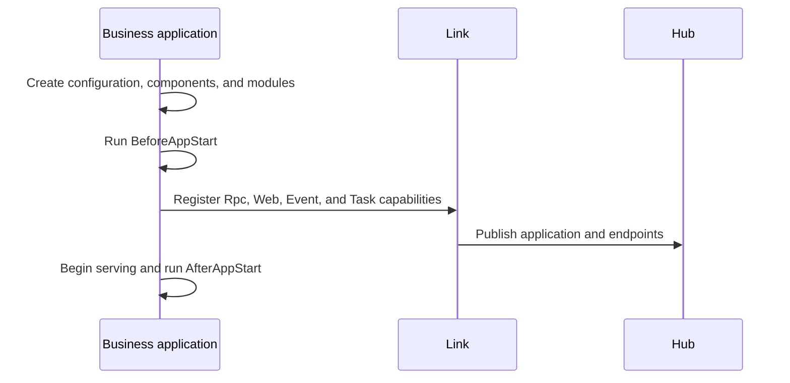
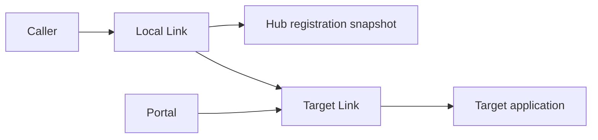
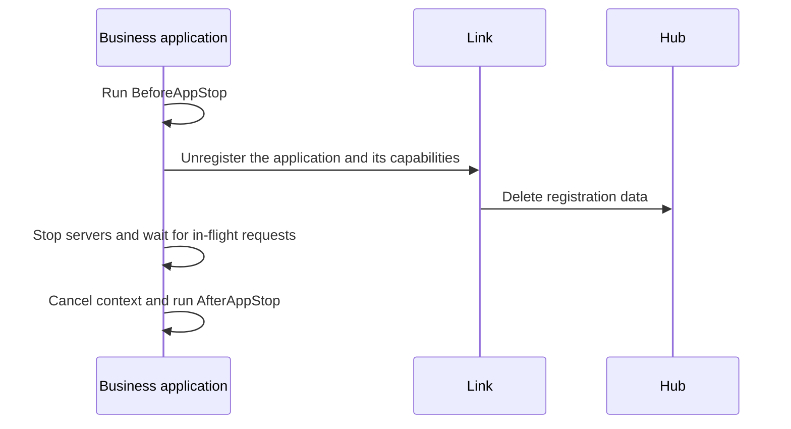

# Runtime Mechanisms

Vine separates application capabilities into a control plane and a request plane. Hub stores desired state and registration data, Link connects applications and provides discovery and delivery, and Portal accepts external requests. Business code only needs to declare capabilities and implement handlers.

## Application Startup

If startup fails, the application does not enter a serving state. Components should return meaningful errors from `BeforeAppStart` instead of continuing with missing dependencies.

## Service Discovery and Request Forwarding

Link selects a target instance from service registrations. When an application starts, stops, or loses its lease, Hub publishes a change and Link and Portal update their local endpoint views.

## Configuration Updates

Hub writes configuration to its Redis distribution layer. Link reads an initial snapshot and subscribes to changes. Applications receive configuration objects that match the generated schema. Instant configuration can change while the application is running, while eternal configuration is intended for startup state.

## Event and Task

Link writes messages from senders to NATS and creates consumers on the receiving side from application declarations. Concurrency, timeout, retry, and Cron settings come from application registration; business listeners and runners do not manage NATS consumers directly.

## Graceful Shutdown

In standalone and linked modes, Vine stops business applications before stopping the in-process Link so that the unregistration path remains available. In a separated deployment, allow the application to complete graceful shutdown before terminating Link.

For configuration and behavior of individual components, see [Components and Modules](/docs/components), [Hub](/docs/hub), [Link](/docs/link), and [Portal](/docs/portal).
