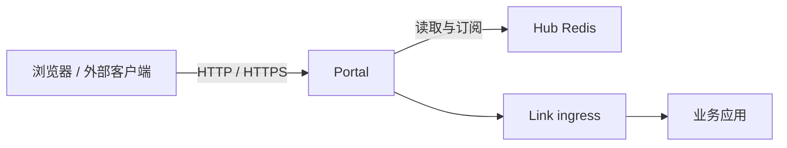

# Portal 外部访问网关

Portal 是 Vine 的北向入口。它从 Hub Redis 读取入口、站点、证书、schema 与 endpoint 信息，并把 HTTP、HTTPS、Rpc 和 Web 请求路由到目标应用的 Link endpoint。



## 职责边界

- **入口监听**：依据 Portal rule 维护 HTTP / HTTPS listener。
- **站点路由**：依据 Portal site 配置创建 RpcGW 或 WebGW，并在站点内匹配请求。
- **Endpoint 发现**：持续订阅 Rpc 与 Web endpoint 注册，向网关提供可用实例。
- **认证与授权**：根据 actor、service、resource schema，在 Rpc 转发前按需调用后端认证和权限服务。
- **TLS 证书**：读取并监听 Hub 中的证书配置，按 SNI 匹配 HTTPS 证书。

Portal 只处理外部入口与网关策略；它不保存配置真源，不负责应用注册，也不运行 heartbeat。

## 启动

Portal 依赖已启动的 Hub：

```bash
vine portal serve \
  --hub-endpoint http://127.0.0.1:7071
```

`--hub-endpoint` 也可通过 `VINE_HUB_ENDPOINT` 设置。Portal 的实际 HTTP / HTTPS 监听地址不是命令行固定参数，而是由 Hub 中的 Portal entry 和 rule 配置驱动。

## 配置如何生效

Portal 不需要重启来加载大多数网关变更。它监听 Hub Redis 中的以下内容：

- `portal:rule:*`：决定 scheme、端口以及请求交给哪个站点。
- `portal:site:*`：定义 Rpc 或 Web 站点及路由规则。
- endpoint 注册信息：决定一个请求可转发到哪些 Link。
- actor、service、resource schema：决定 Rpc 的认证与权限准入。
- TLS 证书：用于 HTTPS listener 的 SNI 匹配。

Hub 发布变更后，Portal 会更新相应 listener、网关或缓存状态；业务实例注册或失效时，endpoint 发现也会随之变化。

## Inproc 模式

Portal 可随 standalone runtime 在同一进程内启动。它的模块划分和 Redis 订阅语义不变，只是 Hub Redis 与目标 Link endpoint 均可能是进程内连接。

该模式可验证路由、schema 监听、准入和转发逻辑，但无法模拟独立进程崩溃、外部网络断连及 TLS 端口不可达等分布式条件。需要验证这些条件时，请采用独立进程部署。

## 相关文档

- [Hub](/docs/hub)：管理 Portal entry、rule、site 与证书配置。
- [Link](/docs/link)：承载目标应用的 ingress 与 endpoint 注册。
- [Rpc](/docs/rpc)：应用内部的 Rpc 抽象。
