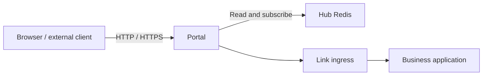

# Portal Gateway

Portal is Vine's northbound entry point. It reads entry, site, certificate,
schema, and endpoint data from Hub Redis, then routes incoming HTTP, HTTPS, Rpc,
and Web requests to the target application's Link endpoint.



## Responsibilities

- **Entry listeners**: maintains HTTP and HTTPS listeners from Portal rules.
- **Site routing**: creates RpcGW or WebGW gateways from Portal site
  configuration and matches requests within each site.
- **Endpoint discovery**: continuously subscribes to Rpc and Web endpoint
  registrations and supplies available instances to gateways.
- **Authentication and authorization**: uses actor, service, and resource schemas
  to call backend authentication and permission services when required before
  forwarding Rpc requests.
- **TLS certificates**: reads and watches certificates stored in Hub and matches
  HTTPS certificates by SNI.

Portal only handles external entry points and gateway policy. It isn't the
configuration source of truth, doesn't register applications, and doesn't send
heartbeats.

## Starting Portal

Portal requires a running Hub:

```bash
vine portal serve \
  --hub-endpoint http://127.0.0.1:7071
```

You can also set `--hub-endpoint` through `VINE_HUB_ENDPOINT`. Portal's actual
HTTP and HTTPS listen addresses are not fixed command-line options; Portal entry
and rule configuration stored in Hub determines them.

For a network deployment, configure Portal's `vine.portal` backend identity:

```bash
vine portal serve \
  --hub-endpoint https://hub.internal:7071 \
  --mtls-ca-file /run/vine/ca.pem \
  --mtls-cert-file /run/vine/portal.pem \
  --mtls-key-file /run/vine/portal-key.pem
```

Portal uses this certificate for Hub Rpc and Redis clients and for calls to Hub
Admin and Link ingress. Its exact X.509-SVID is
`spiffe://<trust-domain>/vine/daemon/vine.portal`, using the same trust domain as Hub and
Link. These backend identity files are never served directly by browser-facing
HTTPS listeners. When mTLS is enabled and no configured certificate matches an
SNI host, Portal generates a separate, short-lived self-signed Web certificate
in memory. Exact and wildcard certificates from Hub always take precedence.
Temporary certificates are bounded in an in-memory cache, are not written to
Hub, and disappear when Portal stops. They encrypt bootstrap traffic but are not
browser-trusted; configure a public certificate before production use.

## How Configuration Takes Effect

Portal can load most gateway changes without restarting. It watches the following
data in Hub Redis:

- `portal:rule:*`: determines the scheme, port, and site that receives a request.
- `portal:site:*`: defines Rpc or Web sites and their routing rules.
- Endpoint registrations: determine which Link instances can receive a request.
- Actor, service, and resource schemas: determine Rpc authentication and
  authorization admission.
- TLS certificates: provide SNI matching for HTTPS listeners.

After Hub publishes a change, Portal updates the corresponding listener, gateway,
or cache. Endpoint discovery also updates as business instances register or
expire.

## Inproc Mode

Portal can run in the same process as a standalone runtime. Its module boundaries
and Redis subscription semantics remain the same, but both the Hub Redis
connection and target Link endpoint may be in-process connections.

This mode can verify routing, schema subscriptions, admission, and gateway
forwarding, but it can't simulate independent process crashes, external network
partitions, or unreachable TLS ports. Use separate processes to test those
conditions.

## Related Documentation

- [Hub](./hub.md): manages Portal entries, rules, sites, and certificates.
- [Link](./link.md): hosts target application ingress and endpoint registrations.
- [Rpc](../infrastructure/rpc.md): the Rpc abstraction used inside applications.
