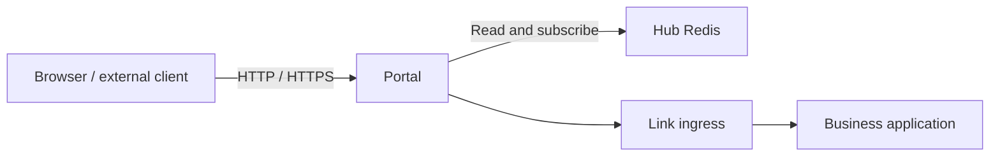

# Portal Gateway

Portal is Vine's northbound entry point. It reads entry, site, certificate,
schema, and endpoint data from Hub Redis, then routes incoming HTTP, HTTPS, Rpc,
and Web requests to the target application's Link endpoint.



## Responsibilities

- **Entry listeners**: maintains HTTP and HTTPS listeners from Portal rules.
- **Site routing**: creates RpcGW or WebGW gateways from Portal site
  configuration and matches requests within each site.
- **Endpoint discovery**: continuously subscribes to Rpc and Web endpoint
  registrations and supplies available instances to gateways.
- **Authentication and authorization**: uses actor, service, and resource schemas
  to call backend authentication and permission services when required before
  forwarding Rpc requests.
- **TLS certificates**: reads and watches certificates stored in Hub and matches
  HTTPS certificates by SNI.

Portal only handles external entry points and gateway policy. It isn't the
configuration source of truth, doesn't register applications, and doesn't send
heartbeats.

## Starting Portal

Portal requires a running Hub:

```bash
vine portal serve \
  --hub-endpoint http://127.0.0.1:7071
```

`--hub-endpoint` can also be set through `VINE_HUB_ENDPOINT`. Portal's actual
HTTP and HTTPS listen addresses are not fixed command-line options; Portal entry
and rule configuration stored in Hub determines them.

For a network deployment, configure Portal's `vine.portal` backend identity:

```bash
vine portal serve \
  --hub-endpoint https://hub.internal:7071 \
  --mtls-ca-file /run/vine/ca.pem \
  --mtls-cert-file /run/vine/portal.pem \
  --mtls-key-file /run/vine/portal-key.pem
```

Portal uses this certificate for Hub Rpc and Redis clients and for calls to Hub
Admin and Link ingress. Its exact X.509-SVID is
`spiffe://<trust-domain>/vine/daemon/vine.portal`, using the same trust domain as Hub and
Link. These backend identity files are never served directly by browser-facing
HTTPS listeners. When mTLS is enabled and no configured certificate matches an
SNI host, Portal generates a separate, short-lived self-signed Web certificate
in memory. Exact and wildcard certificates from Hub always take precedence.
Temporary certificates are bounded in an in-memory cache, are not written to
Hub, and disappear when Portal stops. They encrypt bootstrap traffic but are not
browser-trusted; configure a public certificate before production use.

## How Configuration Takes Effect

Portal can load most gateway changes without restarting. It watches the following
data in Hub Redis:

- `portal:rule:*`: determines the scheme, port, and site that receives a request.
- `portal:site:*`: defines Rpc or Web sites and their routing rules.
- Endpoint registrations: determine which Link instances can receive a request.
- Actor, service, and resource schemas: determine Rpc authentication and
  authorization admission.
- TLS certificates: provide SNI matching for HTTPS listeners.

After Hub publishes a change, Portal updates the corresponding listener, gateway,
or cache. Endpoint discovery also updates as business instances register or
expire.

## Inproc Mode

Portal can run in the same process as a standalone runtime. Its module boundaries
and Redis subscription semantics remain the same, but both the Hub Redis
connection and target Link endpoint may be in-process connections.

This mode can verify routing, schema subscriptions, admission, and gateway
forwarding, but it can't simulate independent process crashes, external network
partitions, or unreachable TLS ports. Use separate processes to test those
conditions.

## Related Documentation

- [Hub](./hub.md): manages Portal entries, rules, sites, and certificates.
- [Link](./link.md): hosts target application ingress and endpoint registrations.
- [Rpc](../infrastructure/rpc.md): the Rpc abstraction used inside applications.

## Entry path mapping

SITE rules accept `routePathPrefix`, a path prefix within the target site. Portal
matches the original request using `matchPathPrefix`, replaces that prefix with
`routePathPrefix`, and then dispatches to the site's WebGW or RpcGW. This changes the
forwarded request, not the browser URL. It does not rewrite response bodies,
asset URLs, or redirect locations.

| `matchPathPrefix` | `routePathPrefix` | Request | Site receives |
| --- | --- | --- | --- |
| `/api` | empty | `/api/users` | `/users` |
| `/api` | `/internal` | `/api/users?x=1` | `/internal/users?x=1` |
| `/api` | `/api` | `/api/users` | `/api/users` |
| `/` | `/internal` | `/users` | `/internal/users` |
| `/api` | `/internal` | `/api` | `/internal` |
| `/api` | `/internal` | `/api/` | `/internal/` |

Empty or `/` retains prefix stripping. Other values must start with `/` and
must not contain a scheme, host, query, fragment, backslash, control characters,
or `.` / `..` segments. Trailing slashes on the configured target prefix are
removed. Encoded request suffixes, query parameters, method, body, and request
context are preserved during entry rewriting. Matching still uses path-segment
boundaries (`/api` does not match `/api2`) and existing rule precedence.
For RpcGW, the resulting path must be a gateway path such as
`/invoke/demo.Service/Method`; `routePathPrefix` does not bypass gateway admission.
Redirect rules use `routeRedirectionPattern` and cannot specify `routePathPrefix`.

Configure **Target path prefix** in the Dashboard rule editor or include it in
Hub seed YAML:

```yaml
portalRules:
  - name: internal-api
    matchScheme: http
    matchHost: api.example.com
    matchPort: 8080
    matchPathPrefix: /api
    routeType: SITE
    routeSiteName: application-web
    routePathPrefix: /internal
```

Configure the target site before sending traffic to the rule. Rule updates
take effect without restarting Portal. Omitting `routePathPrefix`
from an API update leaves it unchanged; sending an empty string clears it.
Seed YAML is a complete rule value: omitting the field means empty.

When upgrading from `v0.14.1`, Hub automatically migrates saved rules. You do not
need to recreate them. Use the following field names when editing seed files
or calling the Admin API.

Legacy YAML remains supported at both startup and Dashboard import. Each old
field produces a warning identifying the rule, old field, and replacement:

| Legacy YAML | Current YAML |
| --- | --- |
| `scheme` | `matchScheme` |
| `host` | `matchHost` |
| `port` | `matchPort` |
| `pathPrefix` | `matchPathPrefix` |
| `targetType` | `routeType` |
| `siteName` | `routeSiteName` |
| `targetPath` | `routePathPrefix` |
| `redirectionPattern` | `routeRedirectionPattern` |

A single rule cannot mix legacy and current fields, even when their values
are identical, empty, or zero. Such imports fail before applying any data.
The Admin API requires the current field names. Update custom Admin clients
that manage entry rules. Upgrade Hub and all Portal instances together;
mixing old and new versions can make entry routes unavailable.

## Rule validation

The following requirements apply to the Admin API, startup seed YAML, and
Dashboard imports. User configuration cannot replace built-in Dashboard rules.

Rules require a name, `matchScheme` of `http` or `https`, and `matchPort` of
`0` (the protocol default) or `1–65535`. `matchHost` may be empty or a hostname/IP,
without a URL, port, or wildcard. A nonempty `matchPathPrefix` must start with `/`
and cannot contain query/fragment delimiters, backslashes, whitespace, control
characters, or dot segments.

`SITE` requires `routeSiteName` and rejects `routeRedirectionPattern`.
`PERMANENT_REDIRECT` and `TEMPORARY_REDIRECT` require `routeRedirectionPattern`
and reject site names and nonempty route path prefixes. Redirect placeholders
are `{scheme}`, `{host}`, `{uri}`, `{path}`, `{query}`, `{method}`, and `{remote}`;
unrecognized placeholders or unmatched braces are rejected.
Saving a rule does not check whether its target site exists. Configure the
target site before it needs to handle requests.

## Certificate information

Issuer, domains, and validity dates are read automatically from the certificate;
you do not need to fill them in. Certificate content takes precedence over any
metadata supplied in YAML.
