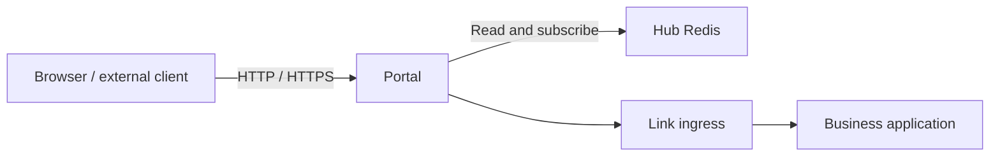

# Portal Gateway

Portal is Vine's northbound entry point. It reads entry, site, certificate,
schema, and endpoint data from Hub Redis, then routes incoming HTTP, HTTPS, Rpc,
and Web requests to the target application's Link endpoint.



## Responsibilities

- **Entry listeners**: maintains HTTP and HTTPS listeners from Portal rules.
- **Site routing**: creates RpcGW or WebGW gateways from Portal site
  configuration and matches requests within each site.
- **Endpoint discovery**: continuously subscribes to Rpc and Web endpoint
  registrations and supplies available instances to gateways.
- **Authentication and authorization**: uses actor, service, and resource schemas
  to call backend authentication and permission services when required before
  forwarding Rpc requests.
- **TLS certificates**: reads and watches certificates stored in Hub and matches
  HTTPS certificates by SNI.
- **Self-registration**: registers its own instance and Vine runtime version with
  Hub, then renews the registration while it runs, so Hub can report which Portal
  instances are serving.

Portal only handles external entry points and gateway policy. It isn't the
configuration source of truth, and it doesn't register applications or their
capabilities with Hub.

## Portal registration

In a separated deployment, Portal registers itself with Hub at startup, renews
the registration every 10 seconds, and unregisters on graceful shutdown. Hub
reports a Portal instance as serving until 30 seconds pass without a heartbeat,
so a terminated Portal disappears from the list on its own. The Hub Dashboard
shows registered Portal instances alongside application instances.

A restarted Hub reports no Portal instances until each Portal registers again on
its next heartbeat. Standalone Portal shares Hub's process and cannot outlive it,
so it registers once without a heartbeat.

## Starting Portal

Portal requires a running Hub:

```bash
vine portal serve \
  --hub-endpoint http://127.0.0.1:7071
```

`--hub-endpoint` can also be set through `VINE_HUB_ENDPOINT`. Portal's actual
HTTP and HTTPS listen addresses are not fixed command-line options; Portal entry
and rule configuration stored in Hub determines them.

For a network deployment, configure Portal's `vine.portal` backend identity:

```bash
vine portal serve \
  --hub-endpoint https://hub.internal:7071 \
  --mtls-ca-file /run/vine/ca.pem \
  --mtls-cert-file /run/vine/portal.pem \
  --mtls-key-file /run/vine/portal-key.pem
```

Portal uses this certificate for Hub Rpc and Redis clients and for calls to Hub
Admin and Link ingress. Its exact X.509-SVID is
`spiffe://<trust-domain>/vine/daemon/vine.portal`, using the same trust domain as Hub and
Link. These backend identity files are never served directly by browser-facing
HTTPS listeners. When mTLS is enabled and no configured certificate matches an
SNI host, Portal generates a separate, short-lived self-signed Web certificate
in memory. Exact and wildcard certificates from Hub always take precedence.
Temporary certificates are not persisted and disappear when Portal stops. They encrypt bootstrap traffic but are not
browser-trusted; configure a public certificate before production use.

## How Configuration Takes Effect

Portal can load most gateway changes without restarting. It watches the following
data in Hub Redis:

- Rule changes: determine the scheme, port, and site that receives a request.
- Site changes: define Rpc or Web sites and their routing rules.
- Endpoint registrations: determine which Link instances can receive a request.
- Actor, service, and resource schemas: determine Rpc authentication and
  authorization admission.
- TLS certificates: provide SNI matching for HTTPS listeners.

After Hub publishes a change, Portal updates the corresponding listener, gateway,
or cache. Endpoint discovery also updates as business instances register or
expire.

Hub restarts are handled the same way. Portal re-reads Hub information on a
timer, so a restarted Hub that advertises a different watch endpoint is followed
without restarting Portal. See
[Hub Restart and Endpoint Changes](./hub.md#hub-restart-and-endpoint-changes).

## Optional credentials

For RPC and Web authentication, optional credential fields can be omitted from
`Authorization`. For example, when `token` is required and `tenant` is optional,
send `Authorization: token abc` if no tenant value is available, or
`Authorization: token abc, tenant team-a` to include it. An omitted field reaches
the authentication service as nil; do not send an empty value.

Every required field must be present, and every supplied value must be non-empty.
Unknown field names and malformed entries are rejected. Skel requires at least
one non-nullable credential field, so a valid request always supplies at least
one non-empty value.

## Inproc Mode

Portal can run in the same process as a standalone runtime, with the Hub Redis
connection and the target Link endpoint as in-process connections.

This mode can verify routing, schema subscriptions, admission, and gateway
forwarding, but it can't simulate independent process crashes, external network
partitions, or unreachable TLS ports. Use separate processes to test those
conditions.

## Related Documentation

- [Hub](./hub.md): manages Portal entries, rules, sites, and certificates.
- [Link](./link.md): hosts target application ingress and endpoint registrations.
- [Rpc](../infrastructure/rpc.md): the Rpc abstraction used inside applications.

## Portal entries

An entry is the access Portal serves: its scheme, host, and port. Every rule
belongs to one entry, and the entry owns that access, so changing an entry
updates every rule it routes at once. The Dashboard lists entries beside sites
and rules, and the rule editor selects one when it creates a rule.

Seed YAML names entries in a `portalEntries` section, and rules in the same
document reference them by `entryName`:

```yaml
portalEntries:
  - name: web
    scheme: https
    host: api.example.com
    port: 8443

portalRules:
  - name: internal-api
    entryName: web
    matchPathPrefix: /api
    routeType: SITE
    routeSiteName: application-web
```

A seed may instead declare the access on each rule with `matchScheme`,
`matchHost`, and `matchPort`. Hub creates the entry each rule needs. The two styles cannot be mixed: every rule in one document either
names an entry or declares an access, and a rule may reference only an entry that
the same document declares. Hub derives the name `scheme:port`, or
`scheme:host:port` when a host is set, for an entry it creates on its own. An
entry may route no rule yet, which keeps it available while you add the rules
that use it.

## Enabling and disabling configuration

Portal sites, entries, rules, and certificates carry an enable switch that the
Dashboard edits. A seed declares only what it turns off:

```yaml
portalRules:
  - name: legacy-api
    disabled: true
    matchPathPrefix: /legacy
    routeType: SITE
    routeSiteName: application-web
```

Everything is enabled when the seed omits the field, and an existing database
keeps its configuration enabled. A disabled rule is not served, and neither are
the rules of a disabled entry or the SITE rules of a disabled site. Redirect rules are not
SITE rules, so they stay published when their site is disabled. A disabled
certificate is not served.

## Entry path mapping

When the Web contract behind a Web site declares a mount path, Portal uses that
path for both matching and forwarding, so the prefixes configured on the SITE
rules that target the site have no effect while the mount path exists:

- The rule editor shows the Web path and reports that the Web fixes both paths.
- Seed rules may omit both prefixes.
- A mount path of `/` serves from the root.
- The stored prefixes are kept, and apply again if the Web stops declaring a
  mount path.
- Site and contract changes refresh the effective paths without restarting Portal.

Redirect rules are unchanged: they keep their configured pattern and take no part
in mount-path resolution.

The following mapping options apply when the target Web has no mount path, or
when the target site is RpcGW.

SITE rules accept `routePathPrefix`, a path prefix within the target site. Portal
matches the original request using `matchPathPrefix`, replaces that prefix with
`routePathPrefix`, and then dispatches to the site's WebGW or RpcGW. This changes the
forwarded request, not the browser URL. It does not rewrite response bodies,
asset URLs, or redirect locations.

| `matchPathPrefix` | `routePathPrefix` | Request | Site receives |
| --- | --- | --- | --- |
| `/api` | empty | `/api/users` | `/users` |
| `/api` | `/internal` | `/api/users?x=1` | `/internal/users?x=1` |
| `/api` | `/api` | `/api/users` | `/api/users` |
| `/` | `/internal` | `/users` | `/internal/users` |
| `/api` | `/internal` | `/api` | `/internal` |
| `/api` | `/internal` | `/api/` | `/internal/` |

Empty or `/` retains prefix stripping. Other values must start with `/` and
must not contain a scheme, host, query, fragment, backslash, control characters,
or `.` / `..` segments. Trailing slashes on the configured target prefix are
removed. Encoded request suffixes, query parameters, method, body, and request
context are preserved during entry rewriting. Matching still uses path-segment
boundaries (`/api` does not match `/api2`) and existing rule precedence.
For RpcGW, the resulting path must be a gateway path such as
`/invoke/demo.Service/Method`; `routePathPrefix` does not bypass gateway admission.
Redirect rules use `routeRedirectionPattern` and cannot specify `routePathPrefix`.

Configure **Target path prefix** in the Dashboard rule editor or include it in
Hub seed YAML:

```yaml
portalRules:
  - name: internal-api
    matchScheme: http
    matchHost: api.example.com
    matchPort: 8080
    matchPathPrefix: /api
    routeType: SITE
    routeSiteName: application-web
    routePathPrefix: /internal
```

Configure the target site before sending traffic to the rule. Rule updates
take effect without restarting Portal. Omitting `routePathPrefix`
from an API update leaves it unchanged; sending an empty string clears it.
Seed YAML is a complete rule value: omitting the field means empty.

## Rule validation

The following requirements apply to the Admin API and startup seed YAML.

An entry requires a `scheme` of `http` or `https` and a `port` of `0` (the
protocol default) or `1–65535`; its `host` may be empty or a hostname or IP
address, without a URL, port, or wildcard. An entry created for a rule that
declares access is named from that access. A rule requires a name, and its
`matchPathPrefix`, when set, must start with `/` and cannot contain query or
fragment delimiters, backslashes, whitespace, control characters, or dot
segments. A rule created through the Admin API names its entry with `entryName`.

`SITE` requires `routeSiteName` and rejects `routeRedirectionPattern`.
`PERMANENT_REDIRECT` and `TEMPORARY_REDIRECT` require `routeRedirectionPattern`
and reject site names and nonempty route path prefixes. Redirect placeholders
are `{scheme}`, `{host}`, `{uri}`, `{path}`, `{query}`, `{method}`, and `{remote}`;
unrecognized placeholders or unmatched braces are rejected.
Saving a rule does not check whether its target site exists. Configure the
target site before it needs to handle requests.

## Rule conflicts

Two rules conflict when they belong to the same entry and resolve to the same
match path, because Portal cannot order them. The rule whose name sorts first
serves the request; the other takes over as soon as the first stops serving it.
The Dashboard marks both rules and shows the request they match, and the Admin API
reports every pair through `listConflicts`.

Resolve a conflict by disabling one rule, creating the rule under a different
entry, or changing the mount path of its site, which changes the path its rules
resolve to.

## Certificate information

Issuer, domains, and validity dates are read automatically from the certificate;
you do not need to fill them in. Certificate content takes precedence over any
metadata supplied in YAML.

## API Service Boundaries

An `api service` is a client entry point reached through Portal. Only API services
are exposed to clients; plain backend services are not. Backend authentication,
permission, and resource-check services keep running behind Portal and are not
client entry points.
