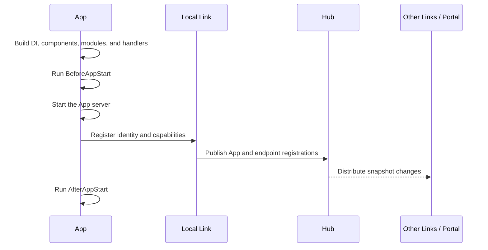
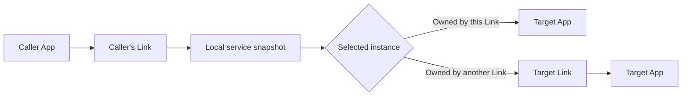
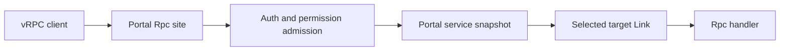
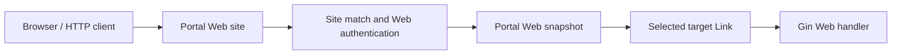
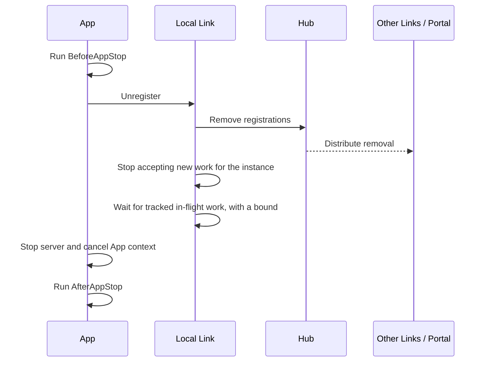

# Request Routing & Readiness

Vine routes by declared capabilities, not by addresses embedded in business
code. An application publishes the Rpc services and Web handlers it can serve;
Hub distributes that registration state; Link and Portal keep local snapshots
and select an instance for each request.

The important boundary is registration: listening is local process state;
being routable means the caller's Link or Portal has observed the registration.

## The four runtime roles

| Runtime | Owns | Does not own |
| --- | --- | --- |
| App | Handler implementations, its application identity, and its capability declaration | Cross-application discovery or public gateway policy |
| Hub | Registration source of truth, leases in network mode, and the distribution snapshot | Per-request forwarding |
| Link | Local App ownership, configuration/discovery snapshots, instance selection, and forwarding | Public site, TLS, or external admission policy |
| Portal | Public HTTP/HTTPS entry, site matching, authentication/authorization, and external endpoint selection | Application registration or heartbeat |

The snapshots in Link and Portal are derived state. They update after Hub
publishes a registration change, so separate processes converge asynchronously
rather than through one global routing table.

## Registration is the routing boundary

An App starts its handlers before it advertises them. Its normal startup path
is:

These moments mean different things:

- **The process is listening**: the App server exists, but discovery may not
  contain the instance yet.
- **Local registration completed**: the App's Link owns the instance and has
  published it to Hub.
- **The deployment is routable**: the Link or Portal used by a real caller has
  observed the updated snapshot.

`Start` completes local registration before it returns, but Vine does not
provide a global convergence barrier for every other Link and Portal. For
deployment readiness, probe the application through the same Portal or Link
path that production callers use. A process-listening check alone is
insufficient.

During rollout, callers may briefly observe a configured service with no
available endpoint, or a snapshot that still contains a departing endpoint.
Treat availability errors as an expected distributed-system boundary and retry
only when the operation is safe to repeat.

## Application-to-application Rpc

A generated Rpc client calls the caller's local Link. That Link chooses one
currently known registration for the service:

For a local target, Link forwards directly to the App endpoint. For a remote
target, it forwards through the target Link, which verifies the instance and
service before invoking the App.

### Instance selection

Selection is round-robin within the calling Link's current service snapshot.
The behavior is deliberately simple:

- Every Link maintains its own cursor; callers using different Links do not
  share one global sequence.
- The starting order is unspecified. Registrations are rebuilt from snapshot
  data, and an add or remove can change the next observed order.
- There is no affinity, weighting, latency-aware choice, or per-instance
  priority.
- Registration health and leases eventually remove unavailable instances, but
  selection does not perform a live probe before every call.
- There is no built-in circuit breaker.
- If the selected endpoint fails, Vine returns that failure. The same call is
  not automatically retried against another instance.

Application-level retry therefore needs an explicit deadline and idempotency
decision. A read may be safe to retry; a payment, email, or state transition
usually needs an idempotency key or a query-before-retry design.

## External Rpc and Web requests

External requests enter through Portal. They do not first use an arbitrary
business application's outbound Link.

### External Rpc

Portal validates the vRPC request, establishes trace and caller metadata,
performs the site's admission checks, and selects a registered service
endpoint. The target Link then forwards to the owning App.

Use a generated vRPC client for this path. The App and Link endpoints are
runtime-internal protocol endpoints; calling them directly bypasses Portal
policy and requires internal metadata that ordinary HTTP tools do not provide.

### External Web

Portal accepts normal browser HTTP, creates the Vine trace, initiator, and
Actor metadata for the backend request, then selects a Web registration.
Directly browsing an App's internal Web endpoint is not a supported public
entry path: that endpoint expects Vine's internal Web metadata headers.

Portal uses a local round-robin cursor for Rpc and Web endpoints. Like Link, it
does not add weights, circuit breaking, or automatic same-request failover.

## Graceful shutdown and drain

Graceful App shutdown removes discovery before closing the App server:

The propagation grace and drain wait reduce dropped work, but they cannot make
every concurrent caller observe removal at the same instant. A stale caller
can still select the instance during convergence and receive an availability
error. Drain is also bounded; it is not permission for handlers to ignore
deadlines indefinitely.

For a controlled deployment:

1. Stop sending new external traffic or make the deployment fail its readiness
   probe.
2. Gracefully stop business Apps while their Link is still available.
3. Let Apps unregister and drain tracked requests.
4. Stop Link only after its Apps have stopped.
5. Stop Portal and Hub after dependent traffic has ended.

The `linked` and `standalone` wrappers already stop business Apps before their
in-process Link. In a separated deployment, preserve that ordering in the
process supervisor.

## Standalone and in-process routing

Standalone keeps the registration, snapshot, proxy, round-robin, metadata, and
serialization boundaries. Calls still pass through Link's routing logic, and
in-process Rpc values are cloned through the same JSON or CBOR representation
used by network calls.

It intentionally does not reproduce every distributed failure:

| Preserved in standalone | Requires linked or separated processes |
| --- | --- |
| Capability registration and removal | Independent process crashes |
| Service and Web selection | Real network partitions and unreachable ports |
| Local/remote-style forwarding decisions | Heartbeat failure and lease expiry |
| Request validation and value cloning | External Link ingress and transport security |
| Portal site/admission logic when configured | Real TLS listener and certificate reachability |

In-process timeout or cancellation also returns without waiting for a handler
that ignores its context to finish, matching the caller-visible behavior of a
network timeout. It does not prove that such a handler has stopped.

Use standalone for fast integration tests. Use linked or fully separated
processes for liveness, lease, network, TLS, and restart exercises.

## Before marking an instance ready

Before declaring a deployment ready, verify:

- Hub is serving registration and distribution state.
- Link has connected to Hub and its messaging dependency.
- The App has completed registration, not merely opened a listener.
- A probe through the caller's real Link or Portal reaches the expected
  capability.
- Portal has the required rule/site configuration and an available endpoint.
- Retry policy is bounded by a deadline and only repeats idempotent work.

Continue with [Deployment Modes](../getting-started/deployment-modes.md),
[Trace & Timeout](../framework/trace-timeout.md), and
[Events & Tasks](../framework/event-task.md).
