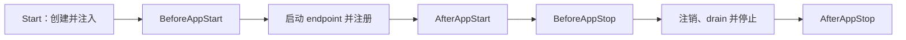

# 组件与模块

组件和模块用于把应用拆成可以独立初始化、注入和停止的功能单元。`app.New`
会创建 App 壳、构造并校验应用规格、捕获运行参数，但此时尚未构造已声明的
组件与模块；`Start` 才会创建并注入它们、执行启动 hook。优雅停止时，停机
hook 按相反顺序执行。

## 能力总览

应用侧能力都由 App 声明，按需启用：

| 能力 | 解决的问题 | 使用入口 |
| --- | --- | --- |
| Module | 组织领域服务、后台工作和生命周期资源 | `InitModules`、`app.BaseModule` |
| Config | 获取 eternal 或 instant 类型配置 | [应用配置](./configuration.md) |
| Rpc | 提供和调用类型安全服务 | [使用 Rpc](./rpc-guide.md) |
| Web | 注册 HTTP route、静态资源和反向代理 | [Web](./web.md) |
| Event | 发布事实并异步通知多个消费者 | [Event 与 Task](./event-task.md) |
| Task | 触发指定工作或按 Cron 调度 | [Event 与 Task](./event-task.md) |
| RDB | 连接 PostgreSQL / SQLite 并注入 DAO | [关系型数据库](./rdb-guide.md) |
| Redis | 注入 Redis、Cache 和分布式 Locker | [Redis](./redis-guide.md) |
| Logger / testkit | 结构化日志与 standalone 集成测试 | [日志与测试](./logging-testing.md) |

多进程运行时由三个组件协作：

| 组件 | 职责 | 说明 |
| --- | --- | --- |
| Hub | 配置、注册和运行时状态分发 | [Hub](../runtime/hub.md) |
| Link | 应用接入、服务发现、转发和消息派发 | [Link](../runtime/link.md) |
| Portal | 外部 HTTP / HTTPS、Rpc 和 Web 网关 | [Portal](../runtime/portal.md) |

它们如何组成 standalone、linked 和分开部署模式，见 [组件运行机制](../runtime/mechanisms.md) 与 [部署拓扑](../getting-started/deployment-modes.md)。

## 什么时候使用模块

业务能力通常写成模块。模块适合承载领域服务、后台工作和需要跟随应用启停的资源：

```go title="module.go"
type UserModule struct {
    app.BaseModule
}

func (m *UserModule) BeforeAppStart() error {
    // 初始化业务资源
    return nil
}

func (m *UserModule) BeforeAppStop() {
    // 停止接收新工作
}
```

在应用中声明模块：

```go title="app.go"
func (*DemoApp) InitModules(add app.TypeAdder) {
    add(app.T[*UserModule]())
}
```

## 什么时候使用基础设施组件

数据库、Redis 等基础设施以组件形式接入。业务应用声明具体组件类型，并在组件中提供连接参数、DAO、Locker 或 Cache：

```go title="app.go"
func (*DemoApp) InitComponents(add app.TypeAdder) {
    add(app.T[*MainDatabase]())
    add(app.T[*MainRedis]())
}
```

组件对外暴露的对象会进入依赖注入容器，模块、Rpc handler、Web handler、Event listener 和 Task runner 都可以直接注入使用。

## 生命周期顺序



- `BeforeAppStart`：在注册前建立连接、预热数据或检查依赖。错误会中止启动并以
  panic 暴露；Vine 不会自动回滚此前已经执行的 hook。
- `AfterAppStart`：endpoint 已启动且注册已经开始后执行。此时请求可能已经到达，
  因此不要把 readiness 工作放在这里。
- `BeforeAppStop`：停止生产新工作，为注销和 drain 阶段做好准备。
- `AfterAppStop`：释放连接和其他资源。

启动时，Vine 先按声明顺序执行基础设施组件，再执行模块；停止时先以相反顺序停止模块，再停止组件。这样业务模块在启动时可以使用已经就绪的数据库和 Redis，在释放这些连接前也有机会完成清理。

同类模块或组件不要重复声明。需要共享依赖时，在应用的 `BindCommon` 或对象自己的 `Bind` 中绑定；一次请求内的上下文依赖交给 execution scope。

进一步了解绑定方式见 [依赖注入](./di.md)，完整的启动与停机顺序见
[应用生命周期](../runtime/application-lifecycle.md)。
