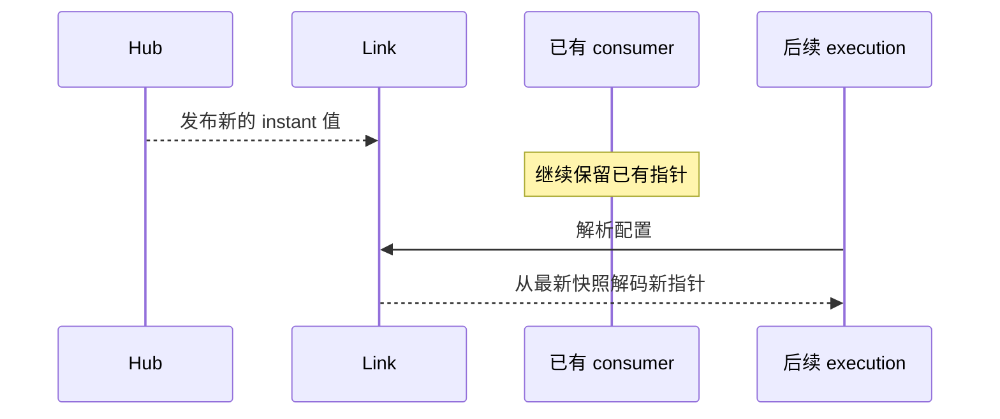
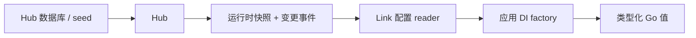

# 配置

Vine 配置由 Skel 声明、Hub 存储、Link 分发，最终作为类型化 Go 依赖解析。应用代码
不需要自己轮询 Hub 或解码配置 JSON。

配置设计的关键不只是字段本身，还有一个很重要的问题：**一个应用实例什么时候可以看到新值**。

## 声明类型化配置

```skel title="skel/domain.skel"
@desc("结算应用")
domain demo.checkout
```

```skel title="skel/config.skel"
domain demo.checkout

config CheckoutConfig eternal {
    timeoutMs: int
    currency: string
}

config FeatureFlagsConfig instant {
    newCheckout: bool
}
```

执行常规 Skel 检查与生成流程：

```bash
skelc check --skel-in ./skel
skelc gen go --skel-in ./skel --go-out ./skeled
```

生成类型会自动向 Vine 注册自己的 Skel 名、Go 类型和生命周期，像普通依赖一样注入即可：

```go title="checkout_service.go"
type CheckoutService struct {
    Config *skeled.CheckoutConfig `inject:""`
}
```

生成的配置类型无需手工注册。

## 选择生命周期

| 生命周期 | Link 保留什么 | 应用代码看到什么 | 适用场景 |
| --- | --- | --- | --- |
| `eternal` | 当前应用实例第一次读取时捕获的值 | 该应用实例余下生命周期始终使用同一快照 | 连接设置、schema 选择、启动策略 |
| `instant` | Hub 发布更新时随之变化的受监听快照 | 后续 DI resolution 解码得到的新值 | Feature flag、限额、可动态调整的行为 |

两种生命周期都是懒读取：只有 DI 第一次需要生成类型时才会读取。注入该配置的 module
或 component 在应用启动时构造；仅由请求 handler 使用的配置，可能直到第一次
对应 execution 才会读取。

### Instant 不会修改已有对象

instant 更新会改变 Link 中的快照，但已经注入的 Go 指针不会变化：



这会影响 DI 的行为：

- 普通 Rpc、Web、Event 或 Task handler 为一次 execution 创建。它注入的配置也在
  该 execution 中解析，所以能看到最新 instant 快照。
- module 与应用 component 是 application lifetime singleton。如果它把 instant 配置
  保存在字段中，该指针就会一直保持构造时的值。
- 任何显式 singleton 依赖只要捕获了 instant 配置，也具有同样行为。

长生命周期对象如果必须响应更新，建议把依赖更新的逻辑放到新建的 execution 依赖中，
或设计显式刷新边界。不要误以为字段注入等于实时引用。

## 提供配置值

Hub seed 文件使用配置的完整 Skel 名；`value` 字段是在 YAML 字符串中编码的 JSON：

```yaml title="seed.yaml"
appConfigs:
  - name: demo.checkout.CheckoutConfig
    value: '{"timeoutMs":3000,"currency":"CNY"}'
  - name: demo.checkout.FeatureFlagsConfig
    value: '{"newCheckout":true}'
```

standalone 模式：

```go title="main.go"
standalone.NewWithOption[*CheckoutApp](standalone.Option{
    SQLiteFile:   "./hub.sqlite",
    SeedYAMLFile: "./seed.yaml",
}).StartAndWait()
```

注意，这里的 `SQLiteFile` 是 **Hub 自己的数据库**，不会配置业务 `infra/rdb` component。
如果应用本身还有关系型数据库，需要另外声明。

独立运行 Hub 时：

```bash
vine hub serve \
  --db-sqlite-file ./hub.sqlite \
  --mq-embedded-nats \
  --seed-yaml-file ./seed.yaml
```

seed 会被导入 Hub 数据库；导入后数据库仍然是 source of truth。

## 配置值如何到达 execution



1. Hub 保存配置 JSON，并发布运行时表示。
2. Link 加载该值；instant 配置在第一次被引用时还会建立订阅。
3. Vine 的 DI binding 向 Link 获取快照，并解码出新的生成 Go 值。
4. consumer 通过字段或 factory 注入取得该值。

standalone 通过进程内连接执行同样步骤。

## 失败语义

配置 resolution 是严格操作：

- 生成配置必须已经在进程中注册。
- Hub 与 Link 中必须存在与完整 Skel 名对应的非空值。
- JSON 必须能解码为生成的 Go 类型。

任何条件不满足，resolution 都会失败，而不是静默返回零值配置。失败出现的位置取决于
第一个 consumer：module 可能让应用启动失败；仅由 handler 使用的配置则可能在请求
到达时才首次失败。

排查配置缺失时：

1. 确认应用确实导入了生成 package。
2. 确认 Hub 中的完整名称与 JSON 字段名。
3. 确认应用所连接的 Link 能访问 Hub API 与 Redis 分发 endpoint。
4. 确认部署的生成 schema 与配置值是一起发布的。
5. 对 instant 配置，先创建新的 execution，再判断已经注入的 singleton 是否理应变化。

## 设计建议

- 如果改配置而不重建应用会导致资源或不变量不一致，请用 `eternal`。
- 只有每个新 execution 都能安全地从新快照选择行为时，才使用 `instant`。
- 配置值应保持声明式。不要拿配置更新当命令式 job trigger，这类工作请用 Task。
- 滚动发布期间，不同应用版本可能暂时读取同一个 Hub 值，因此相关字段应保持向后兼容。
- credential 与私钥必须留在当前可信运行时网络边界内。分发敏感配置前先检查
  [生产就绪清单](../operations/production-readiness.md)。

语言规则见 [Skel 配置语法](https://skel.yorun.ai/docs/syntax)，binding 与 scope
细节见[依赖注入](./di.md)。
