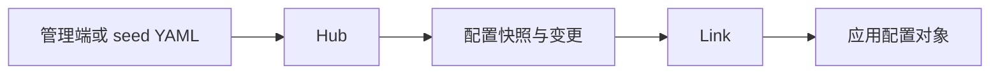

# 配置

Vine 配置由 `.skel` 声明、Hub 保存、Link 分发，并通过依赖注入提供给应用。应用不需要自行轮询配置中心。

## 声明配置

```skel title="config.skel"
config CheckoutConfig eternal {
    timeoutMs: int
    currency: string
}

config FeatureFlagsConfig instant {
    newCheckout: bool
}
```

- `eternal`：应用启动时读取，适合连接参数和启动期决定的行为。
- `instant`：运行期间可更新，适合开关和可动态调整的业务参数。更新后，新创建的执行对象会读取新值；已经注入到现有对象中的配置不会原地变更。

运行 `skelc gen go` 后，生成的配置类型会注册到 Vine。业务对象可像其他依赖一样注入配置：

```go title="service.go"
type CheckoutService struct {
    Config *skeled.CheckoutConfig `inject:""`
}
```

## 提供初始值

Hub seed 文件使用配置的完整 Skel 名称，并把值写成 JSON 字符串：

```yaml title="seed.yaml"
appConfigs:
  - name: demo.checkout.CheckoutConfig
    value: '{"timeoutMs":3000,"currency":"CNY"}'
  - name: demo.checkout.FeatureFlagsConfig
    value: '{"newCheckout":true}'
```

standalone 应用可在启动时导入该文件：

```go title="main.go"
standalone.NewWithOption[*CheckoutApp](standalone.Option{
    SQLiteFile:   "./vine.sqlite",
    SeedYAMLFile: "./seed.yaml",
}).StartAndWait()
```

字段名和类型必须与生成的配置 schema 一致。linked 或分开部署使用相同 seed 格式，由 `vine hub serve --seed-yaml-file ./seed.yaml` 导入。

## 配置如何到达应用



standalone 模式使用同一进程中的 Hub 和 Link，读取方式不变。linked 或分开部署时，Link 连接远端 Hub。配置更新失败时，应先确认 Hub 数据、Link 与 Hub 的连接，以及配置 schema 是否与生成代码一致。

配置语法见 [Skel 语法](https://skel.yorun.ai/docs/syntax)，Hub 启动和 seed 文件见 [Hub](/docs/hub)。
