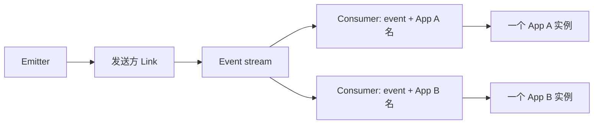
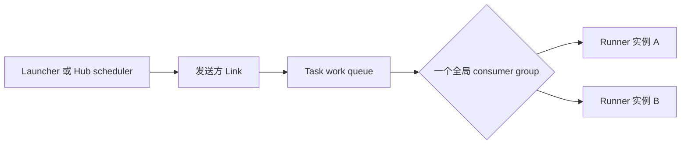

# 事件与任务

Event 用于发布已经发生的事实，Task 用于请求某个 runner 执行一项工作。两者都是
类型安全的 `.skel` 契约，但接收方选择方式有意设计成不同语义。

## 选择 Event 还是 Task？

| 问题 | Event | Task |
| --- | --- | --- |
| 表达什么？ | “用户 42 已创建。” | “重建索引 42。” |
| 有多少逻辑接收方？ | 每个不同的监听 App 名各投递一份 | 全局只向一个 runner 投递一份 |
| 多实例如何工作？ | 同名 App 的实例竞争该 App 的一份消息 | 所有已注册实例竞争同一个 Task |
| 发送方是否等待业务处理？ | 否，只等待消息被接受 | 否，只等待消息被接受 |
| 典型设计 | 通知、投影、集成事实 | 后台工作、定时维护、作业 |

Event 不是向每个进程广播，Task 也不会定向发给启动它的 App。建议根据这些投递组
选择能力，而不是只看方法名称。

## 启用能力

需要监听 Event 或执行 Task 的 App 嵌入对应的 enabled 类型：

```go title="app.go"
type DemoApp struct {
    app.Application
    app.EventerEnabled
    app.TaskerEnabled
}

func (*DemoApp) Name() string {
    return "demo.async"
}
```

这些嵌入类型提供空实现。只需覆盖 App 实际使用的注册和 binding 方法。

## 定义并生成契约

下面的契约包含可供消费者实现幂等的业务标识：

```skel title="skel/async.skel"
domain demo.async

pub event UserCreatedEvent {
    payload {
        eventId: uuid
        userId: uuid
    }
}

task RebuildIndexTask {
    trigger manually {
        input {
            jobId: uuid
        }
    }

    trigger nightly {}
}
```

```bash
skelc check --skel-in ./skel
skelc gen go --skel-in ./skel --go-out ./skeled
```

生成代码会为 Event 提供 emitter/listener，为 Task 提供 launcher/runner。请勿直接
编辑生成文件。

## 发布 Event

### 注册 Listener

嵌入生成的默认 listener，并实现对应方法：

```go title="event.go"
type UserCreatedListener struct {
    skeled.DefaultUserCreatedEventListener
}

func (*UserCreatedListener) OnUserCreated(event *skeled.UserCreatedEvent) {
    // 在产生副作用前，使用 event.EventId 作为幂等键。
    // 更新读模型或发送通知。
}

func (*DemoApp) EventerInitListeners(add app.ListenerTypeAdder) {
    add(
        app.T[*UserCreatedListener](),
        app.WithListenerTimeout(20*time.Second),
        app.WithListenerConcurrency(4),
    )
}
```

不传 option 时，一个已注册 listener 的单次尝试超时为 30 秒，允许 10 个并发
执行，并在失败后重试。

### 从业务代码发送

注入生成的 emitter。方法在 Link 接受并发布消息后返回，不会等待 listener 完成：

```go title="service.go"
type UserService struct {
    Events skeled.UserCreatedEventEmitter `inject:""`
}

func (s *UserService) Publish(eventId skel.UUID, userId skel.UUID) {
    s.Events.EmitUserCreated(&skeled.UserCreatedEvent{
        EventId: eventId,
        UserId:  userId,
    })
}
```



### Event 如何选择接收方

Vine 使用 Event 的 Skel 名和监听 App 名组成 Event consumer identity：

- 两个不同 App 名各收到一份。
- 同一个 App 名的两个实例竞争该 App 的一份。
- 重试可能改由同名 App 的另一个实例执行。
- 并发与重试意味着 handler 不能依赖全局顺序。
- Event 不是可回放审计日志。不要假设稍后出现的 listener 会收到在匹配 consumer
  interest 建立之前发布的事实。

两个逻辑消费者都必须观察 Event 时，应使用不同 App 名；同一个逻辑消费者需要
水平扩容时，应让多个实例使用相同 App 名。

## 启动 Task

### 注册 Runner

嵌入生成的默认 runner。Cron 只能调度无输入 trigger，因此 `nightly` 能调度，
而 `manually` 不能：

```go title="task.go"
type RebuildIndexRunner struct {
    skeled.DefaultRebuildIndexTaskRunner
}

func (*RebuildIndexRunner) RunManually(jobId skel.UUID) {
    // 重建前使用 jobId 作为幂等键。
}

func (*RebuildIndexRunner) RunNightly() {
    // 为本次定时执行使用稳定的业务键。
}

func (*DemoApp) TaskerInitRunners(add app.RunnerTypeAdder) {
    add(
        app.T[*RebuildIndexRunner](),
        app.WithRunnerTimeout(10*time.Minute),
        app.WithRunnerConcurrency(2),
        app.WithRunnerCronScheduler("nightly", "0 2 * * *"),
    )
}
```

不传 option 时，一个已注册 runner 的单次尝试超时为 30 秒，允许 10 个并发执行，
并在失败后重试。

### 从业务代码启动

需要立即执行 Task 时，注入生成的 launcher：

```go title="service.go"
type MaintenanceService struct {
    Tasks skeled.RebuildIndexTaskLauncher `inject:""`
}

func (s *MaintenanceService) RebuildNow(jobId skel.UUID) {
    s.Tasks.LaunchManually(jobId)
}
```



### Task 如何选择 Runner

Vine 仅使用 Task 的 Skel 名组成 consumer identity。为该 Task 注册的所有 Link 和
App 实例都在同一个逻辑 work queue 中竞争：

- 一条消息只会分派给一个选中的 runner。
- 启动 Task 的 App 不选择目标 App 或实例。
- 在同一个 Link 内，可用本地实例按 round-robin 使用。
- 重试可能改由另一个 App、Link 或实例执行。
- Task 执行没有向 launcher 同步返回结果的通道。

如果两个团队需要针对同一业务事实分别执行工作，应定义两个 Task，或显式启动
两份作业。注意，为同一个 Task 注册两个 App 名不会产生两份消息。

## 投递默认值与边界

| 行为 | Event listener | Task runner |
| --- | --- | --- |
| 单次尝试超时 | 30 秒 | 30 秒 |
| 并发 | 每个已注册实例 10 | 每个已注册实例 10 |
| 成功 | handler 成功返回后 Ack | runner 成功返回后 Ack |
| 默认失败行为 | 负确认并重试 | 负确认并重试 |
| 重试上限 | stream 存续期间 Vine 不限制投递次数 | stream 存续期间 Vine 不限制投递次数 |
| `NoRetry` | 终结确认，不重试 | 终结确认，不重试 |
| 死信队列 | 无 | 无 |
| 消息存储 | 内存 stream | 内存 stream |

在注册时配置这些值：

```go
app.WithListenerTimeout(20*time.Second)
app.WithListenerConcurrency(4)
app.WithListenerNoRetry()

app.WithRunnerTimeout(10*time.Minute)
app.WithRunnerConcurrency(2)
app.WithRunnerNoRetry()
```

`NoRetry` 的含义是“第一次尝试失败后终结这条消息”。它不会把消息移动到死信队列，
也不会产生发送方可查询的失败记录。

当前 stream 使用内存存储。发布成功可以抵御单个 handler 失败，但并不保证消息
运行时重启后的磁盘持久性。如果无法接受运行时重启造成的丢失，建议使用数据库
outbox、持久化外部工作流系统或其他持久记录。

## 至少一次要求幂等

Event 与 Task 的默认处理语义是至少一次。下列情况可能让同一业务消息执行多次：

- listener 或 runner 报错；
- 单次尝试超时；
- Ack 丢失；
- 重连或 consumer 重新分配。

Vine 不会向生成的 payload 添加公开 delivery ID。应在契约中放置稳定业务 ID，
例如 `eventId` 或 `jobId`，再让副作用满足幂等。常见做法包括：

- 对业务 ID 建数据库唯一约束；
- 在一个事务内原子地“记录已处理 + 执行状态迁移”；
- 使用幂等 upsert；
- 调用外部 API 时使用其 idempotency-key 能力。

不要仅为避免重复就给非幂等操作设置 `NoRetry`——这只是把重复风险换成了第一次失败
后的静默丢失。应选择业务能对账和修复的结果，并在必要时保留可审计业务记录。

## 超时不等于执行已经停止

注册 timeout 限制 Link 等待一次尝试的时间。listener 或 runner 会获得带该
deadline 的 context，业务代码应在它被取消时停止工作。

如果业务代码忽略 cancellation，Link 可能先超时，把本次尝试标记为失败并重新
投递，而原 handler 仍在运行。网络部署如此，standalone 的进程内 transport 也
有意保留调用方可见的相同行为。所以两次尝试可能重叠。

注意这意味着：

- 长循环中以及不可逆操作前要检查注入的 context。
- 所有可能重试的副作用都必须幂等。
- timeout 应高于正常执行延迟，但仍保持有界。
- concurrency 表示尝试数，不一定等于不同业务消息数。

## 元数据与 Context 传播

Event 与 Task 消息不会携带完整的同步请求 context：

| 元数据 | Event | Task |
| --- | --- | --- |
| Trace id/span | 传播 | 传播 |
| 发送方 App 身份 | 通过 `Emitter()` 获取 | 通过 `Launcher()` 获取 |
| 发布时间 | 通过 `EmittedAt()` 获取 | 通过 `LaunchedAt()` 获取 |
| Actor | 不传播；listener/runner 看到 absent Actor | 不传播；listener/runner 看到 absent Actor |
| Initiator | 不传播 | 不传播 |
| 发送方 deadline/cancellation | 不传播 | 不传播 |

每次投递都从 listener 或 runner 注册配置获得新的 deadline。如果异步工作需要
授权或租户身份，应在契约中放入消费者所需的最小、不可变身份数据，重新校验它，
并避免把 credential 或 secret 复制进 payload。

## Cron 调度

`WithRunnerCronScheduler` 使用标准五字段 Cron 表达式：

```text
分钟   小时   月中日        月    周中日
0      2      *             *     *
```

重要边界：

- trigger 必须没有输入参数。
- option 接收 trigger 的 Skel 名，比如 `"nightly"`，而不是生成的 Go 方法名。
- 同一个 App 名的多个 replica 所提交的等价声明会由 Hub 去重。不同 App 名会
  创建不同 schedule，即使 Cron 表达式相同；两次发布都会进入同一个全局 Task
  queue。
- 只有匹配 runner 处于 active 状态时才会发布定时消息。
- scheduler 使用 Hub 进程的时钟和默认本地时区。
- Vine 不承诺补发 Hub、scheduler 或消息运行时不可用期间错过的执行。
- 定时消息会进入同一个全局 Task work queue，并与手动启动的 Task 具有相同的
  重试和幂等要求。

如果业务日程需要日历规则、严格时区治理、misfire policy、执行历史或运营人员
控制的回放，建议使用专门 scheduler/workflow 系统，再由它启动 Vine Task。

## 依赖 Event 或 Task 之前

- 契约中包含稳定业务标识。
- 接收方应按 App 名各收一份，还是全局竞争。
- timeout 与 concurrency 来自真实工作负载测量。
- handler 会观察 context cancellation。
- 已决定如何对账重复执行和第一次尝试后的终结失败。
- 不依赖不存在的 DLQ、结果查询、顺序、回放历史或磁盘持久性。
- 已测试强制失败、超时、重复投递和优雅停止。

注册与 drain 行为见[请求路由与就绪状态](../runtime/request-routing.md)，同步 context
规则见[Trace 与超时](./trace-timeout.md)，契约语言见
[Skel 语法](https://skel.yorun.ai/docs/syntax)。
