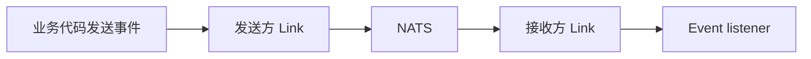
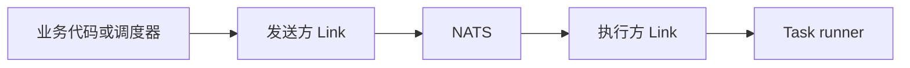

# 事件与任务

Event 适合发布已经发生的事实，Task 适合请求某个应用执行工作。两者都由 `.skel` 定义类型安全契约，并由 Link 通过消息系统投递。

需要消费 Event 或执行 Task 的应用先启用对应能力：

```go title="app.go"
type DemoApp struct {
    app.Application
    app.EventerEnabled
    app.TaskerEnabled
}
```

## Event

```skel title="event.skel"
pub event UserCreatedEvent {
    payload {
        userId: uuid
    }
}
```

生成代码会提供 emitter 和 listener 接口。应用通过 `EventerInitListeners` 注册监听器，并可设置超时、并发和失败重试策略。

```go title="event.go"
type UserCreatedListener struct {
    skeled.DefaultUserCreatedEventListener
}

func (*UserCreatedListener) OnUserCreated(event *skeled.UserCreatedEvent) {
    // 更新读模型或发送通知
}

func (*DemoApp) EventerInitListeners(add app.ListenerTypeAdder) {
    add(
        app.T[*UserCreatedListener](),
        app.WithListenerConcurrency(4),
    )
}
```

发送方可注入生成的 emitter，并调用类型安全的方法：

```go title="service.go"
type UserService struct {
    Events skeled.UserCreatedEventEmitter `inject:""`
}

func (s *UserService) Publish(userId skel.UUID) {
    s.Events.EmitUserCreated(&skeled.UserCreatedEvent{UserId: userId})
}
```



## Task

```skel title="task.skel"
task RebuildIndexTask {
    trigger manually {}
    trigger nightly {}
}
```

生成代码会提供 launcher 和 runner 接口。应用通过 `TaskerInitRunners` 注册 runner；使用 `WithRunnerCronScheduler` 可为 trigger 增加 Cron 调度。

```go title="task.go"
type RebuildIndexRunner struct {
    skeled.DefaultRebuildIndexTaskRunner
}

func (*RebuildIndexRunner) RunManually() {
    // 重建索引
}

func (*RebuildIndexRunner) RunNightly() {
    // 重建索引
}

func (*DemoApp) TaskerInitRunners(add app.RunnerTypeAdder) {
    add(
        app.T[*RebuildIndexRunner](),
        app.WithRunnerCronScheduler("nightly", "0 2 * * *"),
    )
}
```

需要即时触发时，注入生成的 launcher：

```go title="service.go"
type MaintenanceService struct {
    Tasks skeled.RebuildIndexTaskLauncher `inject:""`
}

func (s *MaintenanceService) RebuildNow() {
    s.Tasks.LaunchManually()
}
```



Event 与 Task 都携带 trace、发起应用和 Actor 上下文。监听器或 runner 抛出错误时，是否重试由注册选项决定；对非幂等操作应谨慎启用重试。

完整语法见 [Skel 语法](https://skel.yorun.ai/docs/syntax)，Link 的投递职责见 [Link](/docs/link)。
