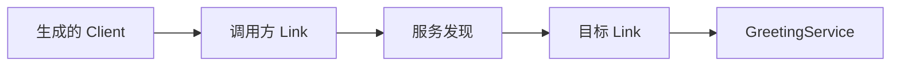

# Rpc

Vine Rpc 的常规工作流是：在 Skel 中声明服务，由 skelc 生成接口，实现服务端，然后在 App 中注册 handler。业务代码通常不需要手工构造底层 `ServiceSpec`。

## 定义和生成

```skel title="greeting.skel"
pub service GreetingService {
    noauth
    method hello {
        input { name: string }
        output Greeting
    }
}
```

```bash
skelc check --skel-in ./skel
skelc gen go --skel-in ./skel --go-out ./skeled
```

## 实现服务

生成代码提供 Server 接口和默认实现。业务实现嵌入默认实现，并实现需要的方法：

```go title="service.go"
type GreetingService struct {
    skeled.DefaultGreetingServiceServer
}

func (*GreetingService) Hello(name string) skeled.Greeting {
    return skeled.Greeting{Message: "Hello, " + name}
}
```

## 注册到应用

```go title="app.go"
type GreetingApp struct {
    app.Application
    app.ServicerEnabled
}

func (*GreetingApp) Name() string {
    return "demo.greeting"
}

func (*GreetingApp) ServicerInitHandlers(add app.TypeAdder) {
    add(app.T[*GreetingService]())
}
```

## 发起第一次调用

生成的 client 可以直接注入 handler 或 module。下面的模块会在应用启动完成后调用刚注册的服务：

```go title="main.go"
type GreetingProbe struct {
    app.BaseModule
    Client skeled.GreetingServiceClient `inject:""`
}

func (m *GreetingProbe) AfterAppStart() {
    greeting := m.Client.Hello("Vine")
    logger.Info("greeting received", "message", greeting.Message)
}

func (*GreetingApp) InitModules(add app.TypeAdder) {
    add(app.T[*GreetingProbe]())
}

func main() {
    standalone.NewWithOption[*GreetingApp](standalone.Option{
        SQLiteFile: "./vine.sqlite",
    }).StartAndWait()
}
```

运行 `go run .` 后，日志中会出现 `message="Hello, Vine"`。这次调用从 module
发起，不属于某个入站请求，因此 Vine 会创建新的 trace、把 `GreetingApp` 标记为
client application，并使用 absent Actor。注入 Rpc、Web、Event 或 Task execution
的 client 则会继承该 execution 的 trace、initiator 和 Actor。两种情况下都由 Link
完成服务发现和转发；standalone 模式会选择进程内 endpoint。



超时、错误返回和底层 client/server 选项见 [Rpc 参考](../infrastructure/rpc.md)。
