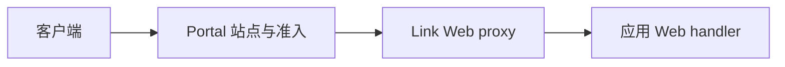

# Web 应用

Web 能力用于为应用注册 HTTP 路由、静态资源或反向代理入口。`.skel` 负责声明 Web 名称和允许访问的 Actor，Go handler 负责具体路由。

## 声明入口

```skel title="web.skel"
web UserPortalWeb {
    for ClientActor via client
}
```

当前端需要固定的公开前缀时，加上 `mount /path`。此时 Portal 会使用该前缀进行匹配和
转发，而不是站点规则上配置的前缀；handler 中的路由仍相对该前缀书写，因此声明
`mount /console` 时，`router.GET("/health", ...)` 对外提供的是 `/console/health`。
路由行为见 [Portal](../runtime/portal.md#入口路径映射)，声明写法见
[Skel 语法参考](https://skel.yorun.ai/docs/actors-and-access)。

生成代码后，实现对应的 Web server，并在 `Routes` 中注册路由：

```go title="web.go"
type UserPortal struct {
    skeled.DefaultUserPortalWebServer
    Context *gin.Context `inject:""`
}

func (h *UserPortal) Routes(router *web.Router) {
    router.GET("/health", h.Health)
}

func (h *UserPortal) Health() {
    h.Context.JSON(200, map[string]string{"status": "ok"})
}
```

用 `router.SubRouter("/orders")` 把相关路由归组到同一路径下。`BasePath()` 返回 Router
在 Web 内的累计路径：根 Router 返回该 Web 的挂载路径，未声明挂载路径时返回 `"/"`；
orders Router 返回 `"/orders"`，其 `SubRouter("/:id")` 返回 `"/orders/:id"`。转发前被
剥离的入口前缀不包含在内，因此仅凭此值不能还原外部 URL。

在应用中启用 Web 能力并注册 handler：

```go title="app.go"
type DemoApp struct {
    app.Application
    app.WebberEnabled
}

func (*DemoApp) WebberInitHandlers(add app.TypeAdder) {
    add(app.T[*UserPortal]())
}
```

Vine 将 Web 能力注册到 Link；Portal 根据站点规则发现 endpoint 并转发外部请求。

## 请求路径



standalone 模式仍走相同的匹配与转发逻辑，但 endpoint 使用进程内连接。静态资源能通过 `web.NewAssetsServer` 提供，转发已有后端用 `web.NewReverseProxy`。

Portal 配置见 [Portal](../runtime/portal.md)，Actor 与 Web 语法见 [Skel 语法](https://skel.yorun.ai/docs/syntax)。
