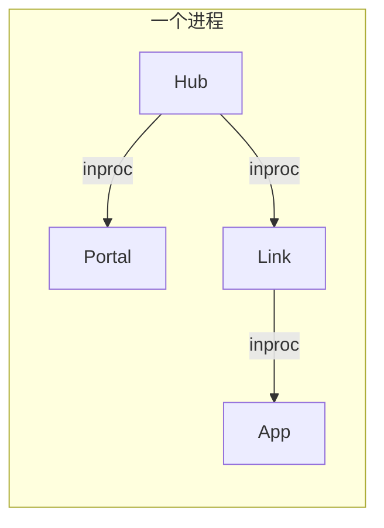
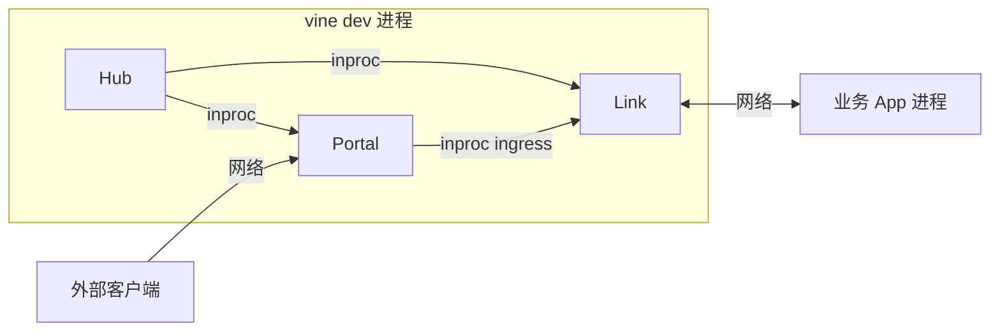
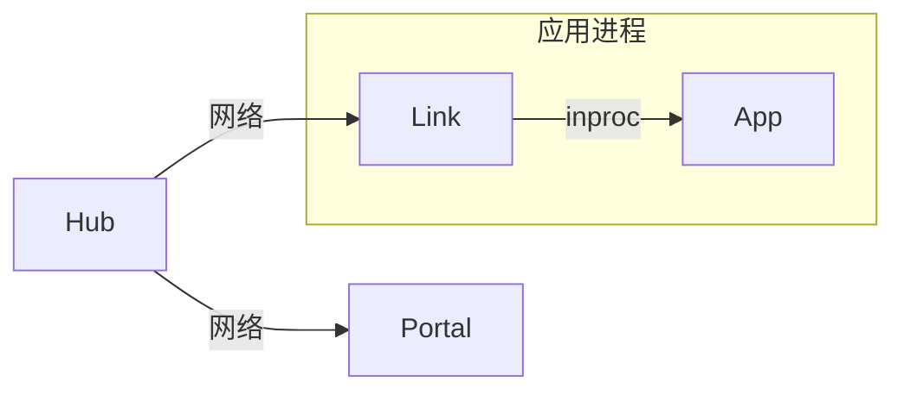
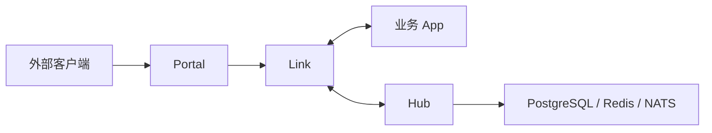

# 部署

Vine 为开发和生产提供不同的运行拓扑，而且不需要为生产环境另写一套应用实现。
同一个 `ApplicationSpec`、component、module 和 Rpc/Web/Event/Task 代码，既能
组成单机单进程应用，也能接入 Kubernetes 中独立部署的运行时服务。变化只发生在
很薄的启动入口、进程边界与 endpoint 配置。

这得益于业务代码声明的是“具备什么能力”，而不是“服务位于哪个地址”。注册、发现和
转发由 Link 负责，Hub 与 Portal 也位于应用之外。背后的机制见
[架构](../runtime/mechanisms.md)。

## 模式对比

| 模式 | Hub / Portal / Link | 业务应用 | 适用场景 |
| --- | --- | --- | --- |
| standalone | 同一进程 | 同一进程 | 快速开始、测试、本地单体开发 |
| `vine dev` | 同一 CLI 进程，内部控制流量走 inproc；Link API 保留网络入口 | 独立进程 | 使用外部应用进程进行本地调试 |
| linked | Hub、Portal 独立；Link 与应用同进程 | 与 Link 同进程 | 本地开发、少量服务、简化应用部署 |
| 分开部署 | Hub、Portal 独立；每个 Link 作为 sidecar 进程与其应用同主机部署 | 位于 Link sidecar 主机上的独立进程 | 生产环境、workload 扩缩容、故障验证 |

无论选择哪种模式，业务应用的 `ApplicationSpec`、Rpc、Web、Event 和 Task 定义
保持不变；变化的只有部署装配与 endpoint 配置。

## Standalone

standalone 将 Hub、Portal、Link 和一个业务应用装配到同一进程：



```go title="main.go"
standalone.NewWithOption[*HelloApp](standalone.Option{
	SQLiteFile: "./vine.sqlite",
}).StartAndWait()
```

启动顺序为 Hub → Portal → Link → 业务应用；停止时按相反顺序执行。Hub 使用进程内 Redis，Link 与 Portal 使用 inproc endpoint，因此不需要提前启动任何 runtime 服务。

要将 seed 配置嵌入应用，可以通过 `standalone.Option.SeedHubData` 传入 YAML 文本，例如由 `go:embed` 填充的字符串：

```go
standalone.NewWithOption[*HelloApp](standalone.Option{
    SeedHubData: "{}",
}).StartAndWait()
```

`SeedHubData` 与 `SeedHubDataFile` 互斥，也不能同时通过 CLI 或环境变量指定 seed 文件。不指定数据库时，必须提供其中一种 seed 来源，配置只读；空配置使用 `{}`。内联 YAML 与 seed 文件使用完全相同的校验与导入流程，使用持久化数据库时也一样。该入口只能通过代码设置，不提供 CLI 参数或环境变量。

### 交付单机应用配置文件 {#deployment-configuration}

发布 standalone 应用时，开发者可以把 seed data 和可选的 source 信息嵌入二进制，
通过 seed 变量暴露需要用户调整的参数。用户维护普通的 YAML 字典，无需了解内部的
 domain 配置名称及其组装方式。

```go title="main.go (excerpt)"
import _ "embed"

//go:embed seed/hub.yaml
var seedHubData string

//go:embed seed/source.yaml
var seedHubSource string

func main() {
    standalone.NewWithOption[*HelloApp](standalone.Option{
        SeedHubData:   seedHubData,
        SeedHubSource: seedHubSource,
    }).StartAndWait()
}
```

嵌入路径相对于这份 Go 源文件。应用需要导入生成的 `app.Vars` 包，以注册变量类型。
示例沿用所在应用中已有的 `HelloApp` 定义和 `standalone` 导入。

交付编译后的二进制和包含部署参数的 `vars.yaml`，启动时执行：

```bash
./hello --seed-hub-vars-file ./vars.yaml
```

Seed data 和 source 文件是构建输入，运行时无需随二进制分发。
变量只能通过文件提供，没有通过 Vine 选项嵌入变量的入口。
没有占位符，或所有引用都有默认值时，二进制可以不带 vars 文件直接启动。

示例未指定数据库，因此每次启动都从内嵌 seed 和部署字典加载配置；
修改 `vars.yaml` 后重启即可生效。如果选择 SQLite 或 PostgreSQL，seed 变量只在
首次初始化数据库时生效，后续启动以数据库中的配置为准。

也可以将 seed 保留为外部文件，通过 `--seed-hub-data-file` 和可选的
`--seed-hub-source-file` 提供。如果提供 source，必须与 data 一起嵌入或一起通过文件
传入，不能混用。两种方式下 vars 都单独通过文件提供。结构定义、替换语法和默认值规则见
[部署变量](../framework/configuration.md#deployment-variables)。

### 特点与限制

- 只需启动一个业务 binary，最适合 [第一个应用教程](./tutorial-first-app.md)。
- 使用 `standalone.Option` 配置 SQLite / PostgreSQL 或 no-db 模式、内联或文件 seed 来源，以及 Dashboard URL。
- Hub 与 Link 不启动 heartbeat、TTL 续租和 registry sweeper；应用停止时靠显式注销清理注册。
- Hub 和 Link 不开放独立管理端口；Portal 仍可按入口规则监听业务 HTTP/HTTPS 端口。
- 跨进程网络、服务单独重启等场景不在覆盖范围内。

## 本地调试外部应用

`vine dev` 让业务应用保留独立进程，同时在一个进程中托管 Hub、Portal 和 Link：



在两个终端中分别启动运行时和应用：

```bash
vine dev --seed-hub-data-file ./seed.yaml
go -C ./src/server run ./cmd/myapp
```

`app.New` 默认连接 `http://127.0.0.1:7079` 的 Link API，因此不需要额外配置
endpoint。应用注册、domain schemas 和业务流量都会经过真实的 App 到 Link 网络
边界；Hub、Redis、NATS 和 Link ingress 的内部流量则使用进程内 transport，避免
额外端口和基础设施故障噪音。

这个拓扑是开发快捷方式，不是部署拓扑；它不覆盖 Hub 租约、TTL 过期或 Link 到
Hub 的网络恢复。

## Linked：Hub 与应用分开

linked 模式将 Hub 与 Portal 作为独立 runtime 服务运行，而每个业务应用在自己的进程中携带一个 inproc Link：



先启动 Hub；Portal 需要外部入口时再启动：

```bash
vine hub serve \
  --db-sqlite-file ./hub.sqlite

vine portal serve \
  --hub-endpoint http://127.0.0.1:7071
```

业务应用导入 `go.yorun.ai/vine/app/linked` 并使用：

```go title="main.go"
linked.NewWithOption[*HelloApp](linked.Option{
	HubEndpoint:   "http://127.0.0.1:7071",
	IngressListen: "127.0.0.1:7082",
}).StartAndWait()
```

`HubEndpoint` 和 `IngressListen` 也可以通过 `VINE_HUB_ENDPOINT`、`VINE_INGRESS_LISTEN`
设置。外部 Hub 启用后台 mTLS 时，可通过 `MTLSCAFile`、`MTLSCertFile`、
`MTLSKeyFile` 配置内嵌 Link 的身份，或使用对应的 `VINE_MTLS_*` 环境变量和
`--mtls-*-file` 命令行参数。

这种模式保留了独立 Hub 的配置、注册和租约语义，但 Link 与业务应用仍同时发布、同时停止。它适合不想额外维护 Link sidecar 的开发和部署环境。

## 分开部署：独立 runtime 与应用

在生产环境中，可将控制面、外部入口、应用侧接入层和业务应用拆成独立进程。进程分离
不会改变 Link 的 sidecar 定位：Link 与其管理的应用通常位于同一主机和部署信任
边界内。Vine 仍允许特殊部署使用非 loopback Link API，但 Link 会告警：这类跨主机
h2c 路径未经认证，也不在预期拓扑内。



一个最小的本地进程启动顺序如下：

```bash
# 1. 控制面
vine hub serve \
  --db-sqlite-file ./hub.sqlite

# 2. 对外网关（需要外部 HTTP / HTTPS 入口时）
vine portal serve \
  --hub-endpoint http://127.0.0.1:7071

# 3. 应用侧 Link
vine link serve \
  --api-listen 127.0.0.1:7079 \
  --ingress-listen 127.0.0.1:7082 \
  --hub-endpoint http://127.0.0.1:7071
```

业务应用不再用 `standalone.New` 或 `linked.New`，而是直接创建：

```go title="main.go"
app.NewWithOption[*HelloApp](app.Option{
	LinkEndpoint: "http://127.0.0.1:7079",
}).StartAndWait()
```

也可不在代码中指定 endpoint，转而设置环境变量：

```bash
VINE_LINK_ENDPOINT=http://127.0.0.1:7079 ./hello-app
```

此模式下，Link 负责向 Hub 注册应用并维持 heartbeat。应用与 Link 拥有独立的进程
生命周期，但通常构成同主机部署的一个 workload，并且应一起扩缩容；Portal 与 Hub
具有独立的部署边界。Portal 的外部监听、站点规则和 TLS 证书通过 Hub 配置管理。
注意：进程分离并不直接等同于高可用；上线前请检查
[生产就绪清单](../operations/production-readiness.md)。

## 选择拓扑

从 standalone 开始。需要共享配置、应用间互相发现或对外暴露入口时，迁移到 linked。
Hub 与 Portal 需要独立扩缩容，或需要故障隔离和完整分布式语义时，再使用分开部署；
每个应用始终与其 Link sidecar 一起扩缩容。

| 需求 | 推荐模式 |
| --- | --- |
| 学习框架或编写单应用测试 | standalone |
| 让应用独立进程运行，同时最小化本地基础设施 | `vine dev` |
| 本地调试多个应用、但不想单独维护 Link | linked |
| 容器化部署、多实例、独立发布与真实故障演练 | 分开部署 |

## 相关文档

- [Hub](../runtime/hub.md)：配置、注册与租约管理。
- [Link](../runtime/link.md)：应用注册、发现和请求转发。
- [Portal](../runtime/portal.md)：外部访问入口与网关规则。
- [应用模型](../framework/application-model.md)：应用构造入口与生命周期。
- [生产就绪](../operations/production-readiness.md)：安全、持久化、停机、故障与扩缩容边界。
