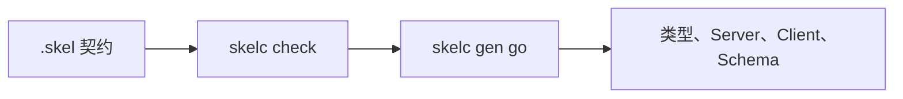

# 第一个 Skel 契约

本教程定义一个 Greeting 服务，使用 `skelc` 完成校验和 Go 代码生成。完成后，你将得到类型安全的服务端接口和客户端。

## 安装 skelc

```bash
go install go.yorun.ai/skelc/cmd/skelc@v0.10.0
skelc version
```

本教程固定 generator 版本，以确保生成结果可复现。调整 Vine、Go 或
`skelc` 前，请先检查[版本兼容性](./compatibility.md)。

## 创建契约目录

在准备存放示例的父目录中执行：

```bash
mkdir -p greeting/skel
cd greeting
```

```text
greeting/
├── skel/
│   ├── domain.skel
│   └── greeting.skel
└── skeled/
```

```skel title="skel/domain.skel"
@desc("Greeting 示例")
domain demo.greeting
```

```skel title="skel/greeting.skel"
domain demo.greeting

pub data Greeting {
    message: string
}

pub service GreetingService {
    noauth

    method hello {
        input {
            name: string
        }
        output Greeting
    }
}
```

## 校验

```bash
skelc check --skel-in ./skel
```

命令无错误退出即表示 domain、类型引用、命名和公开契约规则均有效。查看生成器识别出的 symbol：

```bash
skelc symbol list --skel-in ./skel
```

预期包含：

```text
pub  data     demo.greeting.Greeting
pub  service  demo.greeting.GreetingService
```

## 生成 Go 代码

```bash
skelc gen go \
  --skel-in ./skel \
  --go-out ./skeled
```

生成目录包含数据模型、schema 和 service 代码。你将使用生成的
`GreetingServiceServer` 实现服务端，用生成的 client 发起调用。如果实现位于
生成 package 之外，需要嵌入 `DefaultGreetingServiceServer`；该接口包含
package-private seal method，无法从其他 package 直接实现。生成文件会在下次
执行时更新，不要手工修改。



## 下一步

- 阅读 [使用 Rpc](../framework/rpc-guide.md)，将生成的服务实现注册到 Vine App。
- 阅读 [Skel 语法](https://skel.yorun.ai/docs/syntax)，继续定义 Actor、权限、Event、Web 和 Task。
- 需要独立 regular/pub module 时，参考 [skelc 使用说明](https://skel.yorun.ai/docs/getting-started)。
