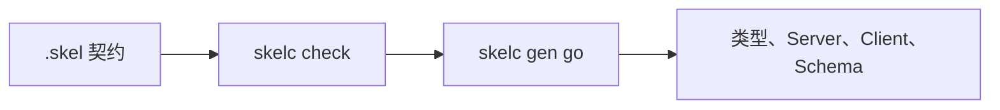

# 第一个契约

下面定义一个 Greeting 服务，校验契约，并生成对应的 Go 类型、服务端接口和
客户端。这里先不实现 Vine handler；生成完成后可直接接着阅读
[Rpc 指南](../framework/rpc-guide.md)。

## 安装 skelc

```bash
go install go.yorun.ai/skelc/cmd/skelc@main
skelc version
```

这里使用 `@main`，是为了与当前 `next` 文档保持一致。正式发布应用时，请安装经过
审查的 commit 或 tag，记录所用的 `skelc version`，并把重新生成契约作为一次明确的
变更提交。具体做法见[版本兼容性](./compatibility.md)。

## 创建契约目录

在准备存放示例的父目录中执行：

```bash
mkdir -p greeting/skel
cd greeting
```

```text
greeting/
├── skel/
│   ├── domain.skel
│   └── greeting.skel
└── skeled/
```

```skel title="skel/domain.skel"
@desc("Greeting 示例")
domain demo.greeting
```

```skel title="skel/greeting.skel"
domain demo.greeting

pub data Greeting {
    message: string
}

pub service GreetingService {
    noauth

    method hello {
        input {
            name: string
        }
        output Greeting
    }
}
```

## 校验

```bash
skelc check --skel-in ./skel
```

命令无错误退出即表示 domain、类型引用、命名和公开契约规则均有效。查看生成器识别出的 symbol：

```bash
skelc symbol list --skel-in ./skel
```

预期包含：

```text
pub  data     demo.greeting.Greeting
pub  service  demo.greeting.GreetingService
```

## 生成 Go 代码

```bash
skelc gen go \
  --skel-in ./skel \
  --go-out ./skeled
```

生成目录包含数据模型、schema 和 service 代码。如果服务实现位于生成 package
之外，必须嵌入 `DefaultGreetingServiceServer`：生成接口带有 package-private
seal method，其他 package 无法从零实现。调用方使用生成的 client。再次生成会
覆盖这些文件，因此契约变更应写进 `.skel`，不要直接改生成的 Go 代码。



## 下一步

- 阅读 [使用 Rpc](../framework/rpc-guide.md)，将生成的服务实现注册到 Vine App。
- 阅读 [Skel 语法](https://skel.yorun.ai/docs/syntax)，继续定义 Actor、权限、Event、Web 和 Task。
- 需要独立 regular/pub module 时，参考 [skelc 使用说明](https://skel.yorun.ai/docs/getting-started)。
