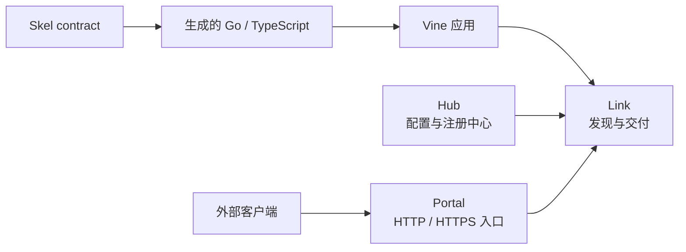

# 快速开始

Vine 是一个 Go 应用运行时框架。它用一套应用模型统一业务代码所需的生命周期、
依赖注入、配置、Rpc、Web、事件、任务、Redis 与关系型数据库。同一份应用代码既可在
内嵌的开发运行时中启动，也可连接到独立部署的运行时服务。

本节帮助你选择最短且有用的文档路径。在开始编写第一个 handler 前，你不需要先理解
Hub、Link 与 Portal 的内部实现。

:::info 先确认版本

复制示例前先检查版本选择器。**Vine next** 跟随当前源码，发行版标签则对应
不可变的文档快照。生产构建应选择一个发行版，并固定相互兼容的 Vine 与
`skelc` 版本，不要在可复现构建中直接复制 `@latest`。详见
[版本与兼容性](./compatibility.md)。

:::

## 先建立心智模型

- **你的应用**拥有业务代码，并且只声明自己需要的能力。
- **Skel 与 skelc**负责定义并生成类型安全的 contract；语言参考由
  [Skel 站点](https://skel.yorun.ai/docs/)维护。
- **Link**是应用侧运行时接入层，负责注册、发现、转发、配置读取与异步交付。
- **Hub**是配置和运行时注册状态的控制面。
- **Portal**是可选的外部 HTTP/HTTPS 网关；应用之间的内部调用不需要经过 Portal。

standalone 模式会在一个进程中启动 Hub、Link、Portal 与业务应用。即使网络跳转变成
进程内调用，各组件的职责边界仍然不变。

## 按需求选择能力

| 你的需求 | 从这里开始 | 核心语义 |
| --- | --- | --- |
| 调用另一个应用并取得结果 | [Rpc](../framework/rpc-guide.md) | 同步、类型安全的请求/响应 |
| 暴露由应用拥有的 HTTP 路由 | [Web](../framework/web.md) | 通过生成的 Web 边界处理 HTTP |
| 向感兴趣的应用发布已经发生的事实 | [Event](../framework/event-task.md) | 按消费应用异步广播 |
| 让一个可用 worker 执行工作 | [Task](../framework/event-task.md) | 异步竞争消费 |
| 读取托管配置 | [配置](../framework/configuration.md) | eternal 快照或 instant 更新 |
| 保存共享缓存状态或协调分布式锁 | [Redis](../framework/redis-guide.md) | 托管 client、类型化 cache 与 locker |
| 持久化关系模型 | [RDB](../framework/rdb-guide.md) | 托管 GORM 连接与类型化 DAO |

如果两个组件属于同一应用，且不需要网络 contract，应直接注入 Go 依赖，而不是额外
创建 Rpc 服务。

## 推荐学习路径

### 评估 Vine

1. 确认[前置条件与兼容矩阵](./compatibility.md)。
2. 运行[第一个 Vine 应用](./tutorial-first-app.md)。
3. 定义[第一个 Skel contract](./first-contract.md)。
4. 按照 [Rpc 指南](../framework/rpc-guide.md)实现并调用生成的服务。

这条路径从 standalone 模式开始，因此不需要预先安装或单独启动任何运行时进程。

### 构建应用

1. 理解[应用模型](../framework/application-model.md)，并学习如何组合
   [component 与 module](../framework/components.md)。
2. 按需添加配置以及 Rpc、Web、Event 或 Task 能力。
3. 仅在应用确实拥有对应基础设施依赖时添加 Redis 或 RDB。
4. 使用[日志与 testkit](../framework/logging-testing.md)验证可观察行为。

### 理解运行时机制

建议在第一个应用跑通后阅读；如果正在做生命周期或并发设计，也可以提前阅读：

1. [运行时架构](../runtime/mechanisms.md)
2. [应用生命周期](../runtime/application-lifecycle.md)
3. [依赖与执行模型](../runtime/execution-model.md)
4. [注册、发现与请求路由](../runtime/request-routing.md)
5. [Trace 与 timeout 传播](../framework/trace-timeout.md)

### 准备部署

1. 选择[部署拓扑](./deployment-modes.md)。
2. 完成[生产就绪清单](../operations/production-readiness.md)。
3. 阅读 [Hub](../runtime/hub.md)、[Link](../runtime/link.md) 与 [Portal](../runtime/portal.md) 的运行指南。
4. 将所有内部运行时 endpoint 保持在 loopback 或可信私网中；当前
   [安全边界](../operations/production-readiness.md#保护运行时网络)
   不支持把这些 endpoint 暴露给不可信网络。

## 业务代码应遵守的边界

- 将业务行为放在 module 与能力 handler 中，不要放进 `main`。
- 将生成代码视为构建产物；修改 `.skel` 源文件后重新生成。
- 必须在应用可被发现前完成的工作应放进 `BeforeAppStart`；`AfterAppStart`
  执行时，服务和注册已经开始工作。
- 让 request scope 依赖留在创建它的 execution 内。
- Event listener 与 Task runner 必须按幂等方式设计，因为失败交付可能重试。
- 发起下游调用时继续使用注入的 context。

需要按 package 查找时，请使用[公共 package 导航](../framework/core-packages.md)或
[Go API 参考](https://pkg.go.dev/go.yorun.ai/vine)。
