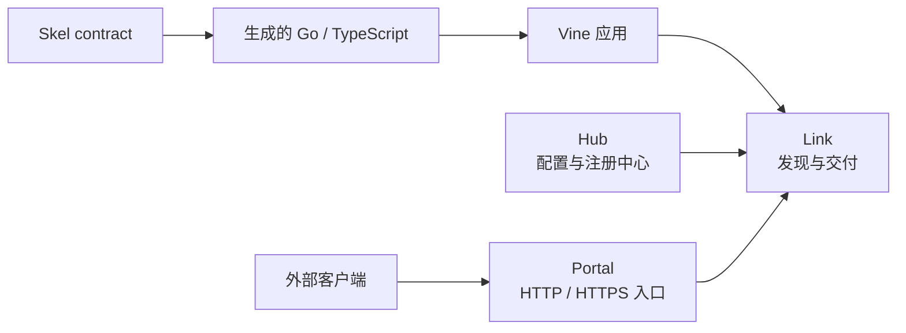

# 快速开始

Vine 用一套 Go 应用模型组织生命周期、依赖注入、配置、Rpc、Web、Event、
Task、Redis 和关系型数据库。刚开始时，把 Hub、Link、Portal 和业务应用都放在
standalone 进程里即可；等到需要真实网络边界或独立运维时再拆开。

第一次使用 Vine，按下面的顺序最省事：

1. 确认 [Go、Vine 与 skelc 的兼容版本](./compatibility.md)。
2. 跑通[第一个应用](./tutorial-first-app.md)。
3. 用[第一个 Skel 契约](./first-contract.md)生成服务代码。
4. 按 [Rpc 指南](../framework/rpc-guide.md)实现并调用服务。

这四步都可以在 standalone 模式完成，不需要预先启动独立运行时服务。

:::info 复制命令之前

Vine 1.0 之前，本站只维护 **Vine next**。它跟随当前源码，可能比最新发行版
更靠前。生产构建应固定精确的 Vine 与 skelc revision；如果示例与所用 revision
有差异，请先查看[版本兼容性](./compatibility.md)。

:::

## 各部分分别做什么

- **你的应用**拥有业务代码，并且只声明自己需要的能力。
- **Skel 与 skelc**负责定义并生成类型安全的 contract；语言参考由
  [Skel 站点](https://skel.yorun.ai/docs/)维护。
- **Link**是应用侧运行时接入层，负责注册、发现、转发、配置读取与异步交付。
- **Hub**是配置和运行时注册状态的控制面。
- **Portal**是可选的外部 HTTP/HTTPS 网关；应用之间的内部调用不需要经过 Portal。

standalone 会在一个进程里启动这四个角色。职责并没有变化，只是通信变成了
进程内调用。

## 按要解决的问题选择能力

| 你的需求 | 从这里开始 | 核心语义 |
| --- | --- | --- |
| 调用另一个应用并取得结果 | [Rpc](../framework/rpc-guide.md) | 同步、类型安全的请求/响应 |
| 暴露由应用拥有的 HTTP 路由 | [Web](../framework/web.md) | 通过生成的 Web 边界处理 HTTP |
| 向感兴趣的应用发布已经发生的事实 | [Event](../framework/event-task.md) | 按消费应用异步广播 |
| 让一个可用 worker 执行工作 | [Task](../framework/event-task.md) | 异步竞争消费 |
| 读取托管配置 | [配置](../framework/configuration.md) | eternal 快照或 instant 更新 |
| 保存共享缓存状态或协调分布式锁 | [Redis](../framework/redis-guide.md) | 托管 client、类型化 cache 与 locker |
| 持久化关系模型 | [RDB](../framework/rdb-guide.md) | 托管 GORM 连接与类型化 DAO |

如果两个组件属于同一应用，且不需要网络 contract，应直接注入 Go 依赖，而不是额外
创建 Rpc 服务。

## 遇到问题时再往下读

### 应用开始变大时

1. 理解[应用模型](../framework/application-model.md)，并学习如何组合
   [component 与 module](../framework/components.md)。
2. 按需添加配置以及 Rpc、Web、Event 或 Task 能力。
3. 仅在应用确实拥有对应基础设施依赖时添加 Redis 或 RDB。
4. 使用[日志与 testkit](../framework/logging-testing.md)验证可观察行为。

### 需要处理生命周期或并发时

先看[运行时架构](../runtime/mechanisms.md)，再按当前问题继续：

- Hook 顺序、就绪、停机和资源归属：看[应用生命周期](../runtime/application-lifecycle.md)。
- Scope、请求内对象、filter 与释放：看[依赖与执行模型](../runtime/execution-model.md)。
- 注册、服务发现、实例选择与 drain：看[请求路由](../runtime/request-routing.md)。
- 下游 deadline 与调用元数据：看 [Trace 与 timeout](../framework/trace-timeout.md)。

### 上线之前

1. 选择[部署拓扑](./deployment-modes.md)。
2. 完成[生产就绪清单](../operations/production-readiness.md)。
3. 阅读 [Hub](../runtime/hub.md)、[Link](../runtime/link.md) 与 [Portal](../runtime/portal.md) 的运行指南。
4. 将所有内部运行时 endpoint 保持在 loopback 或可信私网中；当前
   [安全边界](../operations/production-readiness.md#保护运行时网络)
   不支持把这些 endpoint 暴露给不可信网络。

## 几条不要打破的边界

- 将业务行为放在 module 与能力 handler 中，不要放进 `main`。
- 将生成代码视为构建产物；修改 `.skel` 源文件后重新生成。
- 必须在应用可被发现前完成的工作应放进 `BeforeAppStart`；`AfterAppStart`
  执行时，服务和注册已经开始工作。
- 让 request scope 依赖留在创建它的 execution 内。
- Event listener 与 Task runner 必须按幂等方式设计，因为失败交付可能重试。
- 发起下游调用时继续使用注入的 context。

需要按 package 查找时，请使用[公共 package 导航](../framework/core-packages.md)或
[Go API 参考](https://pkg.go.dev/go.yorun.ai/vine)。
