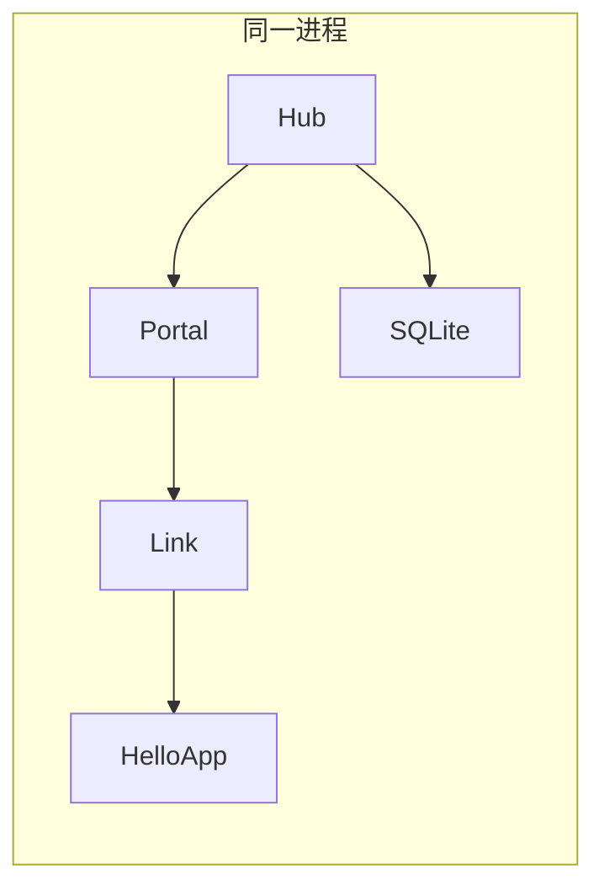

# 第一个 Vine 应用

本教程创建一个最小的 Vine 应用，并以 standalone 模式启动它。standalone 会在同一进程内启动 Hub、Portal、Link 和业务应用，适合第一次体验、本地开发和集成测试。

完成后，你会得到一个可启动、可优雅停止的 Vine 应用，以及一个保存内嵌 Hub
运行时状态的本地 SQLite 文件。

## 前提条件

- Go 1.26.5 或更高版本。
- 已安装 Vine，或项目可访问 `go.yorun.ai/vine` 模块。

新建一个空目录并初始化 Go module：

```bash
mkdir vine-hello
cd vine-hello
go mod init example.com/vine-hello
go get go.yorun.ai/vine@v0.10.0
```

## 定义应用

创建 `main.go`：

```go title="main.go"
package main

import (
	"go.yorun.ai/vine/app"
	"go.yorun.ai/vine/app/standalone"
	"go.yorun.ai/vine/core/logger"
)

type HelloModule struct {
	app.BaseModule
}

func (*HelloModule) AfterAppStart() {
	logger.Info("hello from Vine")
}

type HelloApp struct {
	app.Application
}

func (*HelloApp) Name() string {
	return "demo.hello"
}

func (*HelloApp) InitModules(add app.TypeAdder) {
	add(app.T[*HelloModule]())
}

func main() {
	standalone.NewWithOption[*HelloApp](standalone.Option{
		SQLiteFile: "./vine.sqlite",
	}).StartAndWait()
}
```

这段代码包含三个需要理解的概念：

1. 嵌入 `app.Application` 获得应用规格的默认实现。
2. `Name()` 返回逻辑应用名。它必须由一个或多个以点号分隔的小写字母段组成，例如
   `demo.hello`。同一应用的多个 replica 共用该名称，并通过不同 instance ID 区分；
   同一进程中的两个不同应用不能使用相同名称。
3. `HelloModule` 跟随应用启动，并在启动完成后输出一条可验证的日志。

`StartAndWait()` 启动运行时并等待 `SIGINT` 或 `SIGTERM`。按 `Ctrl+C` 后，应用会按反向顺序优雅停止。

## 运行

```bash
go run .
```

首次运行会在当前目录创建 `vine.sqlite`。终端日志会依次出现 standalone Hub、Portal、Link 和 `demo.hello` 的启动记录，并包含：

```text
hello from Vine
```

看到这条日志，说明应用、依赖注入和模块生命周期都已正常工作。此时应用还没有声明 Rpc、Web、Event 或 Task 能力，但完整 runtime 已经装配完成。

按 `Ctrl+C` 停止。再次执行同一命令会复用 `vine.sqlite` 中保存的 Hub 数据。

## 理解 standalone 的组成



- **Hub** 保存配置和注册信息，并提供进程内 Redis。
- **Portal** 订阅入口、站点和 endpoint 配置。
- **Link** 持有与 `HelloApp` 的连接，并提供配置、发现与转发。这个最小 App
  尚未声明公开能力，因此目前没有需要发布的注册。
- **HelloApp** 是你的业务应用；后续可在其中加入组件、模块以及 Rpc/Web/Event/Task 能力。

standalone 中 Hub 和 Link 的管理连接使用 inproc transport，不额外开放管理端口；Portal 仍可根据入口规则监听业务 HTTP/HTTPS 端口。该模式不模拟 heartbeat、TTL 过期或网络断连，需要验证这些行为时改用 linked 模式。

## 连接已有 Hub

先安装匹配版本的 Vine CLI，再单独启动 Hub：

```bash
go install go.yorun.ai/vine/cmd/vine@v0.10.0

vine hub serve \
  --mq-embedded-nats \
  --db-sqlite-file ./hub.sqlite
```

然后导入 `go.yorun.ai/vine/app/linked`，并将 `main` 改为：

```go title="main.go"
func main() {
	linked.NewWithOption[*HelloApp](linked.Option{
		HubEndpoint:   "http://127.0.0.1:7071",
		IngressListen: "127.0.0.1:7082",
	}).StartAndWait()
}
```

此时业务应用与一个 Link 在同一进程。Link 会连接独立 Hub，并注册你之后声明
的应用能力。`HubEndpoint` 与 `IngressListen` 也可以分别由
`VINE_HUB_ENDPOINT` 和 `VINE_INGRESS_LISTEN` 提供。

如需把 Link 与业务应用拆为独立进程，则使用 `app.New` 启动业务应用，并通过 `--link-endpoint` 或 `VINE_LINK_ENDPOINT` 指定已有 Link 的 API endpoint。

## 下一步

- 完成 [第一个 Skel 契约](./first-contract.md)，生成类型安全的业务代码。
- 阅读 [App](../framework/app.md)，了解应用、组件和模块的完整生命周期。
- 阅读 [Hub](../runtime/hub.md)、[Link](../runtime/link.md) 和 [Portal](../runtime/portal.md)，理解多进程部署的职责边界。
- 阅读 [使用 Rpc](../framework/rpc-guide.md)，开始声明并调用服务。
