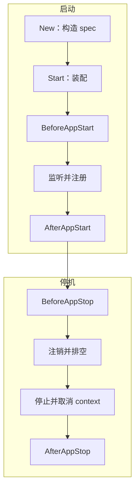
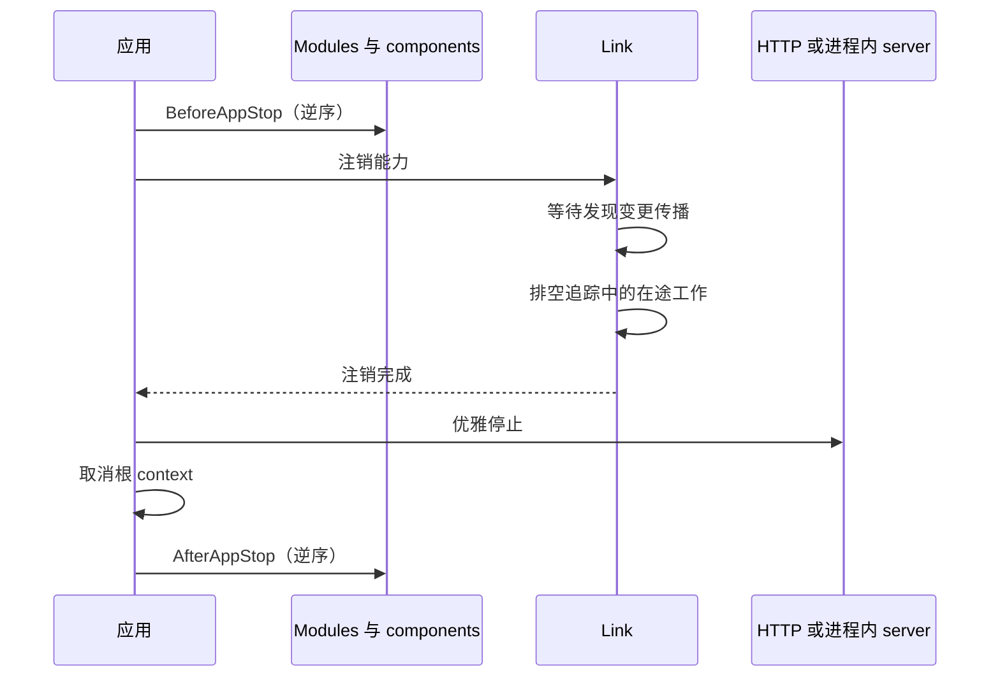

# 生命周期

Vine 应用分两步准备：通过 `New(...)` 构造，再通过 `Start()` 激活。构造并非惰性操作，
但应用的大部分依赖图要到 `Start()` 时才会装配。

实际生命周期如下：



## 构造并非惰性操作

调用应用构造器时，Vine 会立即：

1. 应用传入的 flags，并在需要时创建默认 `RunFlag`。
2. 构造应用 specification，完成字段注入。
3. 如果 specification 实现了 DI 初始化约定，则调用其 `DIInit()`。
4. 校验应用名并分配应用身份。
5. 从 `RunFlag.Context` 派生根 context；如果它是 `nil`，则使用 `context.Background()`。
6. 捕获之后服务器要使用的监听地址。

这会带来两个重要结果。

第一，构造器校验和 specification 初始化可能在 `Start()` 之前就 panic。请把构造视为真正的初始化，而不是创建一个没有行为的描述对象。

第二，构造阶段捕获的运行参数必须在构造器边界或 specification 初始化期间提供。特别是，`BindCommon(...)` 会在之后装配依赖容器时才执行；在那里修改 `AppFlag.ListenAddr`，已经无法改变应用捕获好的监听地址。

推荐在构造器边界提供运行参数：

```go
application := app.New[*DemoApp](
    app.With(&app.RunFlag{
        ListenAddr: "127.0.0.1:18080",
        Context:    rootCtx,
    }),
)
```

自定义 flags 也遵循同一规则：如果后续初始化依赖某个构造参数，应在应用 specification 的 `DIInit()` 中校验或归一化它。构造完成后，请把 flags 当作不可变输入。后续依赖容器中的对象拿到的是副本；修改某个注入的 flag 并不是进程级配置机制。

同一个应用类型和同一个应用名在一个进程中都只能构造一次，即使应用已经停止也一样。应用也是一次性的：不能启动两次，也不能在停止后重新启动。

## `Start()` 做了什么

`Start()` 是同步方法。只有当应用完成依赖装配、启动 endpoint 和各项能力、在需要时向 Link 注册，并执行完所有 `AfterAppStart()` hooks 后，它才返回。

它分为四个阶段。

### 1. 连接并装配

Vine 首先连接 Link，取得应用所需的运行信息，然后创建：

- 应用依赖图。
- 已声明的 Component。
- 已声明的 Module。
- RPC、Web、Event、Task 服务及其 execution containers。

已声明的 Component 和 Module 实例都是应用生命周期单例。依赖图构造时，会完成它们的字段注入并调用 `DIInit()`。框架组件 minder 也会在这里初始化其 Component。例如，RDB Component 可以在生命周期 hooks 开始之前打开数据库。

`BindCommon(...)`、Component `Bind(...)` 和 Module `Bind(...)` 是依赖声明，不是生命周期回调。Vine 可能把它们应用到多个容器，因此它们应当是确定性的，且不包含运行时副作用。

### 2. 执行启动前 hooks

Vine 按以下顺序调用 `BeforeAppStart()`：

1. Components，按声明顺序。
2. Modules，按声明顺序。

此时 Vine 尚未发布应用 endpoint。这个阶段适合执行有界的就绪检查、必须在开始服务前完成的预热，以及依赖完整依赖图的校验。

`BeforeAppStart()` 会返回 error，但 `Start()` 不会把该 error 返回给调用者。Vine 会把它转为 panic。启动也不是事务：已经创建的资源不会自动回滚，已完成的 hooks 也不会收到补偿回调。如果调用者 recover 了启动 panic，需要自行判断是否能够安全清理。

### 3. 启动 endpoint 并发布能力

所有启动前 hooks 成功后，Vine 会：

1. 启动 HTTP 或进程内 endpoint。
2. 启动已启用的 RPC、Event、Task 能力机制。
3. 向 Link 注册应用的 RPC、Web、Event、Task 与 schema 元数据。

因此，listener 会先于注册存在。注册使应用可通过 Link 被发现；远端 Link 和 Portal 的视图仍可能需要一小段传播时间。

没有公开能力的应用不会发布应用注册，但其本地生命周期仍会正常执行。

### 4. 执行启动后 hooks

最后，Vine 调用 `AfterAppStart()`：

1. Components，按声明顺序。
2. Modules，按声明顺序。

此时 endpoint 已启动，并且向本地 Link 的注册已经完成。只应在应用可用期间运行的后台循环，适合在 `AfterAppStart()` 中启动。每个循环都应保留显式的取消与等待机制，以便在 `BeforeAppStop()` 中停止。

## Hook 顺序与职责

| Hook | 顺序 | 运行状态 | 适合的职责 | 避免 |
| --- | --- | --- | --- | --- |
| `BeforeAppStart()` | Component 后 Module；按声明顺序 | 依赖图已装配，endpoint 尚未发布 | 校验依赖、有界预热、就绪检查 | 假定会自动回滚的不可逆工作 |
| `AfterAppStart()` | Component 后 Module；按声明顺序 | Endpoint 已启动，本地注册已完成 | 启动后台循环、声明本地就绪 | 在 hook 中永久阻塞 |
| `BeforeAppStop()` | Module 后 Component；按声明逆序 | 仍处于注册状态，server 与根 context 仍可用 | 停止生产者、取消并等待 worker、执行有界 flush | 无截止时间地等待 |
| `AfterAppStop()` | Module 后 Component；按声明逆序 | 已注销，server 已停止，根 context 已取消 | 释放应用拥有的资源、完成本地收尾 | 发起新的 RPC、Event、Task 或依赖上下文的工作 |

Component 先于 Module 启动，因此业务模块能依赖已经初始化的基础设施。停止时反转这个关系，使 Module 能在 Component 资源仍存在时完成收尾。

Hook 顺序取决于声明顺序，但对象的构造顺序不一定如此。依赖解析可能提前构造被注入对象。不要用声明顺序代替真正的依赖声明。

## 优雅停止

`StopGracefully()` 会阻塞调用者，直到停止完成。可观察到的顺序是：



这些细节是有意设计的：

- `BeforeAppStop()` 执行时，根 context 和 server 仍处于活动状态。请在这里停止后台生产者并等待其 goroutine 退出。
- Link 会从服务发现中移除实例，等待变更传播，并在其排空上限内等待已追踪的在途工作；在此期间应用 endpoint 仍然可用。
- 然后应用优雅停止自身 server。
- 只有 server 停止后，Vine 才取消应用根 context。
- `AfterAppStop()` 执行时根 context 已取消。它适合本地资源释放，不适合远程工作。

生命周期 hook 不会获得自动 timeout；每个 hook 都必须自行限制网络调用和 goroutine
汇合的时间。停止 hook 中的 panic 同样不会转成可恢复的生命周期 error，它会立即
中断剩余的停止序列并传播给生命周期 owner。生命周期 panic 属于 fatal：恢复后继续
使用该 runtime 不受支持。

`RunFlag.Context` 是注入应用 context 的父级，但取消它本身不会调用 `StopGracefully()`。`StartAndWait()` 会等待 `SIGINT` 或 `SIGTERM`，然后执行优雅停止。直接持有应用的代码仍需自行安排调用 `StopGracefully()`。

## 运行包装器与 bundles

无论部署模式如何，业务应用内部的生命周期保持不变；包装器负责外围运行时的顺序。

| 模式 | 启动顺序 | 停止顺序 |
| --- | --- | --- |
| 直接 `app.New(...)` | 业务应用 | 业务应用 |
| `app.NewBundled(...)` | 按声明顺序启动业务应用 | 按逆序停止业务应用 |
| `linked.New(...)` | 进程内 Link，然后业务应用 | 业务应用，然后 Link |
| `linked.NewBundled(...)` | Link，然后按声明顺序启动业务应用 | 按逆序停止业务应用，然后 Link |
| `standalone.New(...)` | Hub、Portal、Link，然后业务应用 | 业务应用、Link、Portal、Hub |
| `standalone.NewBundled(...)` | Hub、Portal、Link，然后按声明顺序启动业务应用 | 按逆序停止业务应用，然后 Link、Portal、Hub |

先停止业务应用、后停止其进程内 Link 至关重要：在每个业务应用完成停止前，注销与排空路径必须保持可用。

## 由 Module 管理后台 worker

谁启动 worker，谁就保存它的 cancel function 和完成信号：

```go
type WorkerModule struct {
    app.BaseModule

    Context context.Context `inject:""`

    cancel context.CancelFunc
    done   chan struct{}
}

func (m *WorkerModule) AfterAppStart() {
    workerCtx, cancel := context.WithCancel(m.Context)
    m.cancel = cancel
    m.done = make(chan struct{})

    go func() {
        defer close(m.done)
        runWorker(workerCtx)
    }()
}

func (m *WorkerModule) BeforeAppStop() {
    if m.cancel == nil {
        return
    }
    m.cancel()

    select {
    case <-m.done:
    case <-time.After(5 * time.Second):
        // 记录 timeout，然后继续停止。
    }
}
```

该 Module 只在发布后启动工作，在依赖仍可用时停止工作，也不会依赖 `AfterAppStop()` 才来得及观察 context 取消。

## 相关文档

- [应用模型](../framework/application-model.md)介绍应用 specification 与能力。
- [Components 与 Modules](../framework/components.md)说明如何划分应用职责。
- [执行模型](./execution-model.md)解释每次请求的注入与释放。
- [运行与部署](../getting-started/deployment-modes.md)比较 standalone、linked 与分离式拓扑。
- [运行机制](./mechanisms.md)把生命周期行为与 Hub、Link、Portal 串联起来。
