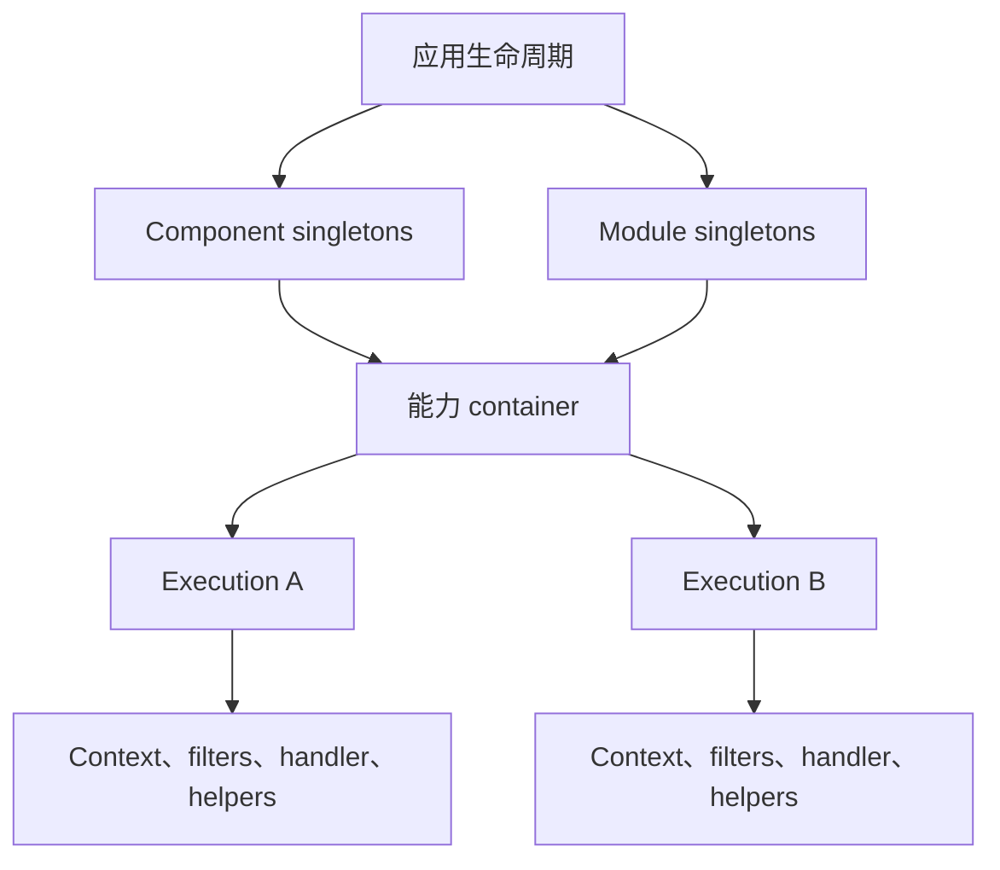
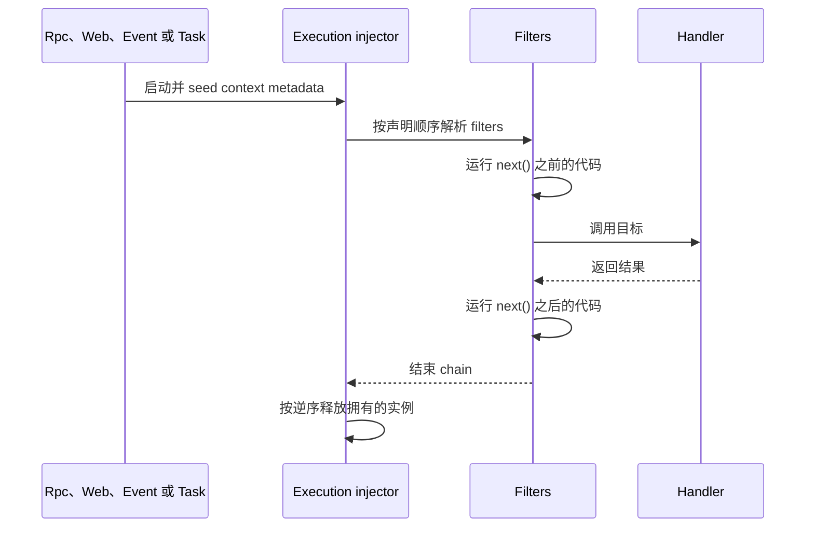

# 执行模型

Vine 在两种不同的生命周期中使用依赖注入：

- **应用生命周期**拥有 components、modules 与其他长生命周期对象。
- 每次 Rpc 调用、Web 请求、Event 投递和 Task 运行都会创建一个**执行生命周期**。

正是 execution 边界，让生成的 client、配置值、DAO、cache 或 locker 能自动跟随当前请求 context，而不必把每个依赖都变成全局 singleton。



## 应用生命周期对象

应用声明的每个 component 和 module 都会在 `Start()` 期间构造一次，并一直保留到应用停止。它们是应用依赖图中的显式 singletons。

它们适合：

- 基础设施连接的所有者。
- 进程内 registries 与 managers。
- 拥有显式生命周期 hooks 的后台 worker。
- 不捕获请求状态的不可变 services。

它们拿到的是应用根 `context.Context` 和根 `meta.Context`，而不是未来某个请求的 context。因此，注入 module 的生成 Rpc client 表示由应用发起的后台工作；之后它不会自动变成请求感知的 client。

长生命周期对象不应保留从 handler、filter 或其他请求路径取得的 execution-scoped 对象。这样做不仅会持有已取消的 context，还会在表面上延长 Vine 已经释放的资源生命周期。

## 每次 execution 一个 injector

每项能力都持有一个描述其 bindings 的 plain container。工作到达时，container 会创建新的 execution injector：

| 能力 | Execution 边界 | Seed 的请求状态 |
| --- | --- | --- |
| Rpc | 一次方法调用 | Rpc context 与 method 信息 |
| Web | 一次路由后的 HTTP 请求 | Web context |
| Event | 一次 listener 投递 | Event context 与 event 信息 |
| Task | 一次 trigger 运行 | Task context 与 trigger 信息 |

Handler、listener、runner 与 filter 实例都在该 execution 中创建。不同 executions 永远不会共享 execution-scoped 实例。

请把 execution 视为一次性的。Filter chain 返回后，Vine 会完成该 execution，并拒绝继续从已完成的 injector 解析依赖。

## 关键的 unscoped 规则

没有显式 scope 的 binding 并不具有一个固定生命周期。它的有效 fallback 取决于由哪一种 injector 解析：

- 在 plain injector 中，unscoped 表示 **transient**。
- 在 execution injector 中，unscoped 表示 **execution-scoped**。

这是有意设计的。例如下面的 binding：

```go
b.BindFactory(func(ctx context.Context) *Repository {
    return NewRepository(ctx)
})
```

在 plain injector 中每次解析都会创建新值；但在一次请求内，它至多创建一次，并由所有消费者复用。下一个请求会得到携带自身 context 的另一个值。

### Scope 速查

| 声明 | Plain injector | Execution injector | 典型用途 |
| --- | --- | --- | --- |
| 无显式 scope | 每次解析一个新值 | 每次 execution 一个值 | Context-aware clients、configs、DAOs、caches、lockers |
| `SingletonScope` | Binding 所属 container 中一个值 | 重定向到同一个 singleton | 应用拥有的 managers 与不可变共享 services |
| `ExecutionScope` | 无法在 execution 外解析 | 每次 execution 一个值 | 请求 context、协议 metadata、handlers |
| `TransientScope` | 每次解析一个新值 | 每次解析一个新值 | 绝不能缓存的小型无状态 helpers |

Scope 属于被请求的 binding target。把某个 interface 绑定为 singleton，并不会自动让另一个单独绑定的 concrete type 成为同一个 singleton。

子 containers 会继承父级 bindings，也能增加新的 target types，但不允许覆盖父级已经绑定的类型。

## Execution pipeline

对于每个工作单元，Vine 都运行同一条核心 pipeline：



Filters 形成洋葱模型：

```go
func (f *TimingFilter) Filter(next ctr.FilterNext) {
    started := time.Now()
    next()
    f.Logger.Info("execution completed", "elapsed", time.Since(started))
}
```

Vine 会把目标调用追加为最后一个 filter。Filter 可以在 `next()` 之前检查或改写参数，也可以在 `next()` 返回后检查或改写结果。

短路是一项协议决定，并不只是省略 `next()`。Rpc、Event 与 Task executor 都期望合法的结果形状。终止这些 chains 的 filter 必须设置与目标契约兼容的结果；否则 execution 会因为没有产生结果而失败。

## 初始化与释放

对于由 Vine 构造的 struct pointers：

1. 分配对象。
2. 解析并赋值带有 `inject:""` 的字段。
3. 如果对象实现了初始化约定，则运行 `DIInit()`。

Execution 完成时会等待正在进行的解析，然后按创建逆序释放 execution 拥有的实例。释放通过以下任一方式完成：

- 对实现释放约定的对象调用 `DIDispose()`。
- 调用 binding 提供的 disposer。

Seed 的请求对象由协议提供，不归 DI 所有，也不会由 DI 释放。

Plain injectors **不会**自动释放其中的 singleton 实例。拥有数据库、Redis client、文件、队列连接或 goroutine 的 component 或 module，必须在应用生命周期 hooks 中显式释放它。正确的停止阶段请参阅[应用生命周期](./application-lifecycle.md)。

## 依赖安全规则

Vine 会在开始服务前校验依赖图：

- 拒绝依赖环。
- 已声明的 singleton 不允许依赖已声明的 execution-scoped 类型。
- Execution-scoped 类型不允许从 plain injector 解析。
- 隐式构造只支持 struct pointers。
- 注入字段必须 exported。

这些检查能防止请求对象被悄悄捕获进长生命周期 singleton，但替代不了生命周期设计：一个 unscoped、context-aware factory 仍可能使用应用根 context，为长生命周期 component 创建值。应有意识地决定消费者属于应用还是某次 execution。

## 常见生成依赖如何取得 context

Vine 会把许多生成或基础设施 helpers 发布为 unscoped factories。它们的有效生命周期遵循前面的 injector 规则。

| 依赖 | 创建时捕获的 context | 在 handler 中的结果 |
| --- | --- | --- |
| 生成的 Rpc client | 当前 `meta.Context` | 出站调用继承当前 trace、actor、initiator 与请求生命周期 |
| 生成的 Event emitter | 当前 `meta.Context` | Emit 与当前 trace 和应用关联 |
| 生成的 Task launcher | 当前 `meta.Context` | Launch 与当前 trace 和应用关联 |
| 生成的配置 | 解析时 Link 的当前 snapshot | 每次 execution 一个解码后的 pointer；已有 pointer 不会原地变化 |
| RDB DAO | 当前 `context.Context` 与请求 logger | GORM 操作使用 execution 的取消信号与关联 logger |
| Redis cache | 当前 `context.Context` | Execution context 结束时，cache 操作也会停止 |
| Redis locker | 当前 `context.Context` | 获取锁和续期都绑定到该 context |

在同一次 execution 内，重复注入同一 target 会返回同一个有效 execution-scoped 值。跨 execution 时，factory 会重新运行，并观察新的 context 或配置 snapshot。

Redis component 本身是应用 singleton，暴露需要显式 context 的命令。它注入的 cache 与 locker helpers 不同：它们会捕获创建时使用的 context。

## 不要跨 executions 移动依赖

下面的代码不安全：

```go
var cachedDAO *OrderDAO

func (h *OrderHandler) Handle() {
    cachedDAO = h.OrderDAO
}
```

请求结束后，`cachedDAO` 中的 DAO 携带的 context 已经结束。同样的规则也适用于生成 clients、请求 loggers、需要保持新鲜度的配置 pointers、caches、lockers、handlers 和 filters。

推荐改用以下设计之一：

- 把依赖保留在 handler 中，并且只在这次调用期间使用。
- 向后台队列传递普通数据，而不是传递依赖。
- 让生命周期托管的 module 拥有一个单独的应用 context client。
- 只有当对象不依赖 context 且有明确停止所有权时，才绑定真正的应用 singleton。

## 如何选择 scope

| 问题 | 推荐 |
| --- | --- |
| 同一请求的每个消费者是否必须共享同一个对象？ | Unscoped 或 `ExecutionScope` |
| 每次解析是否都必须创建一个全新的无状态对象？ | `TransientScope` |
| 对象是否不可变，或在整个应用期间由显式生命周期管理？ | `SingletonScope` |
| 对象是否捕获请求 context、身份、logger、事务或可变配置？ | Execution 生命周期 |
| 对象是否打开了必须关闭的资源？ | 给它显式 owner 与生命周期 hook；只有 scope 不够 |

不要仅仅因为配置、clients 或 caches 经常使用，就把它们设为 singleton。Singleton 会冻结对象以及它捕获的 context 或 snapshot。应根据所有权与新鲜度要求选择生命周期，而不是只看构造成本。

## 相关文档

- [依赖注入](../framework/di.md)是 bindings、factories、scopes 与 seeding 的 API 参考。
- [执行容器](../framework/ctr.md)解释 filters、参数与结果改写。
- [应用生命周期](./application-lifecycle.md)说明启动、停止与 singleton 资源所有权。
- [配置](../framework/configuration.md)解释 eternal 与 instant snapshots。
- [Context 与身份](../framework/meta.md)解释 trace、initiator 与 actor 传播。
