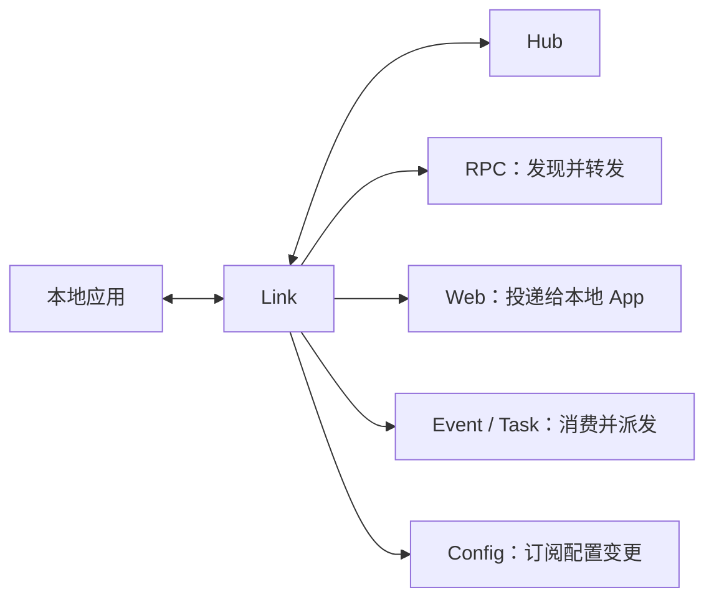

# Link 运行时

Link 是部署在应用侧的 runtime 接入层。它将本地应用注册到 Hub，维护配置和服务发现，并为 RPC、Web、Event 与 Task 提供统一的运行时能力。



## 职责边界

- **应用注册**：保存本地应用实例事实，向 Hub 注册能力，并在退出时注销。
- **健康与租约**：普通模式下对实例进行健康检查并向 Hub 发送心跳。
- **配置读取**：提供配置快照，并监听 Hub Redis 的变更事件。
- **RPC 发现与转发**：选择一个已注册的本地或远端 RPC 实例并转发调用。
- **Web 投递**：接收 Portal 已选定的 Web 请求，并转发给请求中指定的本地应用
  实例。
- **异步消息派发**：消费 NATS 消息，投递给本地声明的 Event Listener 和 Task Runner。

Link 是本地应用能力的唯一 owner。RPC、Web、Event、Task 与配置 Module 只从它派生各自的运行时索引，不直接维护另一份应用实例状态。

## 启动

Hub 启动后，可通过其 API endpoint 启动 Link：

```bash
vine link serve \
  --hub-endpoint http://127.0.0.1:7071
```

默认 API 监听在 `127.0.0.1:7079`。Ingress 默认使用 `0.0.0.0:0`，由系统分配端口并将实际 endpoint 注册到 Hub。需要固定地址时显式配置：

```bash
vine link serve \
  --api-listen 127.0.0.1:7081 \
  --ingress-listen 127.0.0.1:7082 \
  --hub-endpoint http://127.0.0.1:7071
```

对应环境变量为 `VINE_API_LISTEN`、`VINE_INGRESS_LISTEN` 与 `VINE_HUB_ENDPOINT`。

网络部署中，应配置 Link 的 `vine.link` 后台身份并使用 Hub HTTPS endpoint：

```bash
vine link serve \
  --hub-endpoint https://hub.internal:7071 \
  --ingress-listen 10.0.2.10:7082 \
  --mtls-ca-file /run/vine/ca.pem \
  --mtls-cert-file /run/vine/link.pem \
  --mtls-key-file /run/vine/link-key.pem
```

Link 会把该证书用于 Hub Rpc、Redis 与内嵌 NATS client，并作为 Link ingress 的
server 身份。它的精确 X.509-SVID 是
`spiffe://<trust-domain>/vine/daemon/vine.link`，并与 Hub、Portal 使用相同 trust domain。
远端 Link 与 Portal 代理流量必须使用 HTTPS 并认证该 SPIFFE ID。Link API 仍使用
未认证 h2c，因为 Link 是应用的 sidecar。应用与 Link 通常位于同一主机和部署信任
边界内。Vine 仍允许特殊部署使用非 loopback Link API，但会告警；必须由部署侧自行
加密、认证并限制这条路径。

## 请求路径

### RPC

应用发起 RPC 调用时，请求先进入 Link 的 `rpcproxy`。proxy 对当前 service
registration 执行轮询（round-robin），选择下一条注册。注册属于本地应用时，Link 直接调用其
应用 endpoint；否则经目标 Link 转发。本地性只改变转发路径，不构成选择优先级。完成
选择后发生的失败，也不会让该次调用自动改试另一条注册。

### Web

`webproxy` 只索引当前 Link 所拥有应用的 Web Handler。分布式 Web endpoint
快照和轮询选择由 Portal 负责；Portal 把请求发送给选中实例所属的
Link，目标 Link 再校验本地实例与 Handler，并调用应用 endpoint。Link 不会从
自己的 discovery index 中选择远端 Web 目标。Portal 选择、发现新鲜度与失败
边界见[请求路由](./request-routing.md)。

### Event 与 Task

`event` 和 `task` 根据本地实例声明建立 NATS 消费；应用能力变更时，Link 自动更新相应消费与派发状态。

## Inproc 模式

`linked.New(...)` 会让 Link 与业务应用同进程，但 Hub 仍是外部服务。Link 会
开放 ingress、向 Hub 注册并继续向 Hub 发送心跳。进程内 App 与 Link
生命周期绑定，因此独立的应用 healthcheck 会被禁用。

外部 Hub 要求后台 mTLS 时，可通过 `linked.Option.MTLSCAFile`、`MTLSCertFile`、
`MTLSKeyFile` 配置进程内 Link，也可使用共享的 `--mtls-*-file` 参数和
`VINE_MTLS_*_FILE` 环境变量。该证书代表内嵌的 `vine.link` workload。

standalone 才会把 Hub、Portal、Link 和应用全部放入同一进程，并使用进程内 Redis 与 endpoint；这种模式不执行心跳。要验证租约和网络故障，可使用 linked 或完全分开部署。

## 相关文档

- [Hub](./hub.md)：配置与注册信息的来源。
- [Portal](./portal.md)：对外请求进入应用的网关。
- [App](../framework/app.md)：以 linked 或 standalone 方式装配应用。
