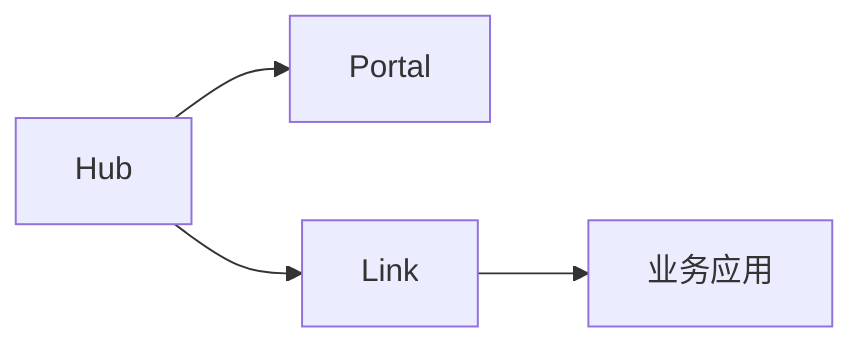
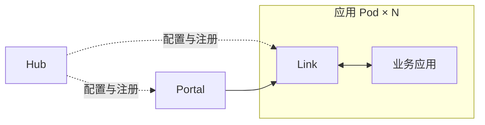
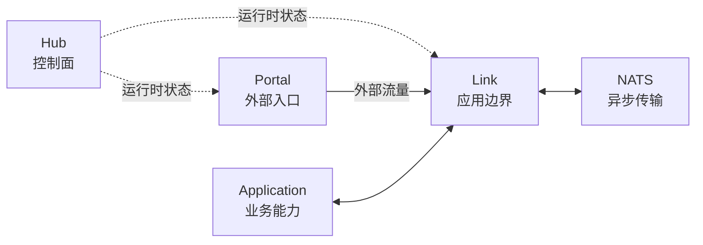
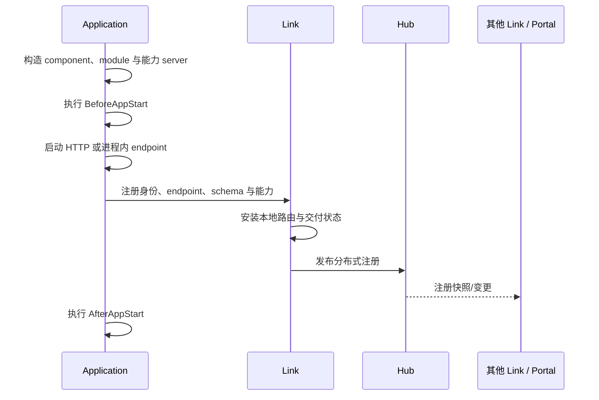
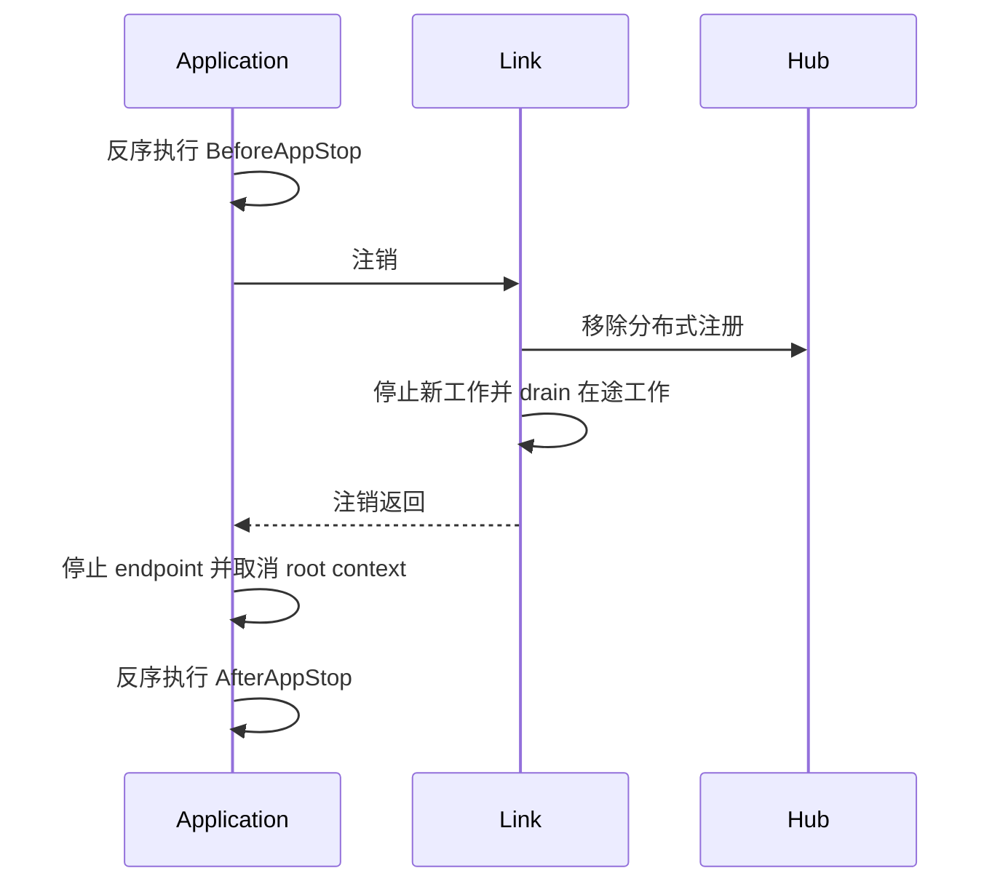

# 架构

Vine 在业务能力和部署拓扑之间划出了一条明确边界。应用声明 Component、Module、
RPC 服务、Web Handler、Event Listener 和 Task Runner，但不在业务代码里维护
服务地址、服务发现或网关连接。怎样找到并调用这些能力，由运行时决定。

因此，同一套应用实现既可以在本地作为单进程系统运行，也可以进入 Kubernetes 集群。
业务 package 不需要改；只有很薄的进程入口和运行时配置负责选择 Hub、Link、Portal
与应用如何组合。

这四个角色可以用一句话概括：

> **Hub 知道有哪些状态，Link 负责连接应用，Portal 接纳外部流量，应用执行业务代码。**

## 一套应用模型，多种部署形态

最小的 Vine 环境把完整运行时放在一个进程里。进入生产集群后，同样的角色能拆成
独立 workload。下面是一种实用的 Kubernetes 布局：每个应用实例旁运行一个 Link，
Hub 与 Portal 独立部署。

**Standalone：单进程**



**Kubernetes：分离运行时**



这只是其中一种布局，并不要求 Link 必须作为 sidecar。只要 Link API 与应用 endpoint
彼此可达，两者也能是独立 workload。

### 保持不变的部分

- `ApplicationSpec` 以及 Component/Module 关系。
- RPC、Web、Event、Task 实现与生成的契约代码。
- 依赖注入、执行上下文、filter、生命周期 hook 和应用配置读取方式。
- 通过生成 client、emitter、launcher 发起的调用。

### 留在部署边缘的部分

| 关注点 | Standalone | Kubernetes / 分开部署 |
| --- | --- | --- |
| 进程装配 | `standalone.New` 启动 Hub、Portal、Link 与应用 | `vine` CLI 和应用 binary 分别启动各个角色 |
| 应用到 Link | 进程内 endpoint | 通过 `VINE_LINK_ENDPOINT` 指向可达的 Link API |
| 注册与发现 | 进程内运行时路径 | Link 向 Hub 注册并消费分布式快照 |
| 外部流量 | 内嵌 Portal 可按配置打开 listener | 独立 Portal 将请求转发到已注册 Link |
| 扩缩容与故障 | 只有一个进程边界 | 应用、Link、Portal 和基础设施可分别运维 |

实际项目里，把启动入口保持得很薄就行，应用 specification 放在可复用 package 中：

```go title="cmd/checkout-standalone/main.go"
func main() {
	standalone.New[*checkout.App]().StartAndWait()
}
```

```go title="cmd/checkout/main.go"
func main() {
	app.New[*checkout.App]().StartAndWait()
}
```

集群入口从部署配置获取 Link 地址：

```bash
VINE_LINK_ENDPOINT=http://127.0.0.1:7079 ./checkout
```

这里变化的是几行启动装配，而不是业务代码。Vine 不负责生成 Kubernetes 资源；它解决
的是把拓扑相关问题留在应用实现之外，让同一套能力模型能直接带入集群。

### 这条边界为什么成立

背后有三个机制：

1. **能力注册与 transport 无关。** 无论 endpoint 在进程内还是网络上，应用上报的
   身份、schema 和 RPC/Web/Event/Task 能力都相同。
2. **位置与交付由 Link 负责。** 业务 Handler 不解析 Pod 地址，也不选择服务实例。
   Link 维护本地和分布式视图，完成最终转发或消息交付。
3. **进程内 transport 复用运行时契约。** Standalone 只是把网络跳转替换为注册过的
   进程内 endpoint，并没有另造一套业务编程模型。

## 四个运行时角色



| 参与者 | 拥有什么 | 是否处于同步业务请求路径 |
| --- | --- | --- |
| Application | Component、Module、Handler、Listener、Runner 与业务状态 | 是，作为调用方或目标 |
| Link | 本地应用状态、配置读取、发现快照、转发、Event/Task consumer、健康与 drain | 是 |
| Hub | 配置、注册状态、Portal 配置、schema 与运行时分发 | 否；Link 与 Portal 使用同步后的状态 |
| Portal | 外部 listener、site、TLS、准入策略与 endpoint 选择 | 仅外部流量 |
| NATS | Event 与 Task 消息 | 仅异步交付 |

这种分离会直接影响故障判断：一个组件可能对控制面收敛必不可少，却不在每次请求中
增加一跳；它也决定了启动与优雅停止期间哪些进程必须保持运行。

## 控制、入口与执行

### 控制面：Hub

Hub 以自己的数据库作为 application config、Portal site、rule、certificate 等托管
配置的 source of truth，并通过 Redis 分发层公开运行时快照与变更通知。

Link 将应用注册与租约状态发布到 Hub；Link 与 Portal 再读取或订阅各自需要的部分。
因此 Hub 是控制面依赖，而不是普通 RPC 或 Web 调用中的额外 proxy。

### 应用接入层：Link

每个应用都会连接一个 Link。Link 同时维护两类知识：

- 应用直接上报给当前 Link 的**本地 source state**；
- 从 Hub 加载的配置与远端发现**分布式快照**。

Link 基于这些视图转发 RPC/Web 请求、提供配置、创建 Event/Task consumer、维护注册
租约，并在停止期间排空应用。

### 外部入口：Portal

Portal 是北向基础设施。它从 Hub 监听 entry rule、site、certificate、schema
与可用 endpoint，随后接收外部 HTTP/HTTPS 流量。Portal 可以根据生成 schema 和 site
策略完成认证、授权，再把请求转发给目标 Link。

应用之间的调用不经过 Portal。Portal 也不能替代 Link：它选择的目标是 Link ingress
endpoint，而不是脱离 Link 独立发现的应用 Handler。

### 执行：Application

应用创建自己的 Component、Module 与能力 server。每次 RPC、Web、Event 或 Task 交付
都会进入 execution container；container 注入正确的 context 与依赖后再调用业务代码。

scope 与 filter 规则见[依赖与执行模型](./execution-model.md)。

## 从声明到可发现能力



注册只描述已声明的运行时事实：应用身份和 endpoint，以及它的 RPC service、Web Handler、
Event Listener、Task Runner 与 domain schema。业务数据不会进入 registry。

只拥有 Module、未暴露这些能力的应用仍可正常运行，但它没有需要通过服务发现公开的内容。

### Readiness 含义

endpoint 启动和注册完成都发生在 `AfterAppStart` hook **之前**。因此
`AfterAppStart` 执行期间请求已经可能到达。所有 readiness 关键检查和资源初始化都应
放进 `BeforeAppStart`；`AfterAppStart` 只用于应用已可见后仍然安全的工作。

完整顺序和 hook 使用建议见[应用生命周期](./application-lifecycle.md)。

## 四类运行时流

| 流 | 来源 | 运行时路径 | 交付模型 |
| --- | --- | --- | --- |
| 配置 | Hub 数据库或 seed | Hub → Redis 快照/变更 → Link → 应用 DI | eternal 实例快照或受监听的 instant 快照 |
| 内部 RPC | 应用中的生成 client | 调用方 Link → 选中的本地应用或目标 Link → 目标应用 | 同步请求/响应 |
| 外部 RPC 或 Web | 外部客户端 | Portal → 选中的 Link → 目标应用 | 同步网关转发 |
| Event 或 Task | 生成的 emitter 或 launcher | 发送方 Link → NATS → consumer Link → 目标应用 | 异步、可重试交付 |

### RPC 选择与 Web 网关路由

应用间 RPC 由调用方 Link 根据注册状态构造当前 service 集合，并选择一个已注册
实例。目标归当前 Link 所有时直接调用本地应用；否则请求先进入目标 Link，再到达
应用。

Web 的选择者不同。Portal 匹配外部 entry 和 site，从自己的分布式 Web endpoint
快照中选择目标，再把请求发送给所选应用所属的 Link。目标 Link 的 `webproxy`
只索引本地应用，负责最后的 Handler 查找与投递。

两条路径都不是持久化 workflow engine。目标失败并不表示同一个请求会透明迁移到
另一个目标。设计重试前请先阅读[注册、发现与请求路由](./request-routing.md)。

### Event 与 Task

Link 将生成的 Event/Task 消息发布到 NATS，并根据已注册的 Listener/Runner 创建
consumer。应用代码不直接创建这些 consumer。

Event 与 Task 的分组语义不同，失败后也可能重新交付。依赖广播、顺序、重试或身份传播
前，请先阅读[Event 与 Task](../framework/event-task.md)。

### 配置

Link 提供应用侧配置读取边界。eternal 配置在当前应用第一次读取时冻结；instant 配置
在第一次读取时建立监听，并更新后续 DI resolution 使用的快照。已经注入的指针不会
被原地修改。

一致性模型见[配置](../framework/configuration.md)。

## 拓扑抽象的边界

| 模式 | 进程 | Transport 变化 | 适用场景 |
| --- | --- | --- | --- |
| Standalone | Hub、Portal、Link 与应用共享一个进程 | 管理和应用 endpoint 可使用进程内连接 | 初次体验、本地开发、集成测试 |
| Linked | 外部 Hub；Link 与一个或多个应用共享进程 | App 到 Link 为进程内连接；Hub 与 Link ingress 使用网络 | 共享开发/运行控制面 |
| Separated | Hub、Portal、Link 与应用可独立运行 | 运行时边界使用网络 endpoint | 生产拓扑与分布式故障测试 |

应用能力代码在三种模式间无需变化。这层抽象覆盖应用装配、注册、路由与交付，但不会
抹平单个进程与真实集群之间的运维差异。进程内 transport 保留的是路由和订阅语义，
不是分布式故障语义：

- Standalone 注册没有 TTL，Link 也不会发送心跳。
- Standalone 无法模拟独立进程崩溃或网络分区。
- 进程内健康检查和 endpoint 可达性不能证明生产 listener、firewall、DNS 路径或 TLS
  配置正确。
- Hub 配置定义了业务 HTTP/HTTPS listener 时，Portal 仍可能打开这些端口。

验证租约过期、独立重启、真实网络可达性与 TLS 时，应使用 separated setup。

## 优雅移除



linked 与 standalone 组合会先停止业务应用，再停止共享 Link，确保注销与 drain 路径
仍可使用。separated 部署也应保持同样的运维顺序：先停止或排空应用，再终止拥有它们
的 Link。

`BeforeAppStop` 在注销前执行。可以用它停止应用自有 producer 并开始静默，但在排空
完成前，仍要保持在途 Handler 所需依赖有效。最终资源应在 `AfterAppStop` 中释放。

## 相关指南

- [应用生命周期](./application-lifecycle.md)：构造、hook、readiness、排空与 bundle 顺序。
- [依赖与执行模型](./execution-model.md)：应用单例、execution scope、filter、context 与释放。
- [请求路由](./request-routing.md)：注册监听、instance 选择、本地/远端转发与失败行为。
- [Trace 与 timeout](../framework/trace-timeout.md)：元数据、截止时间、取消与下游调用。
- [部署拓扑](../getting-started/deployment-modes.md)：选择 standalone、linked 或 separated 运行。
- [生产就绪](../operations/production-readiness.md)：网络边界、持久化、生命周期与故障验证。
