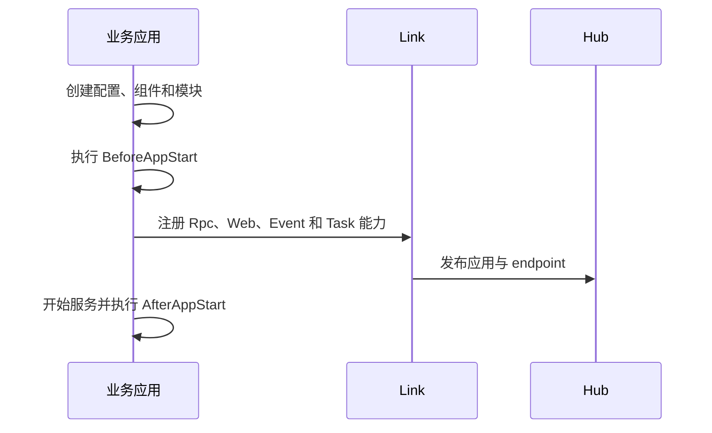
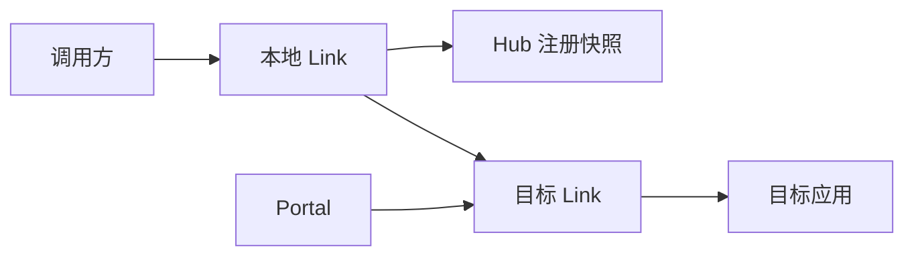
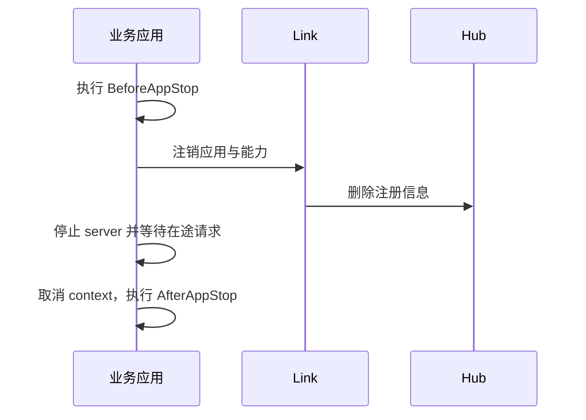

# 运行机制

Vine 将应用能力分为控制面和请求面。Hub 保存期望状态与注册信息；Link 连接应用并提供发现和投递；Portal 接收外部请求。业务代码只需要声明能力和实现 handler。

## 应用启动

启动失败时，应用不会进入可服务状态。组件应在 `BeforeAppStart` 返回有意义的错误，避免带着缺失依赖继续运行。

## 服务发现与请求转发

Link 根据服务注册选择目标实例。应用启动、停止或租约失效时，Hub 发布变更，Link 和 Portal 更新本地 endpoint 视图。

## 配置更新

Hub 将配置写入 Redis 分发层；Link 读取初始快照并订阅变更。应用获得的是匹配生成 schema 的配置对象。instant 配置可在运行中更新，eternal 配置用于启动期状态。

## Event 与 Task

Link 将发送方消息写入 NATS，并在接收侧按应用声明建立 consumer。并发、超时、重试和 Cron 信息来自应用注册；业务 listener 和 runner 不需要直接管理 NATS consumer。

## 优雅停止

在 standalone 和 linked 模式中，Vine 会先停止业务应用，再停止同进程的 Link，保证注销路径仍然可用。分开部署时，应让应用完成优雅停止后再终止 Link。

单个组件的配置和行为见 [组件与模块](/docs/components)、[Hub](/docs/hub)、[Link](/docs/link) 与 [Portal](/docs/portal)。
