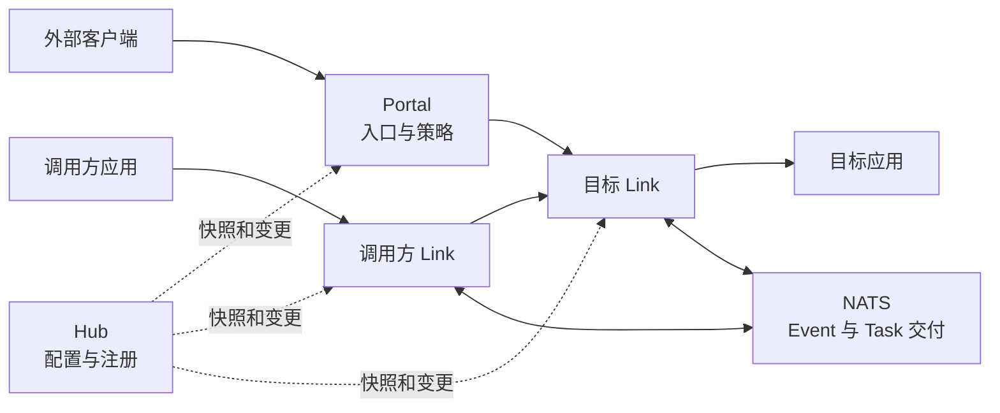
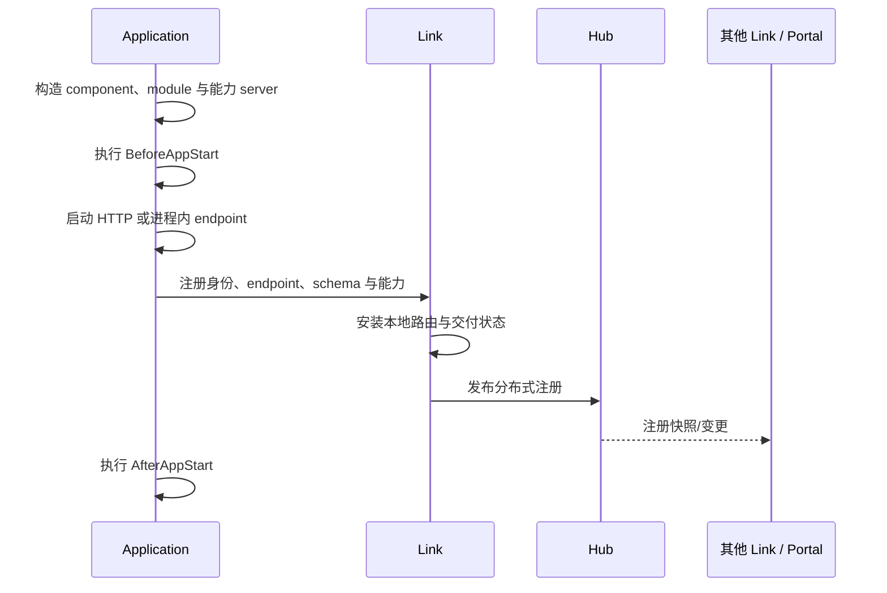
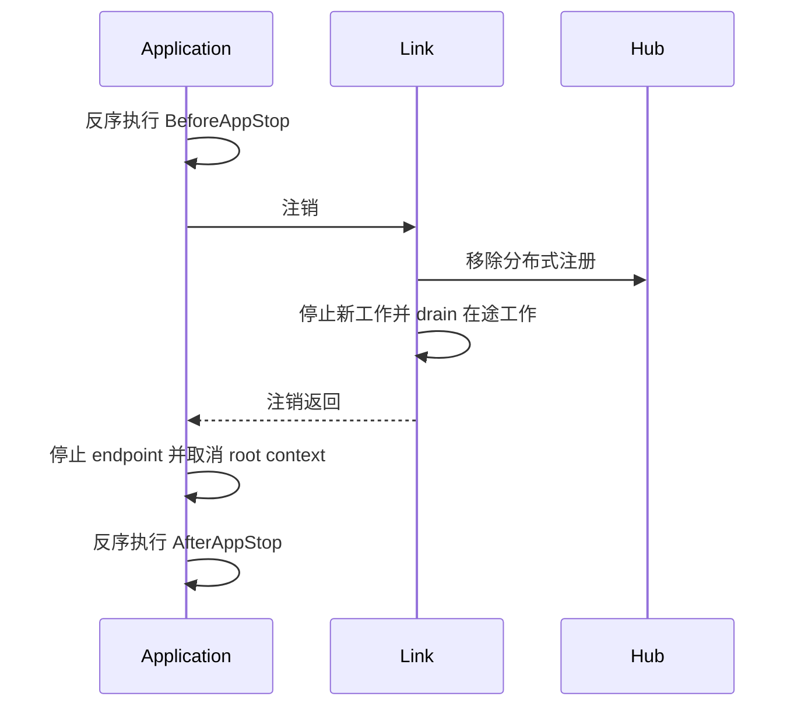

# 运行时架构

Vine 把业务行为和令它可被访问的运行时机制分离。应用声明类型化能力；Link 将声明
转化为可路由、可交付的运行时状态；Hub 分发这些状态；Portal 提供可选的外部入口。

最简洁的心智模型是：

> **Hub 知道有哪些状态，Link 负责连接应用，Portal 接纳外部流量，应用执行业务代码。**

## 运行时全景

| 参与者 | 拥有什么 | 是否处于同步业务请求路径 |
| --- | --- | --- |
| Application | Component、module、handler、listener、runner 与业务状态 | 是，作为调用方或目标 |
| Link | 本地应用状态、配置读取、发现快照、转发、Event/Task consumer、健康与 drain | 是 |
| Hub | 配置、注册状态、Portal 配置、schema 与运行时分发 | 否；Link 与 Portal 使用同步后的状态 |
| Portal | 外部 listener、site、TLS、准入策略与 endpoint 选择 | 仅外部流量 |
| NATS | Event 与 Task 消息 | 仅异步交付 |

这种分离会直接影响故障判断：一个组件可能对控制面收敛必不可少，却不在每次请求中
增加一跳；它也决定了启动与优雅停止期间哪些进程必须保持运行。

## 控制、入口与执行

### 控制面：Hub

Hub 以自己的数据库作为 application config、Portal site、rule、certificate 等托管
配置的 source of truth，并通过 Redis 分发层公开运行时快照与变更通知。

Link 将应用注册与 lease 状态发布到 Hub；Link 与 Portal 再读取或订阅各自需要的部分。
因此 Hub 是控制面依赖，而不是普通 Rpc 或 Web 调用中的额外 proxy。

### 应用接入层：Link

每个应用都会连接一个 Link。Link 同时维护两类知识：

- 应用直接上报给当前 Link 的**本地 source state**；
- 从 Hub 加载的配置与远端发现**分布式快照**。

Link 基于这些视图转发 Rpc/Web 请求、提供配置、创建 Event/Task consumer、维护注册
lease，并在停止期间 drain 应用。

### 外部入口：Portal

Portal 是 northbound 基础设施。它从 Hub 监听 entry rule、site、certificate、schema
与可用 endpoint，随后接收外部 HTTP/HTTPS 流量。Portal 可以根据生成 schema 和 site
策略完成认证、授权，再把请求转发给目标 Link。

应用之间的调用不经过 Portal。Portal 也不能替代 Link：它选择的目标是 Link ingress
endpoint，而不是脱离 Link 独立发现的应用 handler。

### 执行：Application

应用创建自己的 component、module 与能力 server。每次 Rpc、Web、Event 或 Task 交付
都会进入 execution container；container 注入正确的 context 与依赖后再调用业务代码。

scope 与 filter 规则见[依赖与执行模型](./execution-model.md)。

## 从声明到可发现能力

注册只描述已声明的运行时事实：应用身份和 endpoint，以及它的 Rpc service、Web handler、
Event listener、Task runner 与 domain schema。业务数据不会进入 registry。

只拥有 module、未暴露这些能力的应用仍可正常运行，但它没有需要通过服务发现公开的内容。

### Readiness 含义

endpoint 启动和注册完成都发生在 `AfterAppStart` hook **之前**。因此
`AfterAppStart` 执行期间请求已经可能到达。所有 readiness 关键检查和资源初始化都应
放进 `BeforeAppStart`；`AfterAppStart` 只用于应用已可见后仍然安全的工作。

完整顺序和 hook 使用建议见[应用生命周期](./application-lifecycle.md)。

## 四类运行时流

| 流 | 来源 | 运行时路径 | 交付模型 |
| --- | --- | --- | --- |
| 配置 | Hub 数据库或 seed | Hub → Redis 快照/变更 → Link → 应用 DI | eternal 实例快照或受监听的 instant 快照 |
| 内部 Rpc | 应用中的生成 client | 调用方 Link → 选中的本地应用或目标 Link → 目标应用 | 同步请求/响应 |
| 外部 Rpc 或 Web | 外部客户端 | Portal → 选中的 Link → 目标应用 | 同步网关转发 |
| Event 或 Task | 生成的 emitter 或 launcher | 发送方 Link → NATS → consumer Link → 目标应用 | 异步、可重试交付 |

### Rpc 选择与 Web 网关路由

应用间 Rpc 由调用方 Link 根据注册状态构造当前 service 集合，并选择一个已注册
实例。目标归当前 Link 所有时直接调用本地应用；否则请求先进入目标 Link，再到达
应用。

Web 的选择者不同。Portal 匹配外部 entry 和 site，从自己的分布式 Web endpoint
快照中选择目标，再把请求发送给所选应用所属的 Link。目标 Link 的 `webproxy`
只索引本地应用，负责最后的 handler 查找与投递。

两条路径都不是持久化 workflow engine。目标失败并不表示同一个请求会透明迁移到
另一个目标。设计重试前请先阅读[注册、发现与请求路由](./request-routing.md)。

### Event 与 Task

Link 将生成的 Event/Task 消息发布到 NATS，并根据已注册的 listener/runner 创建
consumer。应用代码不直接创建这些 consumer。

Event 与 Task 的分组语义不同，失败后也可能重新交付。依赖广播、顺序、重试或身份传播
前，请先阅读[Event 与 Task](../framework/event-task.md)。

### 配置

Link 提供应用侧配置读取边界。eternal 配置在当前应用第一次读取时冻结；instant 配置
在第一次读取时建立监听，并更新后续 DI resolution 使用的快照。已经注入的指针不会
被原地修改。

一致性模型见[配置](../framework/configuration.md)。

## 职责相同，拓扑不同

| 模式 | 进程 | Transport 变化 | 适用场景 |
| --- | --- | --- | --- |
| Standalone | Hub、Portal、Link 与应用共享一个进程 | 管理和应用 endpoint 可使用进程内连接 | 初次体验、本地开发、集成测试 |
| Linked | 外部 Hub；Link 与一个或多个应用共享进程 | App 到 Link 为进程内连接；Hub 与 Link ingress 使用网络 | 共享开发/运行控制面 |
| Separated | Hub、Portal、Link 与应用可独立运行 | 运行时边界使用网络 endpoint | 生产拓扑与分布式故障测试 |

应用能力代码在三种模式间无需变化。需要特别注意：进程内 transport 保留的是路由和
订阅语义，不是分布式故障语义：

- Standalone 注册没有 TTL，Link 也不会发送 heartbeat。
- Standalone 无法模拟独立进程崩溃或网络分区。
- 进程内健康检查和 endpoint 可达性不能证明生产 listener、firewall、DNS 路径或 TLS
  配置正确。
- Hub 配置定义了业务 HTTP/HTTPS listener 时，Portal 仍可能打开这些端口。

验证 lease 过期、独立重启、真实网络可达性与 TLS 时，应使用 separated setup。

## 优雅移除

linked 与 standalone 组合会先停止业务应用，再停止共享 Link，确保注销与 drain 路径
仍可使用。separated 部署也应保持同样的运维顺序：先停止或 drain 应用，再终止拥有它们
的 Link。

`BeforeAppStop` 在注销前执行。可以用它停止应用自有 producer 并开始静默，但在 drain
完成前，仍要保持在途 handler 所需依赖有效。最终资源应在 `AfterAppStop` 中释放。

## 继续深入

- [应用生命周期](./application-lifecycle.md)：构造、hook、readiness、drain 与 bundle 顺序。
- [依赖与执行模型](./execution-model.md)：应用 singleton、execution scope、filter、context 与释放。
- [请求路由](./request-routing.md)：注册监听、instance 选择、本地/远端转发与失败行为。
- [Trace 与 timeout](../framework/trace-timeout.md)：元数据、deadline、取消与下游调用。
- [部署拓扑](../getting-started/deployment-modes.md)：选择 standalone、linked 或 separated 运行。
- [生产就绪](../operations/production-readiness.md)：网络边界、持久化、生命周期与故障验证。
