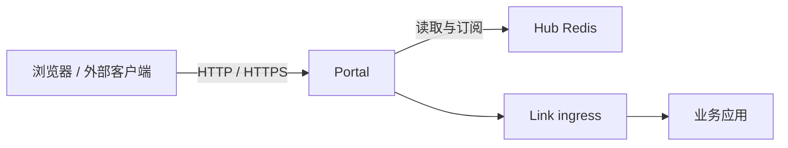

# Portal 网关

Portal 是 Vine 的北向入口。它从 Hub Redis 读取入口、站点、证书、schema 与 endpoint 信息，并把 HTTP、HTTPS、RPC 和 Web 请求路由到目标应用的 Link endpoint。



## 职责边界

- **入口监听**：依据 Portal rule 维护 HTTP / HTTPS listener。
- **站点路由**：依据 Portal site 配置创建 RpcGW 或 WebGW，并在站点内匹配请求。
- **Endpoint 发现**：持续订阅 RPC 与 Web endpoint 注册，向网关提供可用实例。
- **认证与授权**：根据 actor、service、resource Schema，在 RPC 转发前按需调用后端认证和权限服务。
- **TLS 证书**：读取并监听 Hub 中的证书配置，按 SNI 匹配 HTTPS 证书。

Portal 只处理外部入口与网关策略；它不保存配置真源，不负责应用注册，也不运行心跳。

## 启动

Portal 依赖已启动的 Hub：

```bash
vine portal serve \
  --hub-endpoint http://127.0.0.1:7071
```

`--hub-endpoint` 也能通过 `VINE_HUB_ENDPOINT` 设置。Portal 的实际 HTTP / HTTPS 监听地址不是命令行固定参数，而是由 Hub 中的 Portal entry 和 rule 配置驱动。

网络部署中，应配置 Portal 的 `vine.portal` 后台身份：

```bash
vine portal serve \
  --hub-endpoint https://hub.internal:7071 \
  --mtls-ca-file /run/vine/ca.pem \
  --mtls-cert-file /run/vine/portal.pem \
  --mtls-key-file /run/vine/portal-key.pem
```

Portal 会把该证书用于 Hub Rpc 与 Redis client，以及到 Hub Admin 和 Link ingress
的调用。它的精确 X.509-SVID 是
`spiffe://<trust-domain>/vine/daemon/vine.portal`，并与 Hub、Link 使用相同 trust domain。
浏览器侧 HTTPS listener 永远不会直接提供这些后台身份文件。启用 mTLS 且没有配置证书
匹配请求的 SNI host 时，Portal 会在内存中单独生成一个短期自签 Web 证书。Hub 中配置的
精确域名和通配证书始终优先。临时证书使用有上限的内存缓存，不写入 Hub，并在 Portal
停止时消失；它能加密引导流量，但不会被浏览器信任，生产使用前仍应配置公开证书。

## 配置如何生效

Portal 不需要重启来加载大多数网关变更。它监听 Hub Redis 中的以下内容：

- `portal:rule:*`：决定 scheme、端口以及请求交给哪个站点。
- `portal:site:*`：定义 RPC 或 Web 站点及路由规则。
- endpoint 注册信息：决定一个请求可转发到哪些 Link。
- actor、service、resource Schema：决定 RPC 的认证与权限准入。
- TLS 证书：用于 HTTPS listener 的 SNI 匹配。

Hub 发布变更后，Portal 会更新相应 listener、网关或缓存状态；业务实例注册或失效时，endpoint 发现也会随之变化。

## Inproc 模式

Portal 可随 standalone runtime 在同一进程内启动。它的模块划分和 Redis 订阅语义不变，只是 Hub Redis 与目标 Link endpoint 均可能是进程内连接。

该模式可验证路由、Schema 监听、准入和转发逻辑，但无法模拟独立进程崩溃、外部网络断连及 TLS 端口不可达等分布式条件。需要验证这些条件时，请采用独立进程部署。

## 相关文档

- [Hub](./hub.md)：管理 Portal entry、rule、site 与证书配置。
- [Link](./link.md)：承载目标应用的 ingress 与 endpoint 注册。
- [RPC](../infrastructure/rpc.md)：应用内部的 RPC 抽象。

## 入口路径映射

SITE 规则支持 `routePathPrefix`，表示目标站点内的路径前缀。Portal 使用
`matchPathPrefix` 匹配原始请求，将该前缀替换为 `routePathPrefix`，再交给站点的 WebGW
或 RpcGW。这只改变转发请求，不改变浏览器地址，也不会改写响应正文、静态资源
URL 或重定向地址。

| `matchPathPrefix` | `routePathPrefix` | 请求 | 站点收到的路径 |
| --- | --- | --- | --- |
| `/api` | 留空 | `/api/users` | `/users` |
| `/api` | `/internal` | `/api/users?x=1` | `/internal/users?x=1` |
| `/api` | `/api` | `/api/users` | `/api/users` |
| `/` | `/internal` | `/users` | `/internal/users` |
| `/api` | `/internal` | `/api` | `/internal` |
| `/api` | `/internal` | `/api/` | `/internal/` |

留空或 `/` 保持剥离前缀的行为。其他值必须以 `/` 开头，不得包含协议、Host、
查询参数、片段、反斜杠、控制字符或 `.` / `..` 路径段。配置的目标前缀末尾的
斜杠会被去掉。入口改写保留请求后缀的编码、查询参数、方法、正文和请求上下文。
匹配仍遵循路径段边界（`/api` 不匹配 `/api2`）及现有规则优先级。
对于 RpcGW，改写后必须是 `/invoke/demo.Service/Method` 等网关路径；
`routePathPrefix` 不会绕过网关鉴权。重定向规则继续使用 `routeRedirectionPattern`，
不能设置 `routePathPrefix`。

可以在 Dashboard 规则编辑器中配置“目标路径前缀”，或通过 Hub seed YAML 设置：

```yaml
portalRules:
  - name: internal-api
    matchScheme: http
    matchHost: api.example.com
    matchPort: 8080
    matchPathPrefix: /api
    routeType: SITE
    routeSiteName: application-web
    routePathPrefix: /internal
```

请先配置目标站点，再向规则发送请求。规则更新无需重启 Portal 即可生效。
API 更新时不传 `routePathPrefix` 表示不修改，传空字符串表示清除。Seed YAML 表示完整
规则值，省略该字段表示空值。

从 `v0.14.1` 升级时，Hub 会自动迁移已保存的规则，无需重新创建。编辑 seed 文件
或调用 Admin API 时，请使用下面的新字段名。

启动和 Dashboard 导入仍接受旧 YAML 字段，并提示对应的新字段名：

| 旧 YAML 字段 | 新 YAML 字段 |
| --- | --- |
| `scheme` | `matchScheme` |
| `host` | `matchHost` |
| `port` | `matchPort` |
| `pathPrefix` | `matchPathPrefix` |
| `targetType` | `routeType` |
| `siteName` | `routeSiteName` |
| `targetPath` | `routePathPrefix` |
| `redirectionPattern` | `routeRedirectionPattern` |

同一条规则不能混用新旧字段，即使值相同、为空或为 `0`，也会在应用任何数据之前报错。
Admin API 只接受新字段名，请更新管理入口规则的自定义 Admin 客户端。
升级时应一起升级 Hub 和全部 Portal 实例；
新旧 Hub、Portal 混用可能导致入口路由不可用。

## 规则校验

以下要求适用于 Admin API、启动 seed YAML 和 Dashboard 导入。
内置 Dashboard 规则不能被用户配置覆盖。

规则必须填写名称，`matchScheme` 只能为 `http` 或 `https`；`matchPort` 允许
`0`（协议默认端口）或 `1–65535`。`matchHost` 可以为空或主机名/IP，不能带完整
URL、端口或通配符。非空 `matchPathPrefix` 必须以 `/` 开头，不包含查询参数或片段
分隔符、反斜杠、空白、控制字符及 `.` / `..` 路径段。

`SITE` 必须填写 `routeSiteName`，不能设置 `routeRedirectionPattern`。
`PERMANENT_REDIRECT` 和 `TEMPORARY_REDIRECT` 必须填写 `routeRedirectionPattern`，
不能设置站点名称或非空路由路径前缀。重定向模板支持 `{scheme}`、`{host}`、`{uri}`、
`{path}`、`{query}`、`{method}`、`{remote}`；未知占位符或未配对的大括号会报错。
保存规则时不会检查目标站点是否存在，请确保目标站点在接收请求前已配置。

## 证书信息

证书签发者、域名和有效期自动从证书内容解析，无需手填。YAML 中即使填写了
这些元数据，也以证书内容为准。
