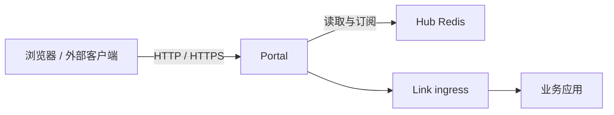

# Portal 网关

Portal 是 Vine 的北向入口。它从 Hub Redis 读取入口、站点、证书、schema 与 endpoint 信息，并把 HTTP、HTTPS、RPC 和 Web 请求路由到目标应用的 Link endpoint。



## 职责边界

- **入口监听**：依据 Portal rule 维护 HTTP / HTTPS listener。
- **站点路由**：依据 Portal site 配置创建 RpcGW 或 WebGW，并在站点内匹配请求。
- **Endpoint 发现**：持续订阅 RPC 与 Web endpoint 注册，向网关提供可用实例。
- **认证与授权**：根据 actor、service、resource Schema，在 RPC 转发前按需调用后端认证和权限服务。
- **TLS 证书**：读取并监听 Hub 中的证书配置，按 SNI 匹配 HTTPS 证书。
- **自身注册**：向 Hub 注册本实例及 Vine runtime 版本，并在运行期间持续续租，使 Hub
  能够展示正在提供服务的 Portal 实例。

Portal 只处理外部入口与网关策略；它不保存配置真源，也不负责应用及其能力的注册。

## Portal 注册

在分离部署中，Portal 启动时向 Hub 注册自身，每 10 秒续租一次，并在优雅退出时注销。
最后一次心跳后 30 秒，Hub 会将某个 Portal 实例判定为停止服务，因此被强制终止的
Portal 也会自动从列表中消失。Hub Dashboard 会在应用实例之外列出已注册的 Portal 实例。

Hub 重启后不会报告任何 Portal 实例，直到各 Portal 在下一次心跳时重新注册。standalone 的
Portal 与 Hub 同进程，不可能比 Hub 存活更久，因此只注册一次，不发送心跳。


## 启动

Portal 依赖已启动的 Hub：

```bash
vine portal serve \
  --hub-endpoint http://127.0.0.1:7071
```

`--hub-endpoint` 也能通过 `VINE_HUB_ENDPOINT` 设置。Portal 的实际 HTTP / HTTPS 监听地址不是命令行固定参数，而是由 Hub 中的 Portal entry 和 rule 配置驱动。

网络部署中，应配置 Portal 的 `vine.portal` 后台身份：

```bash
vine portal serve \
  --hub-endpoint https://hub.internal:7071 \
  --mtls-ca-file /run/vine/ca.pem \
  --mtls-cert-file /run/vine/portal.pem \
  --mtls-key-file /run/vine/portal-key.pem
```

Portal 会把该证书用于 Hub Rpc 与 Redis client，以及到 Hub Admin 和 Link ingress
的调用。它的精确 X.509-SVID 是
`spiffe://<trust-domain>/vine/daemon/vine.portal`，并与 Hub、Link 使用相同 trust domain。
浏览器侧 HTTPS listener 永远不会直接提供这些后台身份文件。启用 mTLS 且没有配置证书
匹配请求的 SNI host 时，Portal 会在内存中单独生成一个短期自签 Web 证书。Hub 中配置的
精确域名和通配证书始终优先。临时证书不会被持久化，并在 Portal 停止时消失；它能加密引导
流量，但不会被浏览器信任，生产使用前仍应配置公开证书。

## 配置如何生效

Portal 不需要重启来加载大多数网关变更。它监听 Hub Redis 中的以下内容：

- 规则变更：决定 scheme、端口以及请求交给哪个站点。
- 站点变更：定义 RPC 或 Web 站点及路由规则。
- endpoint 注册信息：决定一个请求可转发到哪些 Link。
- actor、service、resource Schema：决定 RPC 的认证与权限准入。
- TLS 证书：用于 HTTPS listener 的 SNI 匹配。

Hub 发布配置变更后，Portal 无需重启即可使其生效；业务实例注册或失效时，endpoint 发现也会随之刷新。

Hub 重启无需对 Portal 做任何操作：Portal 会重新连接运行中的 Hub，并在不重启的情况下继续提供服务。详见 [Hub 重启与端点变化](./hub.md#hub-重启与端点变化)。

## 可选凭据字段

RPC 和 Web 认证允许在 `Authorization` 中省略可选凭据字段。
例如，`token` 必填、`tenant` 可选时，没有 tenant 就发送
`Authorization: token abc`；需要提供时发送
`Authorization: token abc, tenant team-a`。省略的字段在认证服务中为 nil，
不要传入空值。

必填字段必须存在，所有已提供的值都必须非空。未知字段名和格式错误会被拒绝。
Skel 要求至少声明一个必填凭据字段，因此合法请求总会包含至少一个非空值。

## Inproc 模式

Portal 可随 standalone runtime 在同一进程内启动，此时 Hub Redis 连接与目标 Link endpoint 都是进程内连接。

该模式可验证路由、Schema 监听、准入和转发逻辑，但无法模拟独立进程崩溃、外部网络断连及 TLS 端口不可达等分布式条件。需要验证这些条件时，请采用独立进程部署。

## 相关文档

- [Hub](./hub.md)：管理 Portal entry、rule、site 与证书配置。
- [Link](./link.md)：承载目标应用的 ingress 与 endpoint 注册。
- [RPC](../infrastructure/rpc.md)：应用内部的 RPC 抽象。

## Portal 入口

入口是 Portal 对外提供服务的访问地址：scheme、host 和 port。每条规则都属于一个入口，
访问地址由入口持有，因此修改入口会一次性更新它承载的所有规则。Dashboard 会把入口与
站点、规则并列展示，规则编辑器在新建规则时选择入口。

Seed YAML 用 `portalEntries` 段声明入口，同一文档中的规则通过 `entryName` 引用：

```yaml
portalEntries:
  - name: web
    scheme: https
    host: api.example.com
    port: 8443

portalRules:
  - name: internal-api
    entryName: web
    matchPathPrefix: /api
    routeType: SITE
    routeSiteName: application-web
```

seed 也可以在每条规则上用 `matchScheme`、`matchHost` 和 `matchPort` 声明访问地址，
由 Hub 创建规则所需的入口。两种写法不能混用：同一文档中的
每条规则要么引用入口，要么声明访问地址；规则也只能引用同一文档声明过的入口。Hub 为
自行创建的入口推导名称为 `scheme:port`，存在 host 时为 `scheme:host:port`。入口可以
暂时不承载任何规则，这样在补充规则期间它仍可选。

## 启用与停用配置

Portal 站点、入口、规则和证书都带有启用开关，可在 Dashboard 中编辑。seed 只声明需要
关闭的项：

```yaml
portalRules:
  - name: legacy-api
    disabled: true
    matchPathPrefix: /legacy
    routeType: SITE
    routeSiteName: application-web
```

seed 省略该字段时默认启用，已有数据库也保持启用状态。被停用的规则不会生效，被停用入口下的
规则、被停用站点下的 SITE 规则同样如此。重定向规则不属于 SITE 规则，因此站点被停用后仍会
生效。被停用的证书不提供。

## 入口路径映射

当 Web 站点背后的 Web 契约声明了挂载路径时，Portal 使用该路径同时进行匹配和转发；
在挂载路径存在期间，指向该站点的 SITE 规则所配置的前缀不生效：

- 规则编辑器会展示 Web 路径，并提示这两个路径由 Web 固定
- Seed 规则可以省略这两个前缀
- 挂载路径为 `/` 时从根路径提供服务
- 已存储的前缀仍然保留；当 Web 不再声明挂载路径时会重新生效
- 站点或契约变更后，实际路径自动跟随，无需重启 Portal

重定向规则不变：它们沿用配置的模板，不参与挂载路径解析。


以下映射配置适用于目标 Web 未声明挂载路径，或目标站点为 RpcGW 的情况。

SITE 规则支持 `routePathPrefix`，表示目标站点内的路径前缀。Portal 使用
`matchPathPrefix` 匹配原始请求，将该前缀替换为 `routePathPrefix`，再交给站点的 WebGW
或 RpcGW。这只改变转发请求，不改变浏览器地址，也不会改写响应正文、静态资源
URL 或重定向地址。

| `matchPathPrefix` | `routePathPrefix` | 请求 | 站点收到的路径 |
| --- | --- | --- | --- |
| `/api` | 留空 | `/api/users` | `/users` |
| `/api` | `/internal` | `/api/users?x=1` | `/internal/users?x=1` |
| `/api` | `/api` | `/api/users` | `/api/users` |
| `/` | `/internal` | `/users` | `/internal/users` |
| `/api` | `/internal` | `/api` | `/internal` |
| `/api` | `/internal` | `/api/` | `/internal/` |

留空或 `/` 保持剥离前缀的行为。其他值必须以 `/` 开头，不得包含协议、Host、
查询参数、片段、反斜杠、控制字符或 `.` / `..` 路径段。配置的目标前缀末尾的
斜杠会被去掉。入口改写保留请求后缀的编码、查询参数、方法、正文和请求上下文。
匹配仍遵循路径段边界（`/api` 不匹配 `/api2`）及现有规则优先级。
对于 RpcGW，改写后必须是 `/invoke/demo.Service/Method` 等网关路径；
`routePathPrefix` 不会绕过网关鉴权。重定向规则继续使用 `routeRedirectionPattern`，
不能设置 `routePathPrefix`。

可以在 Dashboard 规则编辑器中配置“目标路径前缀”，或通过 Hub seed YAML 设置：

```yaml
portalRules:
  - name: internal-api
    matchScheme: http
    matchHost: api.example.com
    matchPort: 8080
    matchPathPrefix: /api
    routeType: SITE
    routeSiteName: application-web
    routePathPrefix: /internal
```

请先配置目标站点，再向规则发送请求。规则更新无需重启 Portal 即可生效。
API 更新时不传 `routePathPrefix` 表示不修改，传空字符串表示清除。Seed YAML 表示完整
规则值，省略该字段表示空值。


## 规则校验

以下要求适用于 Admin API 和启动 seed YAML。

入口必须填写 `scheme`（`http` 或 `https`）和 `port`（`0` 表示协议默认端口，或
`1–65535`）；`host` 可以为空或主机名/IP，不能带完整 URL、端口或通配符。为声明访问
地址的规则创建的入口会按该访问地址命名。规则必须填写名称；`matchPathPrefix` 非空时
必须以 `/` 开头，不包含查询参数或片段分隔符、反斜杠、空白、控制字符及 `.` / `..`
路径段。通过 Admin API 创建的规则用 `entryName` 指定所属入口。

`SITE` 必须填写 `routeSiteName`，不能设置 `routeRedirectionPattern`。
`PERMANENT_REDIRECT` 和 `TEMPORARY_REDIRECT` 必须填写 `routeRedirectionPattern`，
不能设置站点名称或非空路由路径前缀。重定向模板支持 `{scheme}`、`{host}`、`{uri}`、
`{path}`、`{query}`、`{method}`、`{remote}`；未知占位符或未配对的大括号会报错。
保存规则时不会检查目标站点是否存在，请确保目标站点在接收请求前已配置。

## 规则冲突

当两条规则属于同一个入口、且解析到相同的匹配路径时即构成冲突，因为 Portal 无法为它们
排序。名称排序在前的规则负责服务该请求；当它不再服务该请求时，另一条会立即接管。Dashboard
会标记这两条规则并展示它们匹配的请求，Admin API 通过 `listConflicts` 报告每一对冲突。

处理冲突的方式有：停用其中一条规则、在另一个入口下创建该规则，或修改站点挂载路径，
从而改变其规则解析出的路径。

## 证书信息

证书签发者、域名和有效期自动从证书内容解析，无需手填。YAML 中即使填写了
这些元数据，也以证书内容为准。

## API 服务边界

`api service` 是客户端经 Portal 访问的入口。只有 API 服务会暴露给客户端，普通后端服务不会。后端认证、权限和资源检查等服务仍在 Portal 背后运行，不作为客户端入口。
