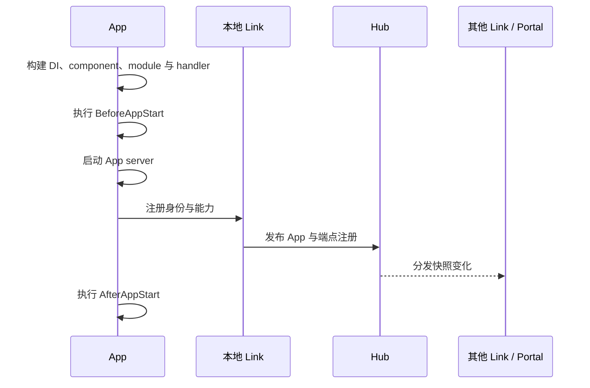
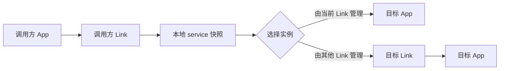
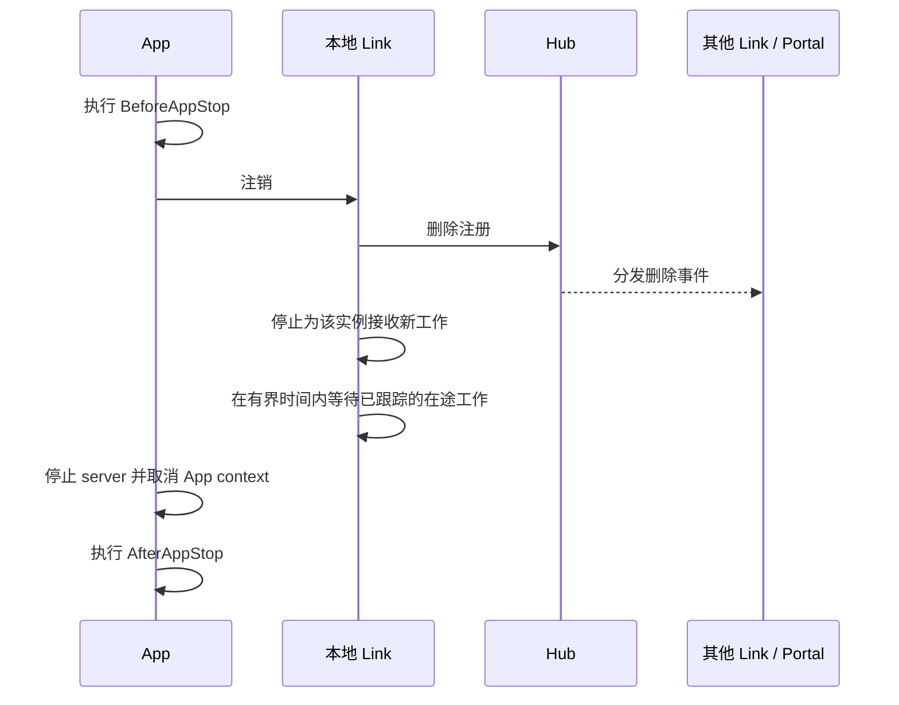

# 请求路由与就绪状态

Vine 根据能力声明路由，而不是让业务代码写死地址。应用发布自己能够处理的
Rpc service 和 Web handler；Hub 分发注册状态；Link 与 Portal 在本地维护快照，
并为每次请求选择实例。

这里最重要的边界是注册：开始监听只是本地进程状态；真正可路由，意味着调用方使用的
Link 或 Portal 已经观察到这次注册。

## 四个运行时角色

| 运行时 | 负责 | 不负责 |
| --- | --- | --- |
| App | handler 实现、应用身份与能力声明 | 跨应用发现或公开网关策略 |
| Hub | 注册状态源、网络模式下的租约与分发快照 | 逐请求转发 |
| Link | 本地 App 所有权、配置/发现快照、实例选择与转发 | 公开站点、TLS 或外部准入策略 |
| Portal | 公开 HTTP/HTTPS 入口、站点匹配、认证授权与外部端点选择 | 应用注册或心跳 |

Link 与 Portal 中的快照是派生状态。Hub 发布注册变化后它们才会更新，因此分离
进程通过异步收敛获得一致视图，并不存在一张全局同步路由表。

## 注册才是路由边界

App 会先启动 handler，再对外声明能力。正常启动路径是：

下面三个时刻含义不同：

- **进程已经监听**：App server 已存在，但发现快照中可能还没有这个实例。
- **本地注册完成**：App 所属 Link 已接管实例，并把它发布给 Hub。
- **部署可路由**：真实调用者所使用的 Link 或 Portal 已观察到新快照。

`Start` 返回前会完成本地注册，但 Vine 不提供等待所有 Link 与 Portal 全局收敛
的屏障。部署就绪检查应通过生产调用者实际使用的 Portal 或 Link 路径探测应用；
仅检查进程是否监听并不充分。

滚动发布期间，调用方可能短暂看到“service 已配置但没有可用端点”，也可能仍
看到即将离开的端点。应把可用性错误视为分布式系统边界；只有操作可安全重复时
才进行重试。

## 应用间 Rpc

生成的 Rpc client 先调用调用方的本地 Link。该 Link 从当前已知的 service 注册
中选择一个实例：

目标在本地时，Link 直接转发到 App 端点；目标在远端时，请求先到目标 Link，
由它校验实例和 service 后再调用 App。

### 实例选择

每个调用方 Link 都在自己的 service 快照内使用 round-robin。其行为有意保持
简单：

- 每个 Link 都有自己的游标；使用不同 Link 的调用方不共享全局顺序。
- 起始顺序未定义。注册列表由快照重建，增加或删除实例也可能改变后续顺序。
- 不提供粘性、权重、延迟感知选择或实例优先级。
- 注册健康状态与租约最终会移除不可用实例，但选择前不会为每个请求做实时探测。
- 没有内建断路器。
- 选中端点失败时，Vine 返回本次失败；不会自动把同一次调用改投另一个实例。

因此应用级重试必须显式设置 deadline，并先判断幂等性。读取通常可以重试；
支付、发邮件或状态迁移通常需要幂等键，或先查询再决定是否重试。

## 外部 Rpc 与 Web 请求

外部请求从 Portal 进入，不会先经过某个任意业务应用的 outbound Link。

### 外部 Rpc

Portal 校验 vRPC 请求，建立 trace 与调用者元数据，执行站点准入检查，然后选择
已注册的 service 端点。目标 Link 再把请求转发给所属 App。

应使用生成的 vRPC client 访问这条路径。App 与 Link 端点是运行时内部协议
端点；直接调用会绕过 Portal 策略，还需要普通 HTTP 工具不会提供的内部元数据。

### 外部 Web

Portal 接收普通浏览器 HTTP，为后端请求创建 Vine trace、initiator 与 Actor
元数据，然后选择 Web 注册。直接用浏览器访问 App 的内部 Web 端点不是受支持的
公开入口：该端点要求 Vine 内部 Web 元数据 header。

Portal 对 Rpc 与 Web 端点也使用本地 round-robin 游标。与 Link 相同，它不会
增加权重、断路器或同一次请求的自动故障转移。

## 优雅停止与 drain

App 的优雅停止会先从发现状态中移除实例，再关闭 App server：

传播宽限和 drain 等待可以减少工作丢失，但无法让所有并发调用者在同一时刻看到
删除结果。收敛期间，持有旧快照的调用方仍可能选中该实例，并收到可用性错误。
drain 也是有界的，不能因此让 handler 无限忽略 deadline。

受控发布建议按以下顺序：

1. 停止引入新的外部流量，或让部署的 readiness probe 失败。
2. 在所属 Link 仍可用时优雅停止业务 App。
3. 等待 App 注销并 drain 已跟踪请求。
4. 所有 App 停止后再停止 Link。
5. 依赖流量结束后再停止 Portal 与 Hub。

`linked` 和 `standalone` wrapper 已经会先停业务 App，再停进程内 Link。分离部署
应在进程管理器中保留这个顺序。

## Standalone 与进程内路由

Standalone 会保留注册、快照、代理、round-robin、元数据和序列化边界。调用仍
经过 Link 的路由逻辑；进程内 Rpc 值也会通过与网络调用相同的 JSON 或 CBOR
表示进行克隆。

它有意不复现所有分布式故障：

| Standalone 中保留 | 需要 linked 或分离进程 |
| --- | --- |
| 能力注册与移除 | 独立进程崩溃 |
| Service 与 Web 选择 | 真实网络分区和端口不可达 |
| 类本地/远端转发决策 | 心跳失败与租约过期 |
| 请求校验和值克隆 | 外部 Link ingress 与传输安全 |
| 配置后可验证 Portal 站点/准入逻辑 | 真实 TLS listener 与证书可达性 |

进程内调用超时或取消时，如果 handler 忽略 context，调用方仍会直接返回而不会
等待 handler 结束，这与网络超时对调用方可见的行为一致；它并不能证明 handler
已经停止。

快速集成测试应使用 standalone；验证存活、租约、网络、TLS 与重启行为时，应
使用 linked 或完全分离的进程。

## 把实例标记为就绪之前

宣布部署就绪前，应验证：

- Hub 已提供注册与分发状态。
- Link 已连接 Hub 及消息依赖。
- App 已完成注册，而不只是打开 listener。
- 通过调用方真实使用的 Link 或 Portal 能探测到目标能力。
- Portal 已有必要的 rule/site 配置，并且存在可用端点。
- 重试受 deadline 约束，而且只重复幂等工作。

接下来可阅读[部署模式](../getting-started/deployment-modes.md)、
[Trace 与超时](../framework/trace-timeout.md)和
[事件与任务](../framework/event-task.md)。
